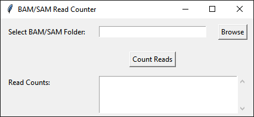

# BAM/SAM Read Counter

`CountReadsInBSAM_V3.py` is a small desktop utility for counting alignment records in every BAM and SAM file inside one folder. Counts appear in the application as each file finishes, and the same results are saved as a text file.



## What the script does

The program looks for files ending in `.bam` or `.sam` in the selected directory. BAM records are counted with `samtools view -c`. SAM records are counted by excluding header lines beginning with `@`. Each result is reported as:

```text
sample.bam: 12543892 reads
```

The count represents alignment records. For paired-end data, mates are stored as separate records and are therefore counted separately.

## Interface controls

| Control | Description |
|---|---|
| **Select BAM/SAM Folder** | Folder containing the BAM and SAM files to count. The script processes files located directly in this folder. |
| **Browse** | Opens a folder picker and fills the folder field. |
| **Count Reads** | Starts counting every `.bam` and `.sam` file found in the selected directory. |
| **Read Counts** | Scrollable results area that updates after each file is processed. |

## Running the program

From Windows PowerShell or Command Prompt:

```bash
python CountReadsInBSAM_V3.py
```

The graphical interface is built with Tkinter. BAM and SAM counting commands run through WSL, with `samtools` used for BAM files and `grep` used for SAM files.

## Output

The script writes `read_counts.txt` into the selected input folder. The file contains one line per successfully counted BAM or SAM file and mirrors the text displayed in the application.

Example:

```text
tumor.bam: 28750411 reads
normal.bam: 24188732 reads
alignment.sam: 912450 reads
```
