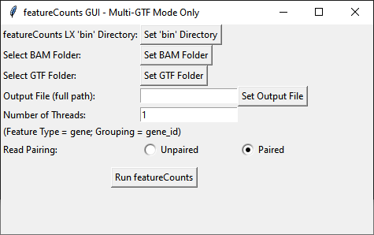

# BAM to RNA-type comparison

`BamToRnaTypeCount_V21.py` compares the same collection of BAM files against multiple GTF annotation sets. It runs featureCounts for every GTF in unstranded, same-strand and reverse-strand modes, then creates a compact table showing what percentage of each sample is assigned to each annotation category.

This is useful when the GTF folder contains separate RNA-class annotations—such as protein-coding RNA, lncRNA, rRNA, miRNA or other custom feature groups—and the goal is to compare their representation across sequencing libraries.



## How the analysis works

For each `.gtf` file, the script runs featureCounts three times:

- unstranded with `-s 0`;
- stranded in the same orientation with `-s 1`;
- reverse-stranded with `-s 2`.

The feature type is fixed to `gene`, and records are grouped with the `gene_id` attribute. Counts are summed across all features in each GTF. The assigned count is divided by the total reads reported in the featureCounts summary, producing an annotation percentage for every BAM sample. An `Unassigned` row completes each strand-mode block.

## Settings

| Setting | Default | Description |
|---|---:|---|
| **featureCounts LX `bin` Directory** | — | Folder containing the `featureCounts` executable. The script appends `/featureCounts` when it builds the WSL command. |
| **BAM Folder** | — | Directory containing the `.bam` files to quantify. All BAMs in the folder are included in every GTF and strand-mode run. |
| **GTF Folder** | — | Directory containing the annotation `.gtf` files. Each filename becomes an annotation label in the comparison table. |
| **Output File** | — | Base `.tabtxt` path chosen for the comparison. The final filename ends in `_comparison.tabtxt`. |
| **Number of Threads** | `1` | Thread count passed to featureCounts with `-T`. |
| **Read Pairing — Unpaired** | — | Runs featureCounts without paired-read mode. Use this for single-end alignment records. |
| **Read Pairing — Paired** | Selected | Adds `-p`, causing featureCounts to count paired-end fragments according to its paired-read behavior. |

The feature type and grouping attribute shown in the interface are informational: this script uses `-t gene` and `-g gene_id` for every run.

## Running the program

```bash
python BamToRnaTypeCount_V21.py
```

Use **Set `bin` Directory**, **Set BAM Folder**, **Set GTF Folder** and **Set Output File** to fill the required paths. Select the read-pairing mode, choose the thread count, and click **Run featureCounts**.

The script converts Windows paths to WSL paths, writes a temporary Linux command file for each GTF/strand combination, executes it through WSL, and updates the blue status line as the analysis progresses.

## Output

The retained comparison file has samples in columns and annotation/strand combinations in rows. Percentages are rounded to one decimal place. Each strand block ends with an unassigned percentage, followed by a final `Total Reads` row.

Example structure:

```text
NoMultimapped_NoOverlapp_Paired    sample1.bam    sample2.bam
unstranded-protein_coding          72.4%          68.1%
unstranded-lncRNA                   8.7%          10.2%
unstranded-Unassigned              18.9%          21.7%

stranded-same-protein_coding       ...            ...

Total Reads                        25000000       31000000
```
