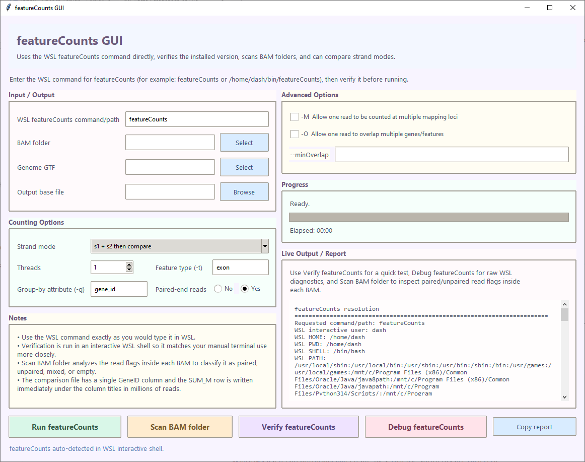

# featureCounts GUI

`Featurecounts_V36.py` is a Windows graphical front end for running featureCounts through WSL. It quantifies one folder of BAM files against a GTF annotation, supports several strand modes, inspects BAM pairing flags, verifies the featureCounts installation and builds comparison tables when more than one strand mode is selected.



## Inputs and outputs

| Setting | Default | Description |
|---|---:|---|
| **WSL featureCounts command/path** | `featureCounts` | Command used inside WSL. It can be a command on the WSL `PATH` or a full Linux path such as `/home/user/bin/featureCounts`. |
| **BAM folder** | — | Folder containing the `.bam` files to quantify. BAMs are sorted by filename and supplied together to featureCounts. |
| **Genome GTF** | — | Annotation file passed with `-a`. Its feature and attribute names determine which values can be used for `-t` and `-g`. |
| **Output base file** | — | Base path for the tab-delimited count files. The program adds `.tabtxt` and a strand-mode suffix. |

## Counting settings

| Setting | Default | Description |
|---|---:|---|
| **Strand mode** | `s1 + s2 then compare` | Selects one or more featureCounts `-s` runs. Options are `s0` unstranded, `s1` same-strand/StringTie `--fr`, `s2` reverse-strand/StringTie `--rf`, an `s1 + s2` comparison, or an `s0 + s1 + s2` comparison. |
| **Threads** | `1` | Number of featureCounts worker threads passed with `-T`. The interface accepts 1–64. |
| **Feature type (`-t`)** | `exon` | GTF feature type to count. With the default, rows whose third GTF column is `exon` are used. |
| **Group-by attribute (`-g`)** | `gene_id` | GTF attribute used to combine counted features into output rows. |
| **Paired-end reads — No/Yes** | `Yes` | Adds featureCounts paired-end mode (`-p`) when Yes is selected. |

## Advanced settings

| Setting | Default | Description |
|---|---:|---|
| **`-M` Allow one read to be counted at multiple mapping loci** | Off | Includes multi-mapping reads in the count operation. |
| **`-O` Allow one read to overlap multiple genes/features** | Off | Allows one alignment or fragment to be assigned to more than one overlapping feature or meta-feature. |
| **`--minOverlap`** | Blank | Minimum number of overlapping bases required between a read/fragment and a feature. Enter an integer to add the option to the featureCounts command. |

## Buttons and live report

- **Run featureCounts** verifies the command, runs the selected strand modes and creates the requested output files.
- **Scan BAM folder** samples up to 2,000 alignments per BAM with samtools and classifies each file as paired, unpaired, mixed or empty from its SAM flags.
- **Verify featureCounts** searches the interactive WSL environment, resolves the executable and displays its version output.
- **Debug featureCounts** prints the WSL home directory, shell, working directory, `PATH`, candidate commands and raw probe results.
- **Copy report** copies the complete live output/report panel to the clipboard.

The progress panel shows the current stage, percentage and elapsed time. featureCounts standard output and command-resolution details are streamed into the report panel.

## Running the program

```bash
python Featurecounts_V36.py
```

The Windows side uses Tkinter. WSL supplies featureCounts and samtools. The repository’s `bin/featureCounts` file can also be selected through an appropriate WSL command or path.

## Output files

Single-mode runs create one strand-labeled table, for example:

```text
counts_s0_Unstranded.tabtxt
```

Comparison runs create one full featureCounts table per strand mode and a merged file:

```text
counts_s1_StrandedSame_Stringtie_fr.tabtxt
counts_s2_StrandedReverse_String_rf.tabtxt
counts_comparison.tabtxt
```

The comparison table begins with a single `GeneID` column. Each following column combines the strand-mode label and BAM filename. A `SUM` row immediately below the header reports each column total in millions of reads, followed by the gene-level counts.
