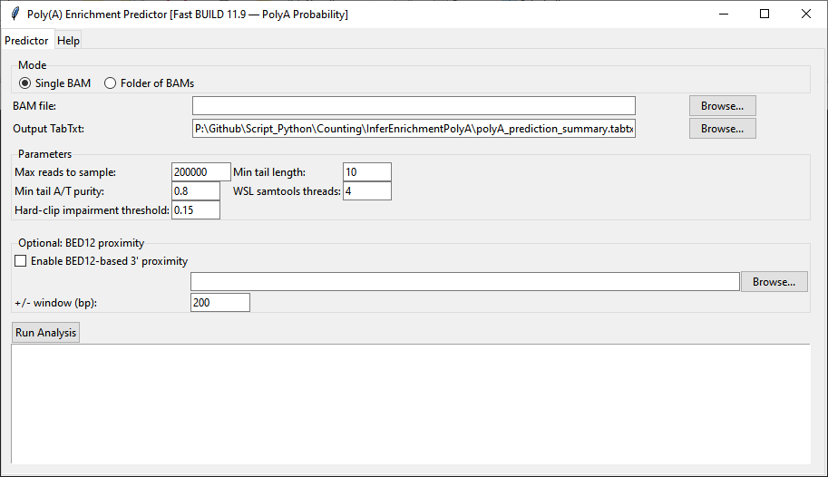

# Poly(A) Enrichment Predictor

`InferEnrichmentPolyA_V12.py` examines aligned RNA-seq reads and estimates the probability that a library was prepared with poly(A) enrichment. It samples BAM alignments, looks for A/T-rich soft-clipped tails, measures their length and orientation, checks for poly(A)-like sequence motifs, and can add transcript 3′-end proximity from a BED12 annotation.



## Analysis modes and files

| Setting | Default | Description |
|---|---:|---|
| **Single BAM** | Selected | Analyzes one BAM and writes one result row. |
| **Folder of BAMs** | — | Analyzes every `.bam` file located directly in the selected folder and writes one row per file. |
| **BAM file / Folder with BAMs** | — | Input selected according to the active mode. |
| **Output TabTxt** | `polyA_prediction_summary.tabtxt` | Destination for the tab-delimited summary. The file is written using Windows-1252 encoding. |

## Tail-detection settings

| Setting | Default | Description |
|---|---:|---|
| **Max reads to sample** | `200000` | Maximum number of alignment records inspected from each BAM. |
| **Min tail length** | `10` | Minimum terminal soft-clip length considered as a candidate poly(A/T) tail. |
| **Min tail A/T purity** | `0.8` | Required fraction of A or T bases within the clipped sequence. `0.8` means at least 80% of the segment is one of those bases. |
| **WSL samtools threads** | `4` | Threads passed to `samtools view` while reading the BAM. |
| **Hard-clip impairment threshold** | `0.15` | Hard-clip fraction at which the result marks tail detection as impaired, because hard-clipped sequence is absent from the BAM record. |

## BED12 proximity settings

| Setting | Default | Description |
|---|---:|---|
| **Enable BED12-based 3′ proximity** | Off | Adds evidence based on how often aligned read ends occur near annotated transcript 3′ ends. |
| **BED12 file** | Blank | Transcript annotation used to obtain strand-aware 3′-end coordinates. The Browse button converts a Windows path to its WSL form. |
| **± window (bp)** | `200` | Distance on either side of an annotated 3′ end within which a read is counted as proximal. |

## How the probability is calculated

The script builds a `FastScore` from six signals:

| Signal | Weight |
|---|---:|
| Rate of detected 3′ tails | `0.50` |
| Overall tail fraction | `0.15` |
| Mean detected tail length, capped at 30 nt | `0.15` |
| Proximity to any BED12 transcript 3′ end | `0.10` |
| Strand-aware 3′ proximity using `XS` tags | `0.07` |
| Poly(A)-like motif rate among detected tails | `0.03` |

The score is converted to `PolyA_Prob%` with a logistic function centered at `0.18`. The reported evidence scale is:

| Probability | Label |
|---:|---|
| 85% and above | Very strong |
| 65% to under 85% | Strong |
| 45% to under 65% | Moderate |
| 25% to under 45% | Weak |
| Under 25% | Unlikely |

## Running the program

```bash
python InferEnrichmentPolyA_V12.py
```

Choose the mode and input, select the output file, adjust the sampling and tail parameters, optionally add BED12 proximity, and click **Run Analysis**. Progress and a concise result summary are printed in the large text panel.

## Output columns

The `.tabtxt` begins with a data dictionary and threshold legend, followed by one row per BAM. It reports the number of reads scanned, tail count and fraction, mean tail length and purity, 5′/3′ tail counts, soft- and hard-clipping measurements, motif rate, optional 3′ proximity, `XS` strand counts, `FastScore`, `PolyA_Prob%`, evidence label, compact signal bands and a plain-language explanation of the assigned score.
