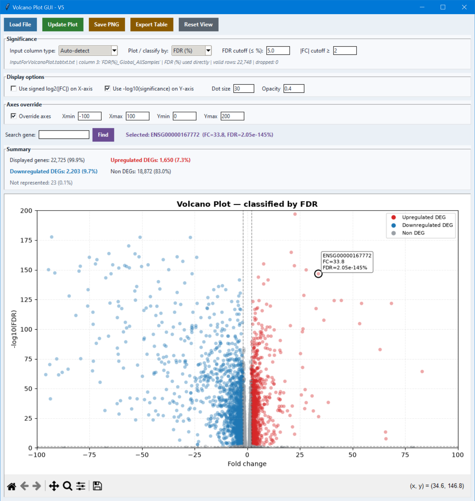
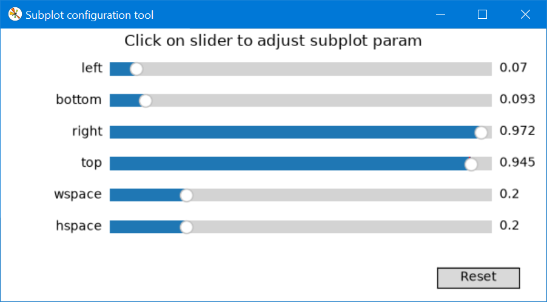

# Volcano Plot GUI

A small desktop application for exploring differential-expression results as an interactive volcano plot. It is designed for the common case where a result file contains a gene identifier, a fold change, and either raw *P*-values or FDR values.

The program is intentionally lightweight: choose a tab-delimited file, adjust the thresholds and display settings, inspect genes of interest, then save the figure or export the resulting classifications.



## What it does

- Reads tab-delimited text files with or without a header.
- Uses the first three columns as **gene**, **fold change (FC)**, and **significance**.
- Recognizes raw *P*-values, FDR fractions (`0–1`), and FDR percentages (`0–100`).
- Calculates Benjamini–Hochberg FDR when raw *P*-values are supplied.
- Colours significant upregulated genes red, significant downregulated genes blue, and all other genes grey.
- Lets you search for or click a gene to highlight it and see its values.
- Saves the current figure as PNG, PDF, or SVG, and exports the classifications as TSV or CSV.

## Requirements

Python 3 with the following packages:

```bash
pip install numpy pandas matplotlib
```

`tkinter` is also required for the interface. It is included with most standard Python installations on Windows and macOS; on Linux it may need to be installed separately through the system package manager.

## Run it

From this folder, run:

```bash
python VolcanoPlot_V5.py
```

Click **Load File**, select your tab-delimited results file, then click **Update Plot** whenever you change a setting.

`TestDEG.tabtxt` is included as an example input file.

## Input format

The first three columns are used, in this order:

| Column | Expected content | Example |
| --- | --- | --- |
| 1 | Gene name or identifier | `ENSG00000107159` |
| 2 | Signed fold change | `134.4` or `-2.1` |
| 3 | Raw *P*-value, FDR fraction, or FDR percentage | `3.04E-239` |

Extra columns are allowed but ignored. A header is optional. Rows whose FC or significance value cannot be read as a finite number are omitted from the plot; the application reports how many rows were retained.

For example:

```text
Gene	FC	FDR(%)
GeneA	2.3	0.8
GeneB	-1.7	4.2
GeneC	0.4	18.6
```

## Significance values

Leave **Input column type** on **Auto-detect** when the column header is clear. The application uses names such as `FDR`, `qvalue`, `padj`, and `adjusted p` as clues; values above 1 are treated as percentages. If a file is ambiguous, choose the interpretation manually.

- **P-value**: values must be between 0 and 1. The program calculates Benjamini–Hochberg FDR across all valid *P*-values before filtering plotting rows.
- **FDR fraction (0–1)**: values are converted to percentages internally.
- **FDR (%)**: values are used directly.

When the input contains only FDR values, raw *P*-value plotting is unavailable—FDR cannot be converted back into the original *P*-values.

## Reading the plot

A point is called a differentially expressed gene only when it meets both selected cutoffs:

- `|FC| ≥` the fold-change cutoff
- significance `≤` the *P*-value or FDR cutoff

Positive FC values are labelled **Upregulated DEG** (red) and negative values are labelled **Downregulated DEG** (blue). Points that do not meet both conditions are **Non DEG** (grey). Dashed vertical and horizontal lines show the current cutoffs.

By default, the y-axis is `-log10(significance)`, which makes very small values easier to see. You can also use signed `log2(|FC|)` on the x-axis, tune point size and opacity, or set a specific visible range under **Axes override**. **Reset View** clears any manual axis limits.

## Working with the figure

Use the built-in Matplotlib toolbar beneath the plot to pan, zoom, or return to the home view. The toolbar’s subplot-configuration button can be used for small layout adjustments when preparing a figure for publication.



Click a point or search for an exact gene identifier to highlight it. The selected-gene label and annotation show its FC and the available significance values.

## Exporting

- **Save PNG** opens a save dialog. Despite the button name, you may save the current figure as PNG, PDF, or SVG. Figures are written at 300 dpi.
- **Export Table** writes the currently loaded valid rows along with their FC, FDR percentage, available raw *P*-values, and final classification. Choose `.csv` for CSV; all other extensions are saved as tab-delimited text.

## Notes

- The plot uses the FC values exactly as supplied. If your analysis reports log2 fold changes, use those values consistently when choosing the FC cutoff.
- With **Axes override** enabled, the summary panel reports only points within the visible limits; points outside the limits are counted as not represented.
