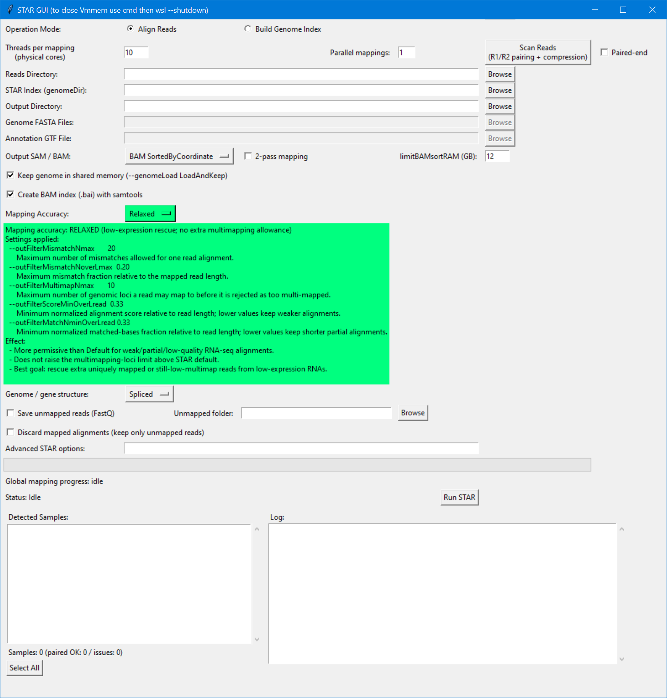

# STAR GUI for RNA-seq mapping

`Star_V52.py` is a Windows/Tkinter interface for running [STAR](https://github.com/alexdobin/STAR) through WSL. It is made for the practical part of RNA-seq analysis: selecting FASTQ files, checking their pairing, building readable STAR commands, and running several samples without manually rewriting long command lines each time.


## Genome index then mapping


| Operation | Input | What STAR creates | When it is needed |
| --- | --- | --- | --- |
| **Build Genome Index** | Reference genome FASTA, optionally a GTF annotation | A `genomeDir` folder containing STAR lookup/index files | Usually once per genome + annotation version. Rebuild only when the reference, annotation, or important index setting changes. |
| **Align Reads** | FASTQ reads from each sample and an existing `genomeDir` | SAM/BAM alignments, splice-junction table, logs, and optionally unmapped FASTQ | Once for every sequencing sample (or again if mapping settings change). |


## Setup

- Windows with WSL available.
- STAR installed inside the WSL Linux distribution and available as `STAR` on the Linux `PATH`.
- `samtools` installed in WSL if the **Create BAM index (.bai)** option is used.
- Read access to FASTQ, FASTA and GTF files, plus write access to the output folder.
- A workstation with enough RAM and disk space for the selected genome and number of simultaneous jobs. For human genome indexing and parallel mapping, 64 GB RAM with a fast SSD is a practical configuration.

The GUI converts normal Windows paths such as `P:\Data\sample.fastq.gz` into WSL paths such as `/mnt/p/Data/sample.fastq.gz`. When the output folder is on a Windows-mounted drive (`/mnt/...`), it automatically sends STAR temporary work to Linux `/tmp`. This avoids a known FIFO/temporary-file problem on NTFS mounted drives. The temporary folder is cleaned after the sample finishes, including after a failure when possible.

## Quick use

1. Start the GUI with Python on Windows:

   ```powershell
   python Star_V52.py
   ```

2. If this is a new reference, choose **Build Genome Index** and create the `genomeDir` first.
3. Choose **Align Reads** for the routine analysis.
4. Select the reads folder, click **Scan Reads**, review the detected samples, and select the ones to run.
5. Select the existing **STAR Index (genomeDir)** and an output directory.
6. Choose the output type and the mapping options appropriate for the experiment.
7. Click **Run STAR**. A window first shows the complete command(s); this is a useful last check before starting.
8. Read `Log.final.out` for every sample before continuing to counting or differential expression.

## Screenshot: relaxed RNA-seq mapping



*Figure 1. The alignment screen of the STAR GUI. The left radio button, **Align Reads**, is selected, so the fields needed for FASTQ mapping are active and the FASTA/GTF index-building fields are greyed out. At the top, ten threads are assigned to one mapping job; `Parallel mappings: 1` runs samples one after another. The output is a coordinate-sorted BAM with 12 GB allocated for BAM sorting and an accompanying `.bai` index. The green panel is the selected **Relaxed** mode. It spells out the actual filter values so the user can see that relaxed mapping is more permissive for partial or weak RNA-seq reads, while retaining the STAR multi-locus setting of 10. The lower panes are intentionally empty in this example: after scanning a reads directory, the left pane lists detected samples and pairing/compression status; during the run, the right pane receives STAR messages and the progress section shows completed samples and an estimated remaining time.*

## Alignment mode: fields and functions

### Sample discovery and compute settings

| GUI function | What it does | Why it is there |
| --- | --- | --- |
| **Threads per mapping (physical cores)** | Sets STAR `--runThreadN` for one sample. | Controls how many CPU threads STAR uses for that sample. |
| **Parallel mappings** | Runs several sample commands in parallel; `0` or `1` runs serially. | Controls how many samples are processed at the same time; total CPU/RAM use follows threads × parallel jobs. |
| **Paired-end** | Tells the scan to look for `R1` and `R2` mates. | Proper mate pairing gives STAR insert-size and paired-read information. The scan reports missing mates instead of silently treating a broken pair as normal. |
| **Reads Directory** | Folder containing FASTQ/FASTQ.gz (also `.fq`, and some `mate1`/`mate2` names). | This is the source data. The script does not modify the original FASTQ files. |
| **Scan Reads (R1/R2 pairing + compression)** | Detects candidate files, groups `R1`/`R2`, and notes compressed files. | It gives a simple quality-control overview before a long run. Compressed reads are automatically passed with STAR `--readFilesCommand zcat`. |
| **Detected Samples / Select All** | Lets the user choose the samples to map. | Allows a subset or a rerun of failed samples without rerunning everything. |
| **STAR Index (genomeDir)** | Existing STAR reference-index folder. | Required for alignment. It contains the genome search structures created by the index mode, not raw FASTA. |
| **Output Directory** | Writes STAR output with one prefix per sample. | Keeps BAMs, logs and splice junction files together. Use a new folder for a distinct run/settings combination so results are traceable. |

### Alignment outputs and performance options

| GUI function | STAR behaviour | Why it is there |
| --- | --- | --- |
| **Output SAM / BAM** | Chooses `BAM Unsorted`, `BAM SortedByCoordinate`, or `SAM` via `--outSAMtype`. | Coordinate-sorted BAM is convenient for viewing in IGV, counting, and downstream QC; unsorted BAM and SAM are also available for workflows that use them. |
| **limitBAMsortRAM (GB)** | Converts GB to bytes for `--limitBAMsortRAM`. | Sets the RAM allocation STAR uses while coordinate-sorting a BAM. |
| **Create BAM index (.bai) with samtools** | Runs `samtools index` after a BAM is made. | A `.bai` lets IGV and many tools jump directly to a genomic region instead of scanning the full BAM. It makes most sense for coordinate-sorted BAM. |
| **Keep genome in shared memory** | Adds `--genomeLoad LoadAndKeep`. | Keeps the STAR index loaded for later samples so serial mapping can start faster. |
| **2-pass mapping** | Adds `--twopassMode Basic`. | STAR first discovers splice junctions, then remaps reads using those junctions. This can improve splice-aware RNA-seq alignment, especially when sample-specific junctions matter. The GUI switches shared-genome loading accordingly when this option is selected. |
| **Save unmapped reads (FastQ)** | Adds `--outReadsUnmapped Fastx`; optional folder moves/renames the output. | Useful when investigating viral/bacterial material, contamination, an alternative genome, or poor mapping. These reads can be analysed separately. |
| **Discard mapped alignments (keep only unmapped reads)** | Sets `--outSAMtype None` and removes alignment files while retaining logs. | Makes an explicit unmapped-read workflow without filling disk with BAMs. It requires saving unmapped reads, because otherwise there would be no useful result left apart from logs. |
| **Advanced STAR options** | Appends extra parameters exactly as space-separated STAR arguments. | Gives users access to special STAR options without changing the script. |

The GUI adds useful alignment tags (`NH`, `HI`, `AS`, `nM`, `NM`, `MD`, `jM`, `jI`, `XS`) to the SAM/BAM record and marks uniquely mapped reads with MAPQ 255. These tags preserve information such as alignment score, mismatches, multiplicity and splice-junction details for later inspection.

### Mapping accuracy: Default, Relaxed, Strict

**Default** is the main reference run for most datasets. Relaxed mode is usefull when there is a biological reason to rescue weak or partial reads; `Log.final.out` provides the mapping summary for each selected mode.

| Mode | Main values used by the GUI | When it can help | What the mode changes |
| --- | --- | --- | --- |
| **Default** | Uses STAR internal defaults (mismatch max 10; mismatch fraction 0.30; multimap max 10; minimum score/matched fraction 0.66). | Standard RNA-seq baseline. | Balanced STAR filtering. |
| **Relaxed** | Mismatch max 20; mismatch fraction 0.20; multimap max remains 10; minimum score and matched fraction 0.33. | Degraded tissue, low-input RNA, or an exploratory search for reproducible low-expression RNA signal. | Keeps more partial and weak alignments. The GUI also writes one SAM/BAM record per multimapping read, keeping the BAM output compact. |
| **Strict** | Mismatch max 3; mismatch fraction 0.03; multimap max 5; minimum score and matched fraction 0.70. | A conservative sensitivity analysis or a dataset where strong matches are the focus. | Selects the strongest alignments under the strict STAR filters. |


### Genome / gene structure

| Option | What STAR receives | Typical use |
| --- | --- | --- |
| **Spliced** | `--outFilterType BySJout` and `--outSAMstrandField intronMotif`. | Normal eukaryotic RNA-seq, where mature RNA reads can span introns. This is the default and the usual choice for transcriptome data. |
| **Unspliced** | `--alignIntronMax 1`, `--alignSJoverhangMin 999`, normal filter type, no strand field. | Genomic DNA, prokaryotic data, or a deliberately intron-free mapping problem. It blocks normal splice junction behaviour. |

## Build Genome Index mode

When **Build Genome Index** is selected, the mapping-specific FASTQ controls are disabled and three fields matter:

| GUI function | What it does | Why it is there |
| --- | --- | --- |
| **Genome FASTA Files** | One or more reference genome FASTA files passed as `--genomeFastaFiles`. Compressed `.gz` FASTA is supported when estimating length. | This is the genome sequence that reads will map against. Multiple chromosome/contig FASTA files may be selected together. |
| **Annotation GTF File** | Optional `--sjdbGTFfile`. | Adds known exon-exon junctions to the STAR index. For standard RNA-seq this is strongly recommended: annotated splice junctions are represented during mapping. |
| **Output Directory** | Used as `--genomeDir`. | This is where STAR writes the index. It becomes the folder selected later in **STAR Index (genomeDir)**; a dedicated reference-index folder keeps the project organised. |
| **Threads per mapping** | Used as `--runThreadN` during `--runMode genomeGenerate`. | Genome generation can use several CPUs; this label is shared with mapping mode for simplicity. |
| **Advanced STAR options** | Added to the genome-generation command. | Supports special references or manual STAR index settings. |

The script calculates `--genomeSAindexNbases` from the total FASTA length using STAR's standard logarithmic rule and uses the supported STAR value range from 1 to 14. An advanced `--genomeSAindexNbases` value is used directly when supplied.

Index creation is generally done once per clearly defined reference. Record the genome build, FASTA source/version, GTF version, date and any advanced options with the resulting `genomeDir`. A change in annotation produces a corresponding new reference configuration for mapping and counting.

## What files to inspect after mapping

For each sample, STAR commonly creates files using the selected sample prefix:

- `*_Log.final.out` — the first QC report to read: uniquely mapped rate, multi-mapping, too-many-loci reads, mismatch rate, splice junctions, and more.
- `*_Aligned.sortedByCoord.out.bam` — coordinate-sorted reads when that output was selected.
- `*.bai` — BAM index, when requested.
- `*_SJ.out.tab` — detected splice junctions for alignment workflows.
- `*_Unmapped.out.mate1` / `mate2` — unmapped reads when saving them; the GUI can move and rename them to the chosen unmapped folder and be used in other pipelines (e.g. host depletion for Kraken2)
- `*_Log.out` and related STAR logs — STAR execution details and option audit trail.


## Implementation notes

- Input fields are validated before the run: positive thread count, non-negative parallel jobs, required folders, detected/selected samples, and compatible unmapped-only settings.
- All commands are shown before execution. This makes the workflow more transparent and gives a final chance to stop an incorrect run.
- The generated shell commands run in a background thread so the GUI and log remain responsive.
- Progress is updated every ten seconds from completed sample markers; the remaining-time estimate is approximate and becomes better after the first samples finish.
- The script increases the Linux open-file limit before running STAR, supporting large jobs with many files.

## Files in this folder

```text
Star_V52.py                         STAR GUI source code
Screenshot/Mapping_Relaxed.png      Example of the Relaxed alignment interface
Readme.md                           This documentation
```
