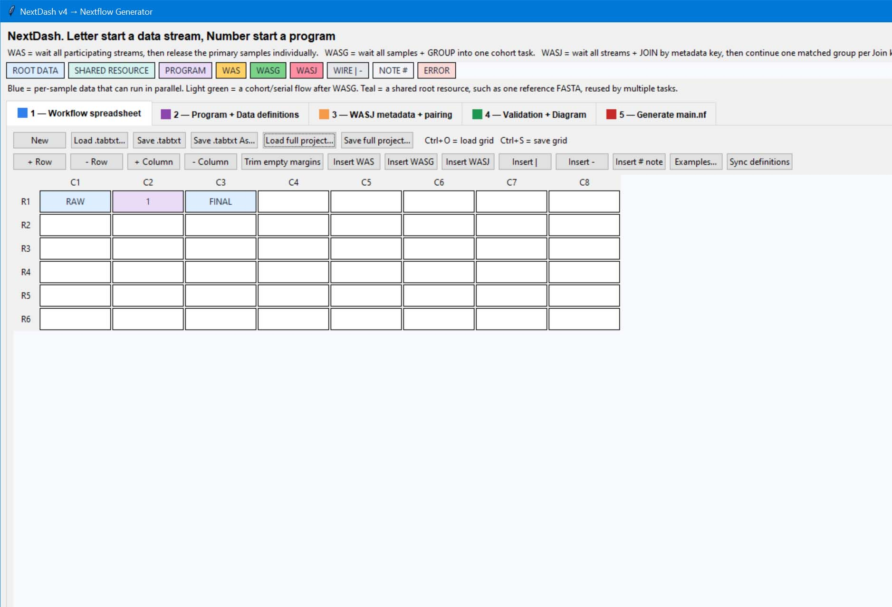
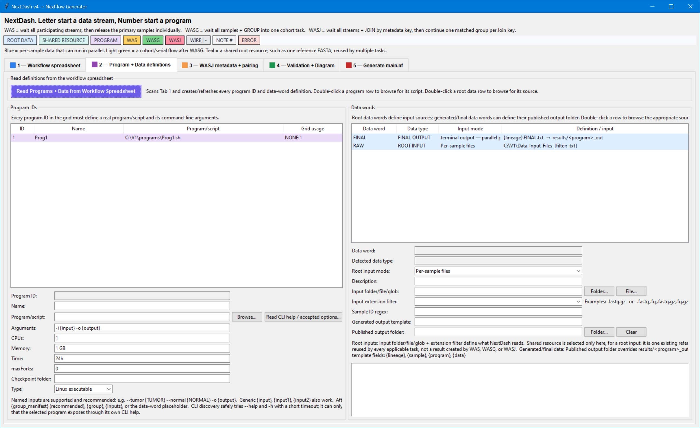
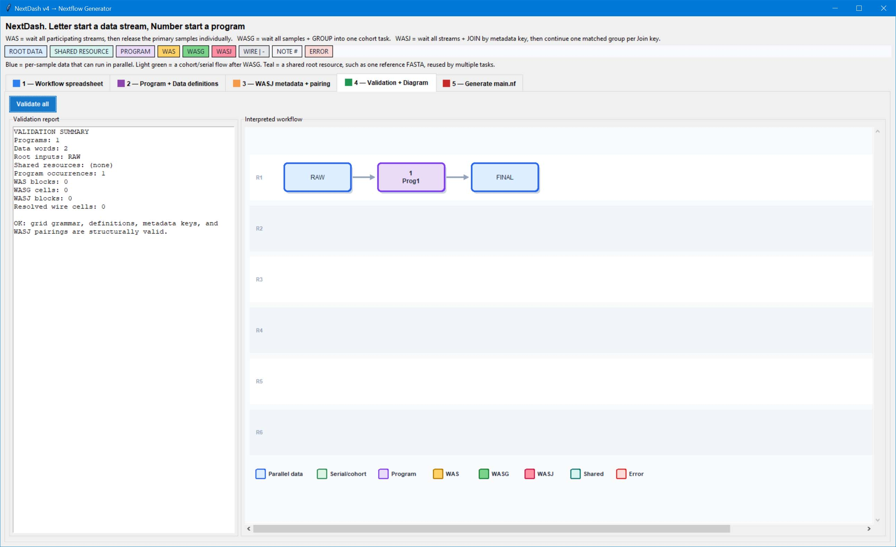
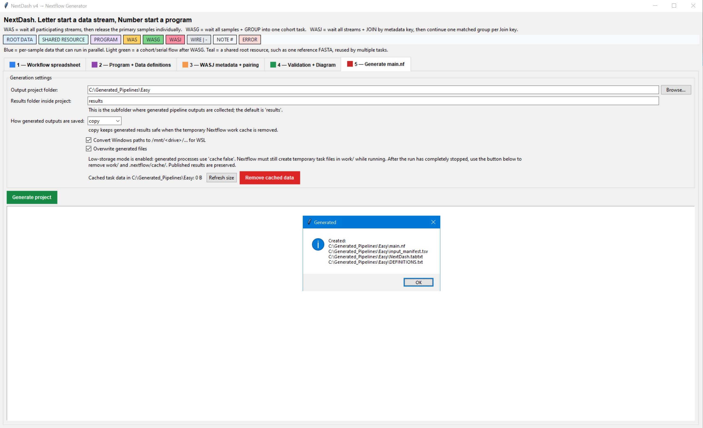
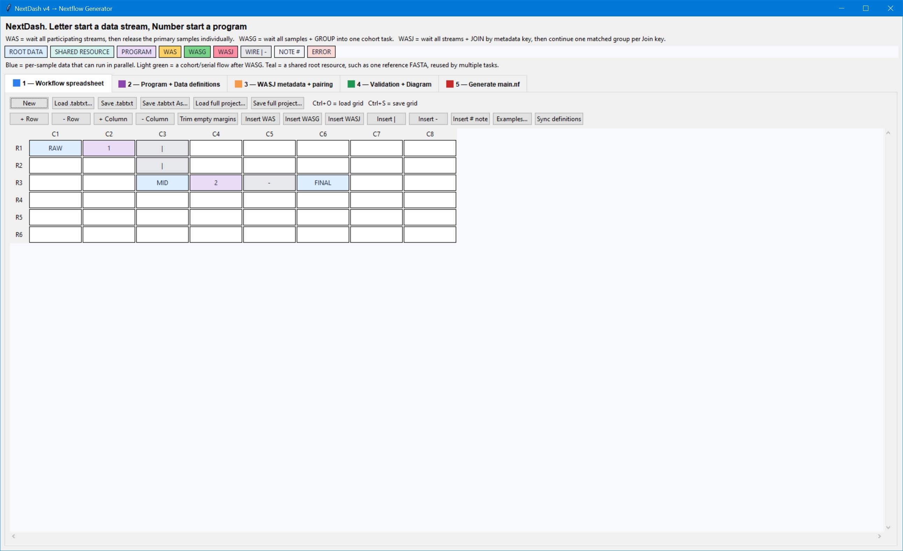

Graphical approach for assembling reproducible, sample-aware Nextflow workflows, including validation of inputs, outputs, and dependencies.
Tab 1 — Workflow spreadsheet: Draw the pipeline using data words, program IDs, reserved words, wires, and notes.

*Figure 1 — NextDash workflow spreadsheet used to visually construct a Nextflow pipeline.*

Tab 2 — Program + Data definitions: Define each program/script and each input, intermediate, or output data word.

Tab 3 — WASJ metadata + pairing: Define how related samples are matched using metadata, such as Patient_ID and Tumor/Normal status.

Tab 4 — Validation + Diagram: Check the pipeline for errors and display how NextDash interprets the workflow.

Tab 5 — Generate main.nf: Generate the Nextflow main.nf workflow and configure output folders, WSL paths, and caching.

Words starting with numbers: Program IDs, such as 1.Star, 2.FeaturesCount, or only a number like 05. Color Blue or lihght green.
Words starting with letters: Data words, such as FASTQ, BAM, TUMOR, or RESULT. Color purple.

Blue: Per-sample data processed in parallel.
Light green: Data processed in parallel, typically groupped by WASG.
Teal: Shared resource used by multiple samples, such as a reference genome.

Purple: Program.

Yellow/orange: WAS. 'Wait for All Samples'. Wait until all required samples (on the left) are ready before continuing.
Green: WASG. 'Wait for All Samples and Group'. Same than WAS but groupe the samples so no more parralele.
Pink: WASJ. 'Wait for All Samples and Join'. Wait for all related samples and join them by matching names using metadata then continue in parrale.

Red: Validation error.
Gray: Connection wires - and |. Horizontal and vertical connections between workflow elements to make complex diagrams more easy to understand.

#: Comment or note; it is not executed.

How to generate blocks
