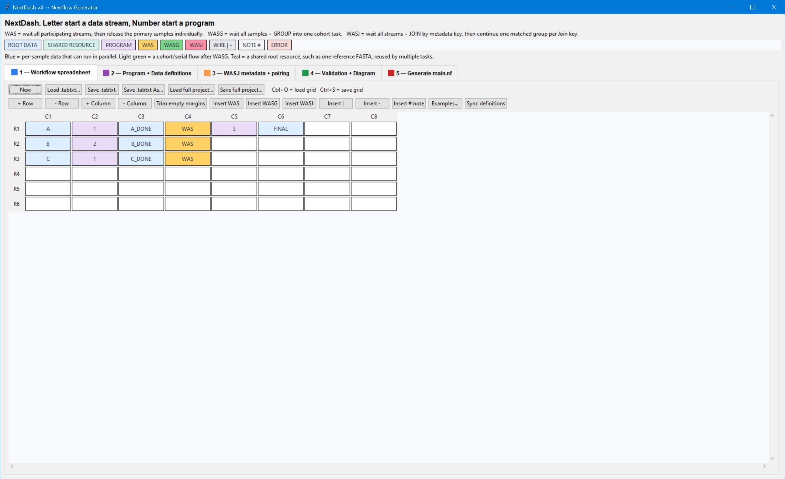
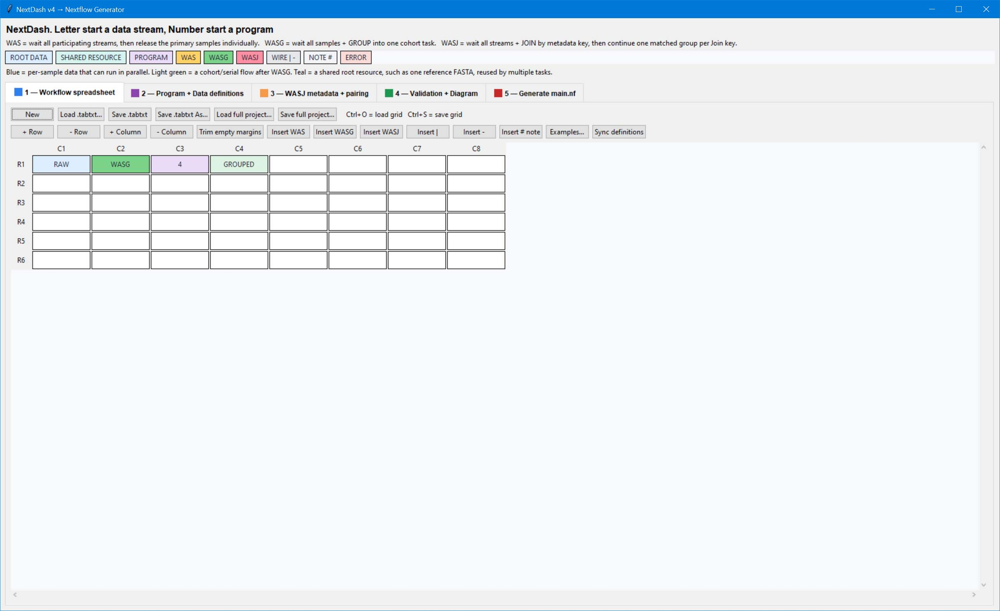
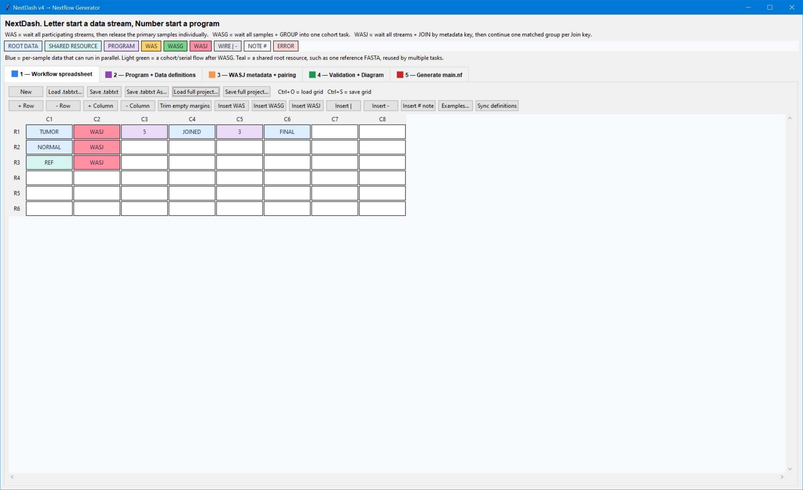
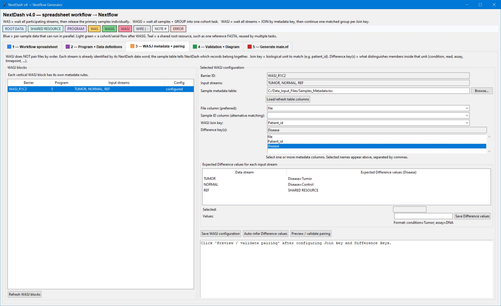

# NextDash v8 — visual Nextflow workflow builder

NextDash is a desktop GUI for designing sample-aware [Nextflow](https://www.nextflow.io/) workflows as a spreadsheet-like diagram. It turns a validated visual graph into a runnable `main.nf` and an input manifest, without requiring users to write the pipeline structure by hand.

It is especially useful when a workflow mixes per-sample processing with synchronization steps:

- **WAS** — wait for all participating streams, then release the primary samples one at a time.
- **WASG** — wait for all samples and process them together as one cohort/group task.
- **WASJ** — wait for related streams and join them by metadata (for example, pair Tumor and Normal by `patient_id`).

> NextDash generates the Nextflow workflow and input manifest. You still need Nextflow and the tools/scripts referenced by your program definitions to run the generated project.

## Screenshots

### Standard per-sample workflow


### Synchronization examples

| WAS | WASG | WASJ |
| --- | --- | --- |
|  |  |  |
| Wait for all required streams before continuing individual samples. | Collect a stream into one cohort-level task. | Join related records using a metadata table. |

For WASJ, configure the metadata and inspect the pairing before generation:



## Requirements

- Python 3 with Tkinter (the GUI has no third-party Python package dependencies).
- Nextflow to run or manually stub-validate a generated pipeline.
- On Windows, a working WSL installation is recommended. NextDash can convert Windows input/output paths to `/mnt/<drive>/...` paths for the generated workflow.
- Every program configured in the app must be available in the environment where the generated pipeline runs. NextDash supports Linux executables, Python 3 scripts, R scripts, and Bash scripts.

## Start the application

From this repository:

```powershell
py -3 .\nextdash_V8.py
```

If your system uses `python` instead of the Python launcher:

```powershell
python .\nextdash_V8.py
```

On Linux/macOS, run `python3 nextdash_V8.py`. If Tkinter is not installed on Linux, install your distribution's `python3-tk` package first.

## Quick start

1. In **Tab 1 — Workflow spreadsheet**, draw the data flow from left to right. Use a word beginning with a letter for a data stream and a token beginning with a number for a program ID.
2. Use `|` and `-` only to route a flow vertically or horizontally; use `#` to add a non-executing note.
3. Click **Read Programs + Data from Workflow Spreadsheet** in **Tab 2**. Define each program's path, arguments, CPU/memory/time settings, and each root data input.
4. For a WASJ workflow, configure the sample metadata table, join key, difference key(s), and expected values for each incoming stream in **Tab 3**.
5. Click **Validate all** in **Tab 4** and resolve every error. The interpreted diagram is the best way to confirm that the GUI understood the intended graph.
6. In **Tab 5**, choose an output folder and click **Generate project**.
7. Run the generated project with Nextflow:

   ```bash
   cd /path/to/generated-project
   nextflow run main.nf
   ```

   If task caching was enabled when the project was generated, rerun with `nextflow run main.nf -resume` to reuse successful tasks.

   To have Nextflow check scheduling/staging without launching the configured analysis commands, use:

   ```bash
   nextflow run main.nf -stub-run
   ```

The **Examples…** menu includes working starting diagrams for WAS, WASG, WASJ, and a mixed workflow.

## Building blocks and colors

| Item | Meaning |
| --- | --- |
| `FASTQ`, `BAM`, `RESULT` | Data word / data stream. Root data words are sources; downstream words are generated data. |
| `1`, `1.Star`, `05` | Program ID. The number-first form distinguishes programs from data words. |
| `WAS` | Wait for all participating streams, then continue the primary stream per sample. |
| `WASG` | Wait for all samples and create one group/cohort task. |
| `WASJ` | Wait, then join records using metadata—not row or file order. |
| `|`, `-` | Vertical and horizontal wires for a clearer diagram. |
| `# note` | Comment only; not executed. |

| Color | Meaning |
| --- | --- |
| Blue | Per-sample stream that can run in parallel. |
| Light green | Cohort/serial flow, typically downstream of WASG. |
| Teal | Shared root resource, such as one reference genome reused by tasks. |
| Purple | Program. |
| Yellow/orange | WAS barrier. |
| Green | WASG barrier. |
| Pink | WASJ barrier. |
| Red | Validation error. |
| Gray | Diagram wire. |

## Configure programs

Each program ID needs a real executable or script and an argument template. Named placeholders are recommended because they make multi-input processes explicit:

```text
--tumor {TUMOR} --normal {NORMAL} -o {output}
```

Useful placeholders include:

| Placeholder | Meaning |
| --- | --- |
| `{input}`, `{input1}`, `{input2}` | Logical input streams. |
| `{DATA}` | A named data stream, such as `{TUMOR}` or `{READS}`. |
| `{DATA_1}`, `{DATA_2}` | Individual files in a grouped input. Members are ordered alphabetically by filename. |
| `{inputs}` | All staged files after WASG. |
| `{group_manifest}` | TSV manifest of a WASG group. |
| `{output}` | The generated output file path. |
| `{sample}` | Current sample ID. |
| `{cpus}` | CPUs allocated to the Nextflow task. |

Use doubled braces for literal braces in a command template, for example `{{"key": 1}}`.

## Configure data

For root inputs, provide a file, folder, or glob plus an optional extension filter. `**` searches nested folders recursively. A sample-ID regex can derive sample names from filenames.

For paired-end inputs, a typical configuration is:

- Sample-ID regex: `(.+)_R[12]\.fastq\.gz`
- Enable **Group same sample ID**
- Set **Files/sample** to `2`
- Reference the members as `{READS_1}` and `{READS_2}` in the program arguments

Grouped members are sorted alphabetically. They are not automatically interpreted as R1/R2, lane, or assay categories, so use a naming scheme and argument template that make the desired ordering unambiguous.

A root input can also be configured as **Shared single resource**, for example a reference FASTA. A shared resource is one existing file that is reused across relevant tasks; it is not a product of WAS, WASG, or WASJ.

For generated/final data, set an output template and, optionally, a published-output folder. Per-sample templates must include `{lineage}` or `{sample}`. Available fields are `{lineage}`, `{sample}`, `{program}`, and `{data}`.

## WASJ metadata pairing

WASJ pairing is metadata-driven. It does not assume that two directories are in the same order.

1. Select the WASJ block in Tab 3.
2. Load a CSV/TSV metadata table.
3. Choose either a file column (preferred) or sample-ID column to map files to metadata records.
4. Select a **Join key** such as `patient_id`.
5. Select one or more **Difference keys**, such as `condition`, `assay`, or `timepoint`.
6. Define expected values for each input stream, for example `condition=Tumor` for `TUMOR` and `condition=Normal` for `NORMAL`.
7. Use **Preview / validate pairing** before generating.

## Generated project

Generating a project writes these files into the selected output folder:

| File | Purpose |
| --- | --- |
| `main.nf` | Generated Nextflow DSL2 workflow. |
| `input_manifest.tsv` | Input files, sample IDs, lineage, and metadata used at runtime. |
| `NextDash.tabtxt` | Tab-separated copy of the visual workflow grid. |
| `DEFINITIONS.txt` | Readable summary of programs, data, and WASJ configuration. |

You can also save the editable GUI state as `*.nextdash.json`, which preserves the grid, definitions, WASJ configuration, and generation settings. Save this alongside your generated project for reproducibility.

By default, published task outputs are copied, which keeps results usable after the Nextflow work cache is removed. Nextflow task caching is optional; enable it only if you plan to rerun with `-resume`. The app can report and safely remove its generated project's `work/` and `.nextflow/cache/` directories after all runs have stopped.

## Validation and troubleshooting

- Run **Validate all** before every generation. It checks graph structure, missing definitions, paths, metadata pairing, output publication conflicts, and runtime-safe identifiers.
- Use **Read CLI help / accepted options…** on a selected program to try its `--help`/`-h` output with a short timeout.
- Run `nextflow run main.nf -stub-run` to have Nextflow parse and stage the generated workflow without running the real analysis commands.
- Leave **Convert Windows paths to `/mnt/<drive>/...`** enabled when generating a pipeline that runs under WSL.
- If `nextflow` is not found during stub validation, install/configure Nextflow inside the WSL distribution used to run the pipeline.
- If generation says files already exist, choose a new output folder or enable **Overwrite generated files** deliberately.

## Current scope

NextDash is a graphical workflow generator, not an environment manager. It does not install Nextflow, containers, Conda environments, or analysis tools, and it does not execute the final analysis pipeline from the GUI. Review the generated `main.nf` and use your normal Nextflow profile/container/environment setup before running production data.

## Repository layout

```text
nextdash_V8.py   # Standalone Tkinter application and Nextflow renderer
README.md        # Project documentation
Screenshots/     # UI and workflow examples used above
```

## Contributing

Before opening a change, confirm that the application still compiles:

```powershell
py -3 -m py_compile .\nextdash_V8.py
```

When changing workflow rendering, also validate a representative generated pipeline with `nextflow run main.nf -stub-run` and add/update a screenshot or reproducible example when appropriate.
