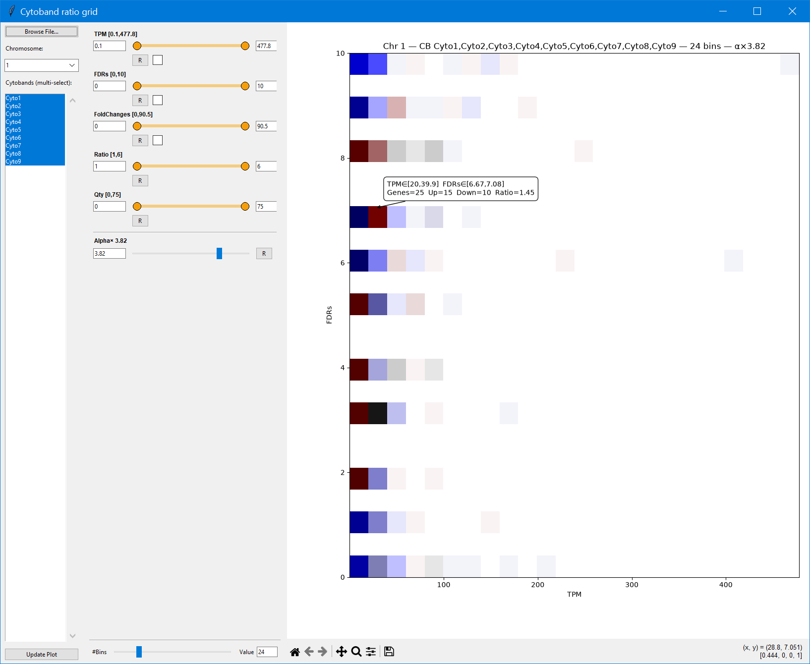
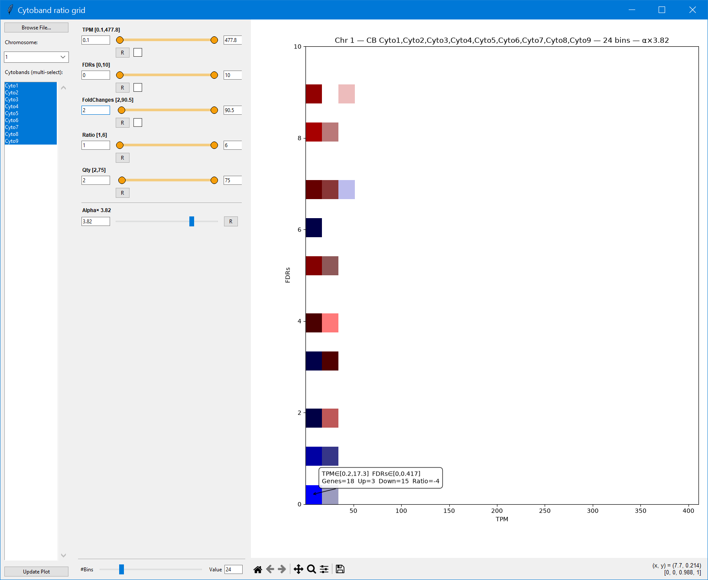

# Cytoband Ratio Grid

`PlotCytobandDE_V31.py` is an interactive tool for exploring differential-expression thresholds within a chromosome or a selected set of cytobands. It bins genes by statistical significance (for example, FDR) and expression intensity (here, TPM), then shows whether each bin is dominated by upregulated or downregulated genes.

The main purpose is to help choose practical combinations of statistical cutoff, expression level, fold change, and minimum gene count. Instead of testing one threshold at a time, the grid shows how the balance of up- and downregulated genes changes across the complete FDR–TPM space.



## What the colors mean

Each square is one FDR–TPM bin containing genes from the selected chromosome and cytobands.

- **Red** means that the bin contains more upregulated than downregulated genes.
- **Blue** means that the bin contains more downregulated than upregulated genes.
- **Color saturation** is determined by the absolute up/down ratio. A stronger imbalance between the two directions produces a stronger red or blue.
- **Transparency** is determined by the number of genes in the bin. Bins containing more genes are more opaque; bins with fewer genes are lighter.
- **White/empty space** means that the bin contains no qualifying genes or that it was excluded by the Ratio or Qty filters.

More precisely, the program calculates a pseudocount-adjusted ratio:

```text
up-dominant bin:     (up + 1) / (down + 1)
down-dominant bin: - (down + 1) / (up + 1)
```

Positive ratios are drawn in red and negative ratios in blue. Saturation is scaled using the 95th percentile of the absolute ratios, which prevents a single extreme bin from making the rest of the plot appear nearly white. Opacity is the bin’s gene count relative to the largest bin, multiplied by the adjustable **Alpha×** value.

The second screenshot shows a more restrictive selection. The hover box reports the exact TPM and FDR intervals, total genes, up/down counts, and ratio for a bin.



## Requirements

Install Python 3 and the required packages:

```bash
pip install numpy pandas matplotlib mplcursors
```

The graphical interface also requires `tkinter`, which is included with most standard Python installations on Windows and macOS.

## Run the application

From this folder, run:

```bash
python PlotCytobandDE_V31.py
```

Click **Browse File…** and select a tab-delimited input file. A test dataset is provided at `test_file/Input.tabtxt`.

## Input format

The first six columns are read by position, so they must appear in this order:

| Position | Content | Example header |
| --- | --- | --- |
| 1 | Chromosome | `Chromosom` |
| 2 | Gene name or identifier | `GeneName` |
| 3 | Cytoband | `Cytoband` |
| 4 | Fold change | `FoldChanges` |
| 5 | Statistical value, such as FDR | `FDRs` |
| 6 | Expression intensity | `TPM` |

For example:

```text
Chromosom	GeneName	Cytoband	FoldChanges	FDRs	TPM
1	Gene152	Cyto1	-3.5	0.001	12
1	Gene29	Cyto1	2.8	0.020	24
```

The FC, FDR, and TPM columns must contain numeric values. Rows with invalid values in any of those three columns are removed during import. The original column names are retained in the axes, tooltips, and exported table.

## How the grid is built

The program follows this sequence:

```text
select chromosome/cytobands
        ↓
filter genes by TPM, FDR, and absolute FC
        ↓
divide the remaining FDR–TPM space into bins
        ↓
count upregulated and downregulated genes per bin
        ↓
filter bins by ratio and gene quantity
        ↓
draw direction, saturation, and transparency
```

Genes with FC greater than `1` are counted as upregulated, and genes with FC below `1` are counted as downregulated. The FC range control uses the absolute FC value. The interpretation therefore assumes that the input fold-change scale and direction were prepared consistently with this rule.

## Selecting chromosomes and cytobands

After loading a file, choose a chromosome from the dropdown. All cytobands on that chromosome are selected initially. To study a smaller region, select one or several cytobands in the list and click **Update Plot**.

Combining cytobands is useful when the goal is to identify a threshold that remains informative across a larger chromosomal region. Selecting a single cytoband focuses the grid on its local gene population.

## Gene-level filters

The first three dual-range sliders filter genes before binning:

| Filter | Role |
| --- | --- |
| TPM | Selects the permitted range of expression intensity. This becomes the x-axis. |
| FDR | Selects the permitted range of statistical significance. This becomes the y-axis. |
| Fold change | Selects the permitted absolute FC range. It affects which genes enter the bins but is not an axis. |

Each slider can be adjusted with its two handles or by typing minimum and maximum values. **R** resets that row to the full data range.

The small checkbox beside TPM, FDR, or FC changes that metric to a logarithmic display/selection scale:

- TPM: `log10(TPM + 1)`
- FDR: `−log10(FDR)`
- absolute FC: `log10(|FC| + 1)`

Log transformation changes the slider and binning scale, not the values written to an exported gene table. Zero FDR values are clipped to a very small positive number before applying `−log10`.

## Bin-level filters

The next two sliders operate after the genes have been assigned to bins:

| Filter | Role |
| --- | --- |
| Ratio | Keeps bins within a selected absolute up/down-ratio range. Increase the minimum to emphasize bins dominated by one direction. |
| Qty | Keeps bins containing a selected number of classified genes. Increase the minimum to avoid choosing thresholds supported by only a few genes. |

These two filters are especially important when deciding on a threshold. A highly saturated bin can have a large ratio but very few genes, whereas an opaque bin can contain many genes with only a modest directional imbalance. A useful cutoff normally considers both properties.

## Bins and Alpha

**#Bins** controls the grid resolution from 5 to 100 bins per axis. More bins give finer threshold intervals but may spread genes across many low-count cells. Fewer bins produce broader, more stable summaries.

**Alpha×** multiplies the opacity derived from gene quantity. It changes visibility only; it does not change gene counts, ratios, or filtering. Increase it when valid low-count bins are difficult to see, and reduce it when dense bins obscure the overall pattern.

## Finding a useful threshold

A practical workflow is:

1. Select the chromosome and cytobands of interest.
2. Start with the full TPM, FDR, and FC ranges.
3. Choose a moderate number of bins so each cell has enough genes to interpret.
4. Hover over candidate cells and compare their gene count, up/down balance, and ratio.
5. Raise the minimum **Qty** to remove bins supported by too few genes.
6. Raise the minimum **Ratio** to emphasize stronger directional enrichment.
7. Narrow the FDR, TPM, and absolute-FC ranges and check whether the pattern remains stable.
8. Export the genes from the selected region for biological review and validation.

The display is an exploratory aid for choosing and understanding cutoffs. The final threshold should also reflect the experimental design, multiple-testing procedure, sample size, effect-size requirements, and any pre-specified analysis plan.

## Inspecting and exporting a region

Hover over a colored square to display:

- the TPM interval;
- the FDR interval;
- the number of genes;
- the upregulated and downregulated counts;
- the signed up/down ratio.

Drag a rectangle over one or more bins to export the corresponding genes as a tab-delimited file. The export begins with a reproducibility summary containing the chromosome, selected cytobands, active scales, selected TPM/FDR ranges, number of touched bins, gene counts, and combined ratio. The table that follows contains the original chromosome, gene, cytoband, FC, TPM, and FDR values.

The standard Matplotlib toolbar below the figure can be used to return home, pan, zoom, configure the plot, or save an image of the current grid.
