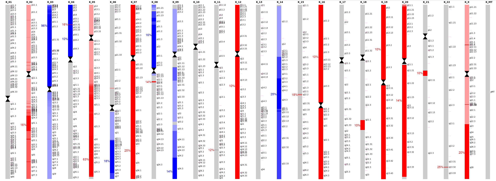
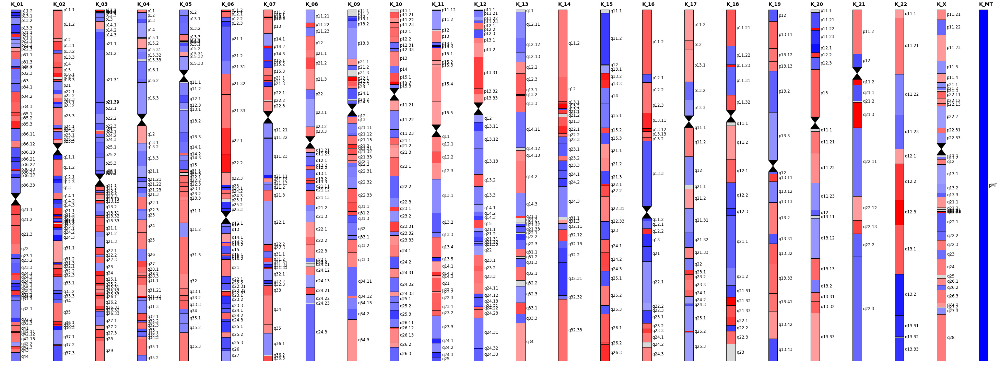
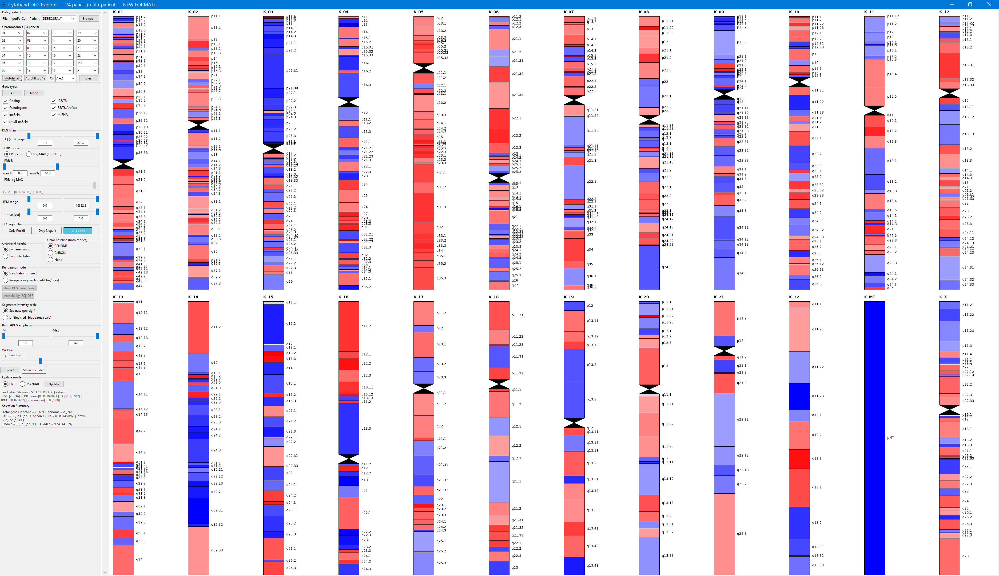
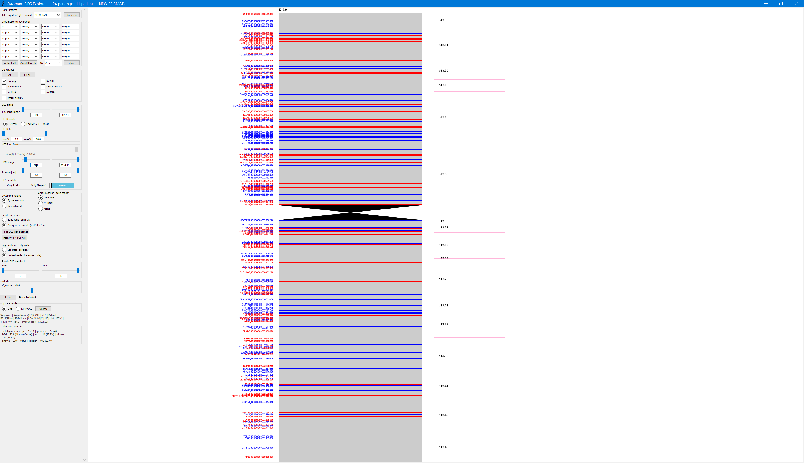
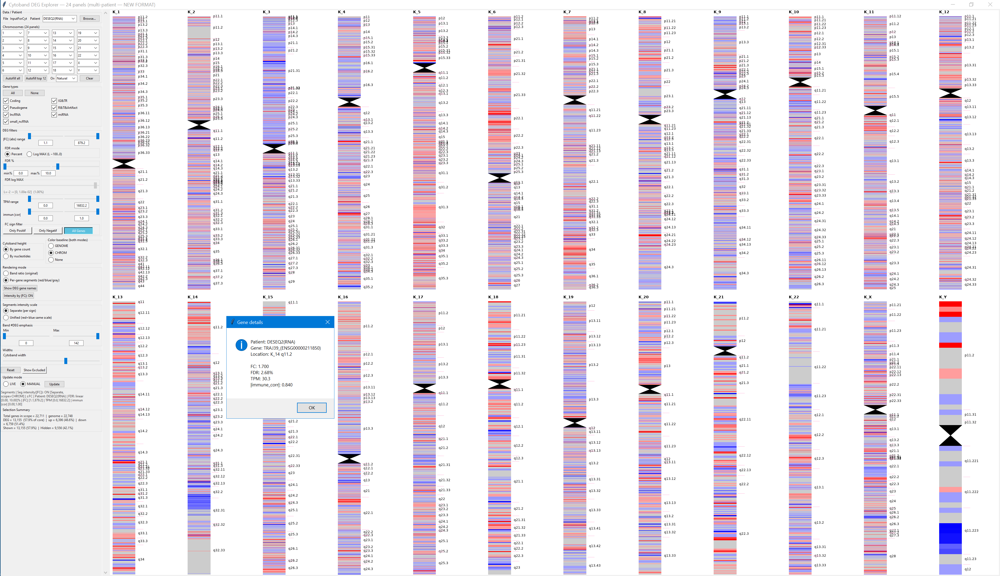
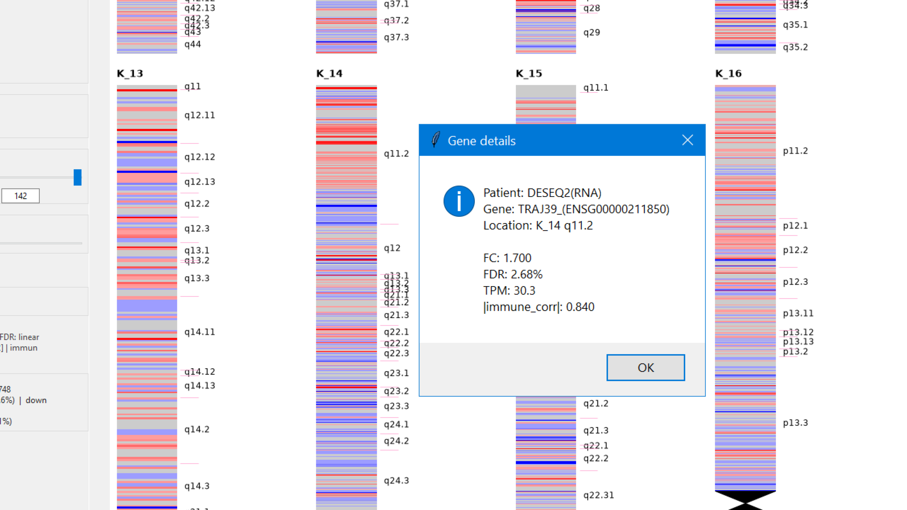

# Cytoband DEG Explorer

`K_CytobandDE_V83.py` is an interactive, multi-panel explorer for projecting differential-expression and DNA copy-number results across cytobands and genes. It can display up to 24 chromosome panels at once, switch between a compact cytoband summary and a per-gene view, filter results interactively, and inspect one cohort or patient at a time.

This program analyzes how **DNA copy-number frequency** and **RNA differential expression** are interconnected, either at the individual-patient level or globally at the cohort level.


The meaning of each color follows the sign of the supplied FC-like effect or low-pass DNA-sequencing result. Colors should therefore be interpreted in the context of the input analysis. For low-pass DNA sequencing, blue represents DNA loss and red represents DNA gain. For gene-expression results that use non-tumor expression as the reference, blue represents gene downregulation and red represents gene upregulation.

## Example views

### Cohort DNA alterations

This example is based on low-pass DNA sequencing from a cohort of 56 patients. The colored cytobands summarize the frequency and direction of DNA variation within the cohort. In this view, blue denotes loss and red denotes gain. For example, the blue `96%` at chromosome 3p means that nearly all patients have a loss in that region; the `63%` gain at chromosome 5q indicates a recurrent gain in 63% of the cohort.



### RNA differential expression

The same layout can show RNA differential expression from DESeq2. Here, red represents genes with positive FC (upregulation) and blue represents negative FC (downregulation).



## Requirements and launch

Install Python 3 and the required packages:

```bash
pip install numpy pandas matplotlib openpyxl
```

`tkinter` is also required for the desktop interface. It is normally included with Windows and macOS Python installations.

Run the program from this folder:

```bash
python K_CytobandDE_V83.py
```

Use **Browse…** to load a tab-, comma-, semicolon-, or pipe-delimited text file, or an Excel workbook. `Test_File/InputForCytobandK_RNA_DNA_V11_Cohort+2Patients.tabtxt` is an example input.

## Input format

An example input file is provided in the `Test_File` folder.

The first eight columns have a fixed order. Every remaining patient or cohort is represented by a three-column block: FC, FDR, and TPM.

| Position | Required field | Purpose |
| --- | --- | --- |
| 1 | `chr` | Chromosome name/number. `chr` prefixes are accepted. |
| 2 | `band` | Cytoband, such as `p21.1` or `q22.1`. |
| 3 | `band_gene_count` | Approximate number of genes in the cytoband. |
| 4 | `band_nt_size` | Cytoband size in nucleotides. |
| 5 | `gene` | Gene name/identifier. |
| 6 | `gene_order` | Position/order of the gene within its chromosome. |
| 7 | `immune_corr` | Gene correlation with the selected immune-related measure. |
| 8 | `gene_type` | Gene category, for example Coding, lncRNA, pseudogene, or another study-specific class. |
| 9 onward | `[Patient_FC, Patient_FDR, Patient_TPM]` | Repeated triplet for each patient or cohort comparison. |

The patient/cohort label is taken from the FC column header before its first underscore. After the first eight columns, the total number of remaining columns must be divisible by three. The application expects FDR values in **percent** (0–100), not fractions; use the FDR mode controls to work with either a direct percent range or a log-scale upper bound.

## Main controls

The left panel contains the data, chromosome, filtering, and rendering controls.

| Control | Default | What it changes |
| --- | --- | --- |
| Patient | First detected triplet | Selects which patient/cohort FC, FDR, and TPM values to display. |
| Chromosome panels | 24 panels | Choose chromosomes manually, fill all panels, fill only the top 12, or clear them. |
| Gene types | All selected | Restricts displayed/counting genes to selected classes. This is useful for testing focused views, such as immune genes, lncRNAs, or pseudogenes. |
| Absolute FC range | 1.1–10 | Keeps genes whose absolute FC lies within the range. |
| FDR | 0–10% | Filters by FDR in percent, or switch to **Log MAX** when setting a very small upper FDR limit. |
| TPM range | 0–100 | Filters RNA by expression abundance. |
| Absolute immune correlation | 0–1 | Filters genes according to their relationship with immune expression (used for immune deconvolution of tumor tissue). |
| FC sign | Both signs | Limit the view to positive FC only, negative FC only, or both directions. |
| Cytoband height | Gene count | Scale cytoband height by the number of genes or by nucleotide size. |

Changing filters does not alter the input file. It only controls which genes contribute to the current drawing and selection summary.

## Band ratio mode

**Band ratio (original)** condenses each cytoband into a single colored bar. Its color reflects the balance of qualifying positive and negative FC values, with intensity also responding to the amount of evidence in the band. It is the compact view used for broad genome-level patterns such as recurrent gains/losses or overall up/downregulated regions.

**Color baseline** determines how the balance is centered:

- **GENOME** centers a chromosome against the qualifying genome-wide distribution.
- **CHROM** centers it against the qualifying distribution within that chromosome.
- **None** leaves the balance uncentered.

The **Band #DEG emphasis** range dims bands outside the chosen count range. **Show Excluded** is available in band mode to inspect genes/bands excluded by the active filters.

## Per-gene segment mode

**Per-gene segments (red/blue/gray)** draws individual genes along the cytoband. Qualifying positive-FC genes are red, qualifying negative-FC genes are blue, and genes excluded by the active filters are gray. Use **Show DEG gene names** to label the selected genes. Click a colored segment to inspect its gene name, FC, FDR, TPM, immune-correlation value, and other available details; gray filtered segments are intentionally not clickable.

The following multi-parameter view illustrates how the filters can focus on different biological questions—including immune-gene deconvolution, lncRNAs, and pseudogenes—without changing the underlying source data.



This view projects the result at the individual-gene level across the selected chromosomes.



## Intensity by absolute FC

When **Intensity by |FC|** is on in segment mode, color strength is proportional to the absolute FC: stronger effects are drawn with more saturated red or blue, while smaller qualifying effects remain visible in a lighter tint. This is helpful when many genes meet the thresholds but their effect sizes differ substantially.



Two scaling approaches are available:

- **Separate (per sign)** scales red and blue genes independently. Use this when up- and downregulated effects have different ranges and you want contrast within each direction.
- **Unified (red + blue same scale)** uses a shared absolute-FC scale. Use this when comparing saturation directly between gains and losses or up- and downregulation.

The color-baseline choice also sets the scaling scope for segment intensity: **GENOME** uses all qualifying segments; **CHROM** uses the qualifying segments in the current chromosome; **None** behaves as genome-wide for this purpose. Scaling uses robust 5th–95th percentile bounds to reduce domination by extreme FC values.

The zoomed example below shows how the setting makes a DESeq2-derived gene effect easier to read locally.



## Updating the view

Use **LIVE** mode to redraw the figure after each setting change. A powerful workstation may be required when all genes are projected at 4K resolution. For large tables or when testing several filters, switch to **MANUAL** mode: changes are queued until **Update** is clicked. **Reset** restores the default display settings.

The selection summary and status line report the current patient, mode, filter limits, FDR interpretation, and—in segment mode—the intensity setting and scope. These are useful checks before comparing screenshots or reporting a result.
