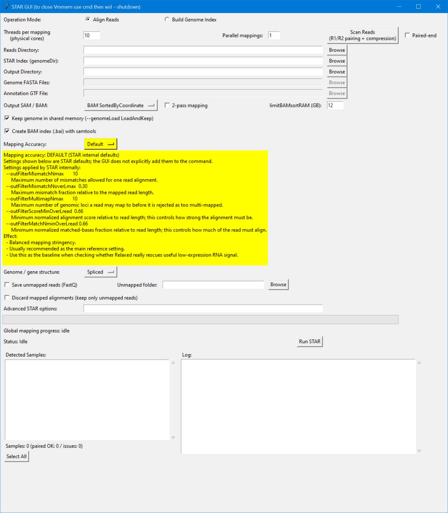
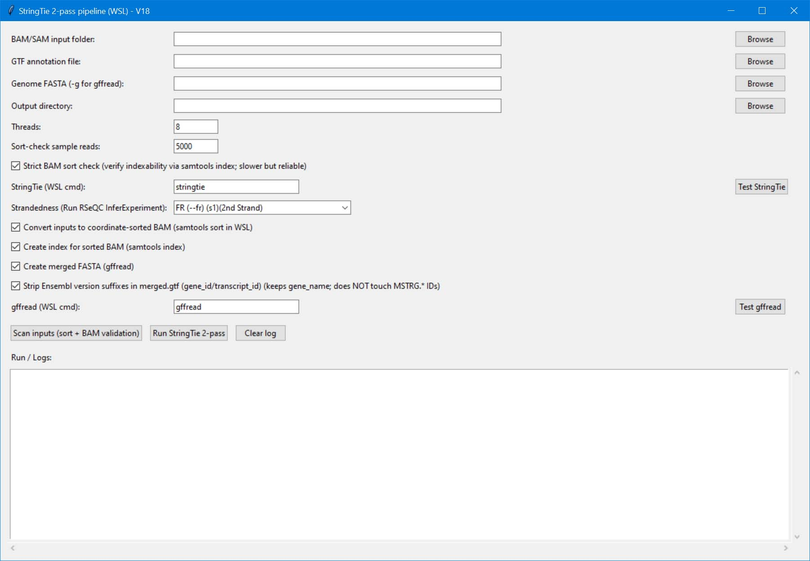
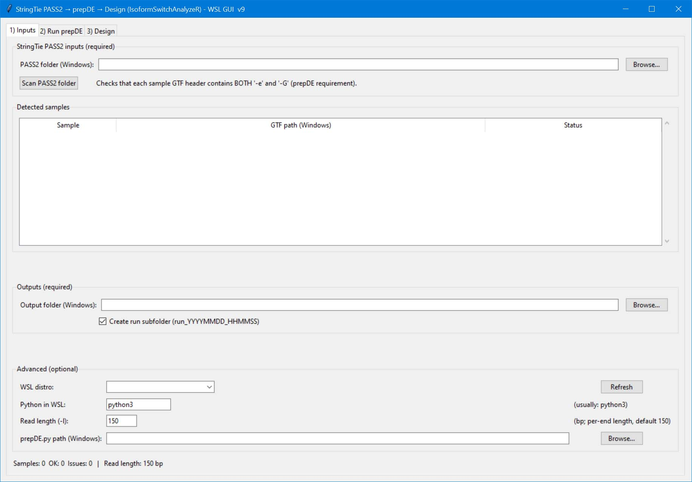
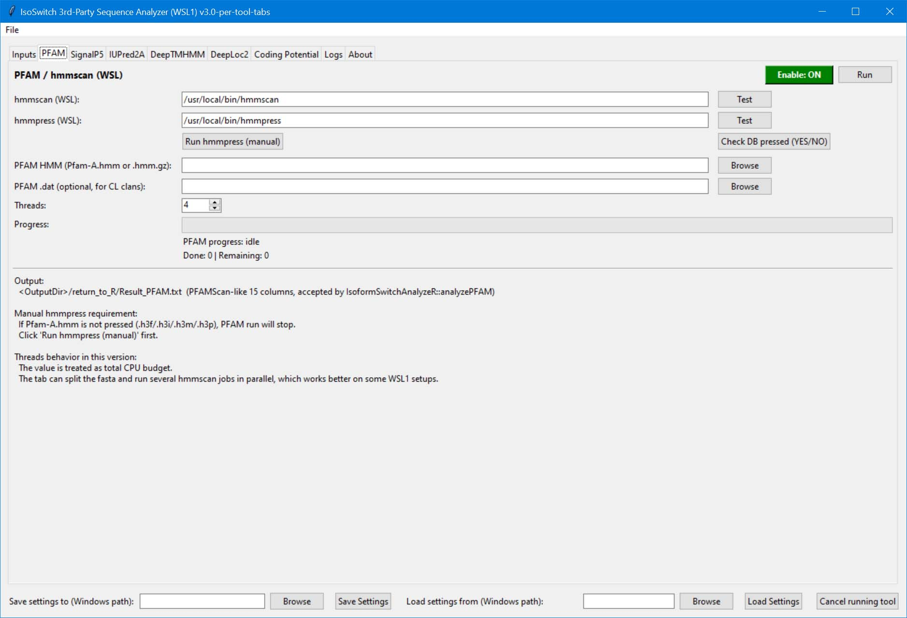
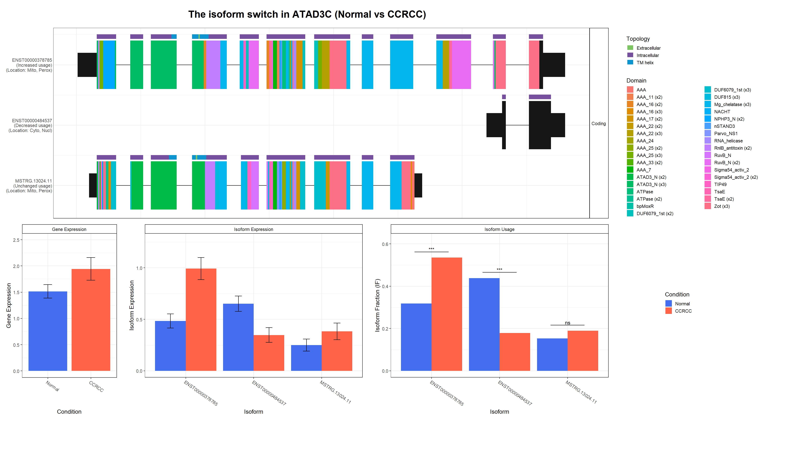
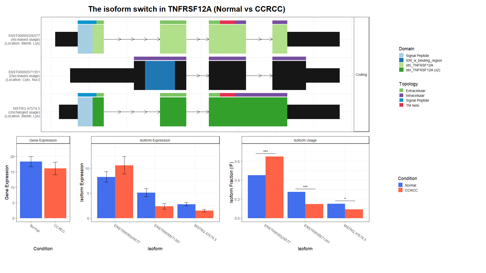
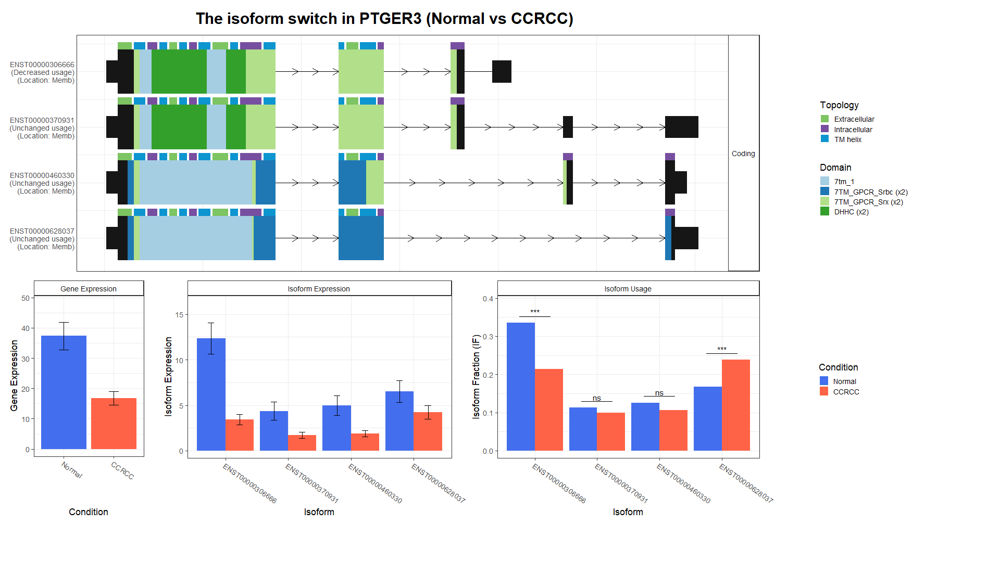

# From RNA-seq FASTQ files to isoform, protein-domain, and functional effects

This repository is a multi-step system for RNA-seq and isoform-switch analysis, with a particular use for cancer and other genomics projects. It begins with raw sequencing reads (`FASTQ`) and ends with interpretable figures showing whether an isoform switch may change a protein's domains, coding potential, predicted location in the cell, membrane topology, signal peptide, or sensitivity to nonsense-mediated decay (NMD).

The pipeline is deliberately split into steps so that quality can be checked before moving on. Instead of receiving one final black-box result, the user can inspect the read pairing and mapping quality, BAM sorting, transcript assembly, count matrices, study design, generated sequences, prediction-tool logs, and final plots. This makes it easier to identify an input or biology problem early, before it is propagated to the final interpretation.

## Why isoforms and protein domains matter

The simple idea **“1 gene → 1 protein”** is often not true enough for genomics. One gene can make several RNA isoforms through alternative transcription start sites, splicing, and transcript termination. These isoforms can have different coding potential and may produce proteins with different lengths, protein domains, signal peptides, transmembrane regions, predicted subcellular localisation, or NMD sensitivity. Some isoforms have only small “leaked” coding activity, or may be mostly non-coding, and still be very relevant to the interpretation.

As a result, a gene-level expression change alone will not explain the biological effect. A gene can keep a similar overall expression while its preferred isoform changes. The resulting protein may lose a functional domain, gain a membrane segment, no longer be predicted to reach the same cell compartment, or become unlikely to produce a stable protein. This pipeline is designed to make those possibilities visible.

The `Results/` folder contains real examples from early-grade kidney cancer (paired Normal versus CCRCC) to illustrate this point.

## Workflow at a glance

```text
FASTQ reads
  → 00 STAR mapping and BAM quality checks
  → 01 StringTie transcript / isoform quantification and assembly
  → 02 PrepDE gene and isoform count matrices
  → 03 IsoformSwitchAnalyzeR: differential isoform usage and AA/NT sequences
  → 04 Functional sequence annotation
  → 05 Integrated isoform-switch and protein-domain figures
```

| Step | What the step does | Quality-control checkpoint before continuing |
| --- | --- | --- |
| **00 — STAR** | Maps raw reads to the reference genome and produces SAM/BAM alignments. | Check FASTQ pairing/compression, selected samples, mapping stringency, reference/index, output format, logs, and BAM index/sorting. |
| **01 — StringTie** | Uses alignments to quantify known transcripts and, when present, assemble candidate new isoforms. | Scan input alignments, verify coordinate sort/indexability, check strandedness, annotation/GTF and genome FASTA, then review the run log. |
| **02 — PrepDE** | Converts StringTie output into gene and isoform count matrices. | Confirm every sample GTF has the required StringTie attributes and that sample names/paths are consistent before making matrices. |
| **03 — IsoformSwitchAnalyzeR, first stage** | Tests differential transcript/isoform usage and prepares nucleotide (NT) and amino-acid (AA) sequences for selected isoforms. | Check the experimental design, groups, contrast, count matrix, and the selected statistical thresholds. |
| **04 — sequence annotation** | Sends AA/NT sequences to specialised predictors and databases. | Verify input FASTA IDs, tool paths, databases, enabled analyses, run progress, and tool-specific logs. |
| **05 — IsoformSwitchAnalyzeR, second stage** | Integrates expression, isoform use, and functional annotations into gene-level and protein-level plots. | Inspect significant switches and whether the predicted functional change is biologically plausible before drawing conclusions. |

## What is analysed in Step 04?

Step 04 is not a single prediction. It combines several sources of evidence for each isoform:

| Tool / analysis | Question it helps answer |
| --- | --- |
| **PFAM / HMMER** | Which known protein domains are present, lost, shortened, or gained? |
| **SignalP5** | Is a signal peptide predicted, suggesting secretion or entry into the secretory pathway? |
| **IUPred2A** | Which parts of the protein may be intrinsically disordered and able to mediate flexible interactions? |
| **DeepTMHMM** | Is the isoform predicted to contain transmembrane helices or a different membrane topology? |
| **DeepLoc2** | Where is the protein most likely to be located in the cell? |
| **Coding potential** | Is the transcript likely to encode a protein, or is it more likely non-coding? |
| **NMD information** | Is the transcript likely to be sensitive to nonsense-mediated decay, which may limit stable protein production? |

## Screenshots: what happens at each stage

### Figure 1 — Step 00: STAR mapping starts with the raw reads



*Figure 1. This screen prepares the first analysis step: mapping raw FASTQ reads to a reference genome with STAR. The user can scan the reads folder to check R1/R2 pairing and compression, choose the genome index and annotation, select the output BAM format, and decide how many samples can run in parallel. The yellow explanation panel describes the mapping-stringency choice. Two-pass mapping can be enabled when splice-junction detection is important, which is often the case for isoform analysis. This step is important because poor mapping, wrong strandedness, or incorrectly paired reads can create false isoform differences later in the pipeline.*

### Figure 2 — Step 01: StringTie converts aligned reads into transcript/isoform evidence



*Figure 2. This screen receives the BAM/SAM alignments, a GTF annotation, and the genome FASTA. StringTie estimates transcript and isoform expression and can assemble transcripts that are not represented in the reference annotation. Before the run, **Scan inputs** checks whether alignments are properly sorted and usable; the options can also sort/index BAM files if needed. The user chooses the library strandedness, confirms that StringTie and gffread are available in WSL, and reads the run log. This quality control matters because an unsuitable alignment or strandedness setting can make an apparent new isoform that is only a technical artefact.*

### Figure 3 — Step 02: create the matrices used for statistical comparison



*Figure 3. PrepDE reads the StringTie PASS2 output and produces two tables: one for gene-level counts and one for isoform-level counts. The screen lists every detected sample and reports whether it is valid before the matrices are generated. This is a useful pause point: the sample names in the matrices should correspond exactly to the biological groups in the study design (for example, Normal and CCRCC). A valid gene matrix is still useful, but the isoform matrix is the key input for discovering changes in isoform usage.*

### Figure 4 — Step 03: find changes in isoform usage and create sequences

Step 03 is run with `Step03_R_PrepareSequence_AAs_and_NTs.R` rather than a separate GUI. It uses the isoform count matrix and the study design to identify candidate isoform switches, then prepares the nucleotide and predicted amino-acid sequences required for the next step. At this stage, check that the comparison, statistical threshold, and selected samples answer the intended biological question.

### Figure 5 — Step 04: annotate the possible protein consequences



*Figure 5. This is one tab of the Step 04 sequence-analyser application, shown here for PFAM/HMMER domain annotation. The full program also has tabs for SignalP5, IUPred2A, DeepTMHMM, DeepLoc2, coding potential, inputs, and logs. Each tool can be enabled, tested, and run separately; this is useful because it lets the user check configuration and output from each predictor instead of assuming every external tool ran correctly. PFAM scans the predicted amino-acid sequence for known domain families. If two isoforms of the same gene have different domain patterns, the switch may have a direct functional consequence.*

### Figure 6 — Step 05 result: ATAD3C shows that the isoform can change the predicted protein map



*Figure 6. This Normal-versus-CCRCC example shows three ATAD3C isoforms. The upper panel gives one horizontal protein map per isoform: black blocks show the translated sequence extent, coloured blocks represent predicted protein domains, and the small coloured bars above the proteins describe predicted topology/localisation features. The isoform labels at left indicate whether usage is increased, decreased, or unchanged, together with predicted locations. The lower plots separate gene expression, isoform expression, and isoform fraction (usage). The figure illustrates why gene expression alone is insufficient: a change in relative isoform use can select a protein form with a different domain arrangement and predicted cellular localisation.*

### Figure 7 — Step 05 result: TNFRSF12A can alter membrane and localisation features



*Figure 7. TNFRSF12A is a clear example for interpreting protein topology. The protein maps show isoforms with different combinations of signal peptide, extracellular/intracellular regions, transmembrane helix, and TNFRSF12A domain annotations. In the lower panels, the orange and blue bars compare CCRCC with Normal expression and isoform use. A shifted isoform fraction can therefore mean more than “the gene went up or down”: it may change which form of a membrane-associated receptor-related protein is most represented. This is a prediction to investigate biologically.*

### Figure 8 — Step 05 result: PTGER3 illustrates an isoform switch inside a membrane receptor gene



*Figure 8. PTGER3 contains several coding isoforms with different protein lengths and domain/topology maps. The coloured features identify predicted extracellular/intracellular regions, transmembrane helices, and 7TM-GPCR-related domains. The bar plots show that gene expression and isoform usage are different measurements: some isoforms change significantly in usage even when others do not. For a membrane receptor gene, this is biologically interesting because changing the preferred transcript can potentially change receptor structure, membrane placement, or signalling capacity. The figure gives a reason to prioritise the gene for validation.*

## How to read a final isoform figure

1. **Start at the gene-expression panel.** Is total expression different between groups?
2. **Look at isoform expression and isoform usage (isoform fraction).** A meaningful isoform switch is often clearer in the fraction plot than in total gene expression.
3. **Compare the protein maps.** Do the changing isoforms differ in translated length, domains, signal peptide, transmembrane helices, disorder, or predicted location?
4. **Check coding potential and NMD.** An RNA isoform may not create the same stable protein, even if it is expressed.
5. **Return to the earlier quality checks.** A striking result should be supported by correct read mapping, transcript assembly, sample design, and tool logs.
6. **Validate experimentally when needed.** These results prioritise hypotheses; they do not alone prove a protein-level or clinical effect.

## Main scripts and folders

```text
Step00_Mapping_with_STAR/                 STAR mapping GUI
Step01_Stringtie/                         StringTie two-pass transcript/isoform GUI
Step02_PrepDE/                            PrepDE count-matrix GUI
Step03_Create_Sequence_AAs_and_NTs/       R script preparing NT and AA sequences
Step04_ThirdPArtiySequenceAnalyzer/       Functional-prediction GUI and tool tabs
Step05_Results/                           R script integrating annotations and plots
Screenshots/                              Screens used in this README
Results/                                  Example Normal-versus-CCRCC isoform figures
```

## Software used by the system

The wrapper applications orchestrate external bioinformatics software. Depending on the stages you run, install and configure STAR, samtools, StringTie, gffread, PrepDE, R with IsoformSwitchAnalyzeR, PFAM/HMMER, SignalP, IUPred2A, DeepTMHMM, DeepLoc2, and the coding-potential tool used by your installation. The GUIs expose paths, tests, run logs, and settings so that each dependency can be checked before a long run.

