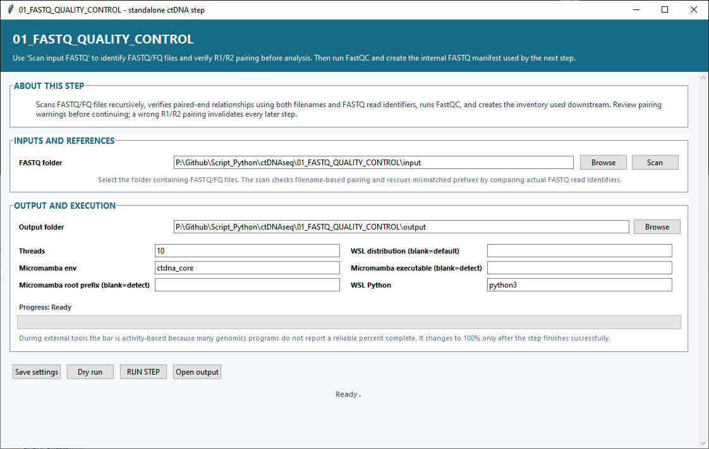

# Step 01 — FASTQ quality control

This step discovers raw FASTQ/FASTQ.GZ files, confirms paired-end relationships from filenames and read identifiers, runs FastQC, and creates the input inventory used by the trimming step.

## Settings

| Setting | What it controls |
|---|---|
| **FASTQ folder** | Root folder containing the sequencing files. The scan is recursive, so FASTQs may be arranged in sample subfolders. |
| **Output folder** | Destination for the validated inventory, FastQC results, plots, logs and saved run settings. |
| **Threads** — default `10` | Number of CPU threads available to FastQC and the step’s parallel work. |
| **Micromamba env** — default `ctdna_core` | Linux environment containing FastQC, Python and the supporting analysis packages. |
| **Micromamba root prefix** | Micromamba installation root. Leave blank to let the script detect it. |
| **WSL distribution** | WSL distribution used for Linux tools. Leave blank to use the default distribution. |
| **Micromamba executable** | Full path to the Micromamba executable. Leave blank for automatic detection. |
| **WSL Python** — default `python3` | Python command used inside WSL for backend work. |

**Scan** reads the selected folder, finds FASTQ files and evaluates R1/R2 pairing. **Save settings** keeps the current selections, **Dry run** validates the planned work, **RUN STEP** starts FastQC and report generation, and **Open output** opens the result directory.

## Main outputs

The most useful files are `fastq_inventory.tsv`, `fastq_files_detected.tsv`, `fastqc_basic_metrics.tsv`, `fastqc_module_status.tsv`, `summary.txt`, and the yield, file-size, layout and FastQC-status plots.
