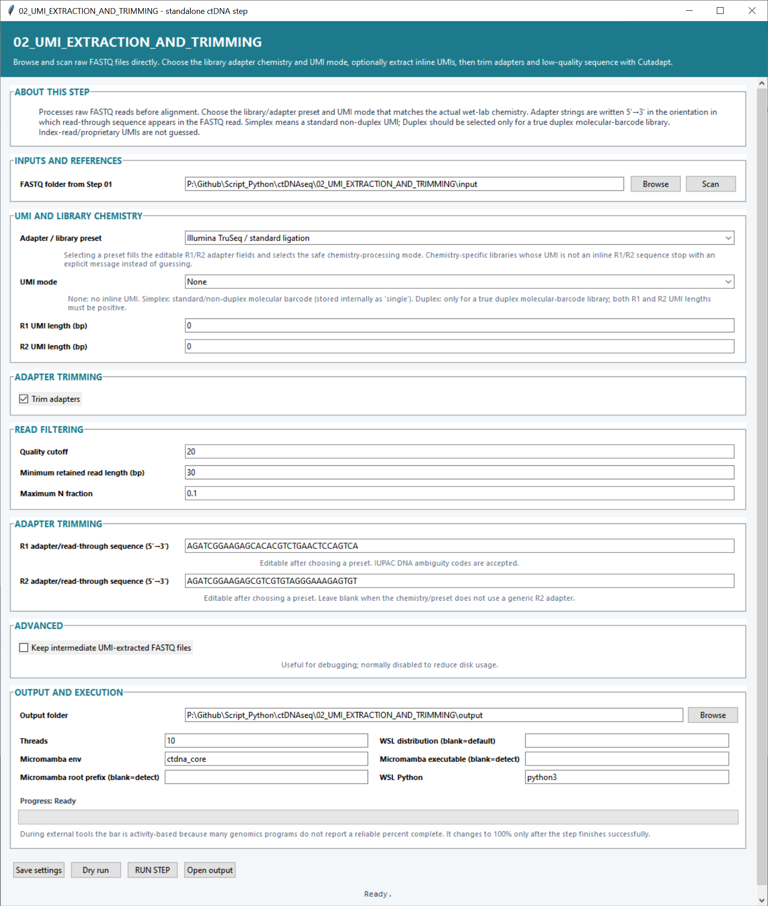

# Step 02 — UMI extraction and trimming

This step prepares raw reads for alignment. It records inline molecular barcodes when present, trims adapter read-through and low-quality ends with Cutadapt, and removes reads that do not meet the selected length or sequence-quality criteria.

## Input and library settings

| Setting | Default | What it controls |
|---|---:|---|
| **FASTQ folder from Step 01** | — | Folder containing the raw FASTQ files identified in Step 01. **Scan** discovers samples and read pairs. |
| **Adapter / library preset** | Illumina TruSeq / standard ligation | Fills the R1 and R2 adapter sequences and selects the processing pattern associated with the library chemistry. The resulting adapter fields remain editable. |
| **UMI mode** | `None` | Selects no inline barcode, a simplex/single UMI, or a true duplex UMI. This determines how molecular identifiers are extracted and preserved. |
| **R1 UMI length (bp)** | `0` | Number of leading R1 bases assigned to the UMI. Used when the selected chemistry stores an inline R1 barcode. |
| **R2 UMI length (bp)** | `0` | Number of leading R2 bases assigned to the UMI. A positive value is used for libraries with an inline R2 barcode. |

## Trimming and filtering settings

| Setting | Default | What it controls |
|---|---:|---|
| **Trim adapters** | On | Runs adapter removal. Turn it off when the reads have already been adapter-trimmed. |
| **Quality cutoff** | `20` | Trims low-quality bases from read ends using the selected Phred-quality threshold. |
| **Minimum retained read length (bp)** | `30` | Discards a read when its post-trimming length is shorter than this value. |
| **Maximum N fraction** | `0.1` | Largest accepted fraction of ambiguous `N` bases in a retained read. `0.1` represents 10%. |
| **R1 adapter/read-through sequence (5′→3′)** | TruSeq R1 sequence | Adapter sequence searched for in R1. IUPAC ambiguity codes are accepted. |
| **R2 adapter/read-through sequence (5′→3′)** | TruSeq R2 sequence | Adapter sequence searched for in R2. It can be blank for chemistries without a generic R2 adapter. |
| **Keep intermediate UMI-extracted FASTQ files** | Off | Retains the barcode-extracted FASTQs in addition to the final processed reads. |

## Output and execution settings

**Output folder** chooses the result directory. **Threads** defaults to `10`. **Micromamba env** defaults to `ctdna_core`; the Micromamba root and executable can be supplied directly or detected automatically. **WSL distribution** selects the Linux distribution, and **WSL Python** defaults to `python3`.

Use **Save settings** to retain the form, **Dry run** to inspect the planned processing, **RUN STEP** to start, and **Open output** to view the results.

## Main outputs

The step creates processed paired or single-end FASTQs, `processed_fastq_results.tsv`, `trimming_qc_metrics.tsv`, Cutadapt JSON reports, and plots of input/output read counts and retention percentages.
