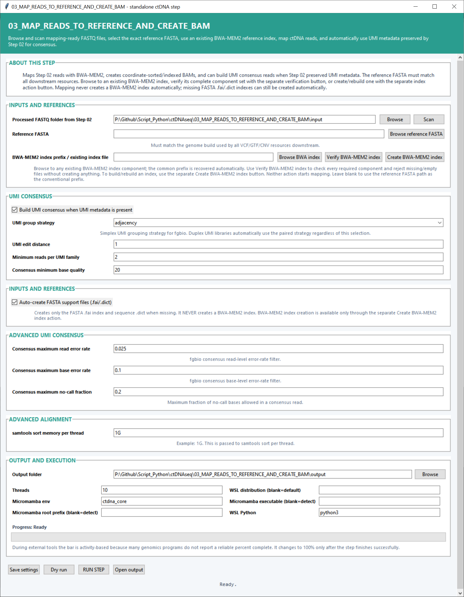

# Step 03 — Map reads and create BAM files

This step aligns the processed reads with BWA-MEM2 and creates coordinate-sorted, indexed, analysis-ready BAM files. When UMI metadata is available, it can group reads into molecular families and build consensus reads before producing the final alignments.

## Inputs and reference settings

| Setting | Default | What it controls |
|---|---:|---|
| **Processed FASTQ folder from Step 02** | — | Folder containing the mapping-ready FASTQs. **Scan** detects samples and R1/R2 pairs. |
| **Reference FASTA** | — | Genome sequence used for alignment and coordinate reporting. |
| **BWA-MEM2 index prefix / existing index file** | Reference FASTA prefix | Selects an existing BWA-MEM2 index. Choosing any component allows the script to recover the shared prefix. |
| **Auto-create FASTA support files (.fai/.dict)** | On | Creates the samtools FASTA index and sequence dictionary when they are not already present. |

**Verify BWA-MEM2 index** checks every required component. **Create BWA-MEM2 index** builds or rebuilds the index as a separate action.

## UMI consensus settings

| Setting | Default | What it controls |
|---|---:|---|
| **Build UMI consensus when UMI metadata is present** | On | Activates molecular-family grouping and consensus generation for reads carrying Step 02 UMI metadata. |
| **UMI group strategy** | `adjacency` | fgbio strategy used to group related simplex UMIs. Duplex libraries use paired grouping. |
| **UMI edit distance** | `1` | Maximum barcode difference allowed when placing reads in the same UMI family. |
| **Minimum reads per UMI family** | `2` | Smallest family that can contribute a consensus read. |
| **Consensus minimum base quality** | `20` | Minimum input base quality used during consensus construction. |
| **Consensus maximum read error rate** | `0.025` | Maximum estimated whole-read error rate accepted by the fgbio consensus filter. |
| **Consensus maximum base error rate** | `0.1` | Maximum estimated error rate accepted for an individual consensus base. |
| **Consensus maximum no-call fraction** | `0.2` | Largest fraction of unresolved bases allowed in a consensus read. |

## Alignment and execution settings

| Setting | Default | What it controls |
|---|---:|---|
| **samtools sort memory per thread** | `1G` | Memory allocation passed to each samtools sorting thread. |
| **Output folder** | — | Destination for BAM files, indexes, metrics, plots and logs. |
| **Threads** | `10` | CPU budget for alignment, sorting and consensus work. |
| **Micromamba env** | `ctdna_core` | Environment containing BWA-MEM2, samtools and fgbio. |
| **Micromamba root prefix / executable** | Auto-detect | Direct Micromamba locations when custom paths are used. |
| **WSL distribution** | Default WSL | Distribution that runs the Linux tools. |
| **WSL Python** | `python3` | Python command used by the backend. |

## Main outputs

Each sample receives an `analysis_ready.bam` and BAM index. The folder also contains mapping, pairing, duplicate and UMI-consensus metrics, index-verification records, flagstat reports and mapping-quality plots.
