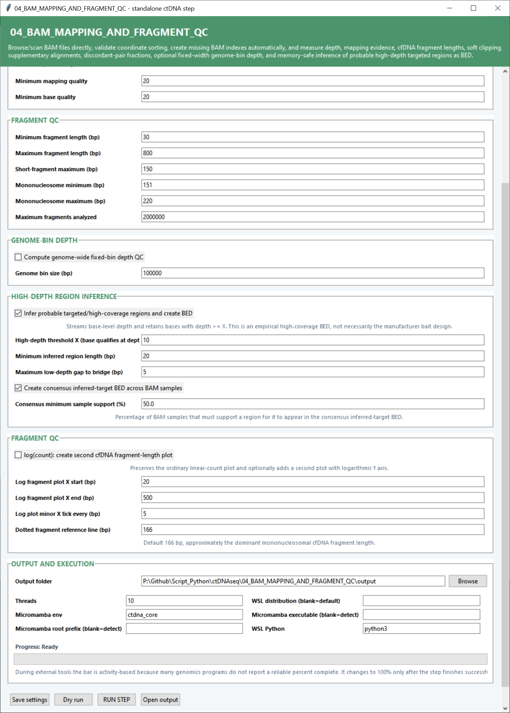

# Step 04 — BAM mapping and fragment quality control

This step measures alignment quality, depth and cfDNA fragment characteristics from the complete BAM files. It also produces empirical high-depth regions that can serve as assay intervals in later stages.

## Input and mapping settings

| Setting | Default | What it controls |
|---|---:|---|
| **Validated/full BAM folder** | — | Folder containing complete coordinate-sorted BAMs. **Scan** finds BAMs and associates their indexes. |
| **Known target/capture BED** | Blank | Genomic intervals used for target-aware depth summaries when a panel BED is available. |
| **Minimum mapping quality** | `20` | Mapping-quality threshold for reads contributing to QC calculations. |
| **Minimum base quality** | `20` | Base-quality threshold for depth-related measurements. |

## Fragment settings

| Setting | Default | What it controls |
|---|---:|---|
| **Minimum fragment length (bp)** | `30` | Lower fragment-size boundary included in distributions and summary statistics. |
| **Maximum fragment length (bp)** | `800` | Upper fragment-size boundary included in the analysis. |
| **Short-fragment maximum (bp)** | `150` | Largest fragment counted in the short-fragment population. |
| **Mononucleosome minimum (bp)** | `151` | Lower boundary of the mononucleosome-sized fragment group. |
| **Mononucleosome maximum (bp)** | `220` | Upper boundary of the mononucleosome-sized fragment group. |
| **Maximum fragments analyzed** | `2,000,000` | Per-sample cap used for fragment-length calculations and plotting. |

## Depth and inferred-region settings

| Setting | Default | What it controls |
|---|---:|---|
| **Compute genome-wide fixed-bin depth QC** | Off | Calculates mean coverage in equally sized bins across the genome. |
| **Genome bin size (bp)** | `100000` | Width of each fixed genomic depth bin. |
| **Infer probable targeted/high-coverage regions and create BED** | On | Streams base-level depth and joins qualifying bases into empirical high-depth regions. |
| **High-depth threshold X** | `10` | A base enters an inferred region when its depth is at least this value. |
| **Minimum inferred region length (bp)** | `20` | Shortest high-depth region retained in the BED output. |
| **Maximum low-depth gap to bridge (bp)** | `5` | Joins nearby high-depth blocks when the intervening low-depth gap is no larger than this value. |
| **Create consensus inferred-target BED across BAM samples** | On | Merges the sample-level inferred regions into a cohort interval set. |
| **Consensus minimum sample support (%)** | `50.0` | Percentage of BAM samples that must support a region for inclusion in the consensus BED. |

## Log-scale fragment plot settings

| Setting | Default | What it controls |
|---|---:|---|
| **log(count): create second cfDNA fragment-length plot** | Off | Adds a second fragment plot with a logarithmic count axis. |
| **Log fragment plot X start / end (bp)** | `20` / `500` | Visible fragment-length range of the logarithmic plot. |
| **Log plot minor X tick every (bp)** | `5` | Spacing of minor x-axis tick marks. |
| **Dotted fragment reference line (bp)** | `166` | Position of the vertical reference line, commonly used for the dominant cfDNA mononucleosome length. |

## Output and execution settings

Choose an **Output folder** and CPU **Threads** (`10` by default). The **Micromamba env** is `ctdna_core`; Micromamba paths can be detected or entered directly. **WSL distribution** selects the Linux environment and **WSL Python** defaults to `python3`.

## Main outputs

Outputs include BAM validation and QC tables, fragment-length tables and plots, depth histograms, genome-bin profiles, inferred-region BED/TSV files, and cohort summaries for mapping, depth, fragment sizes, soft clipping, supplementary reads and discordant pairs.
