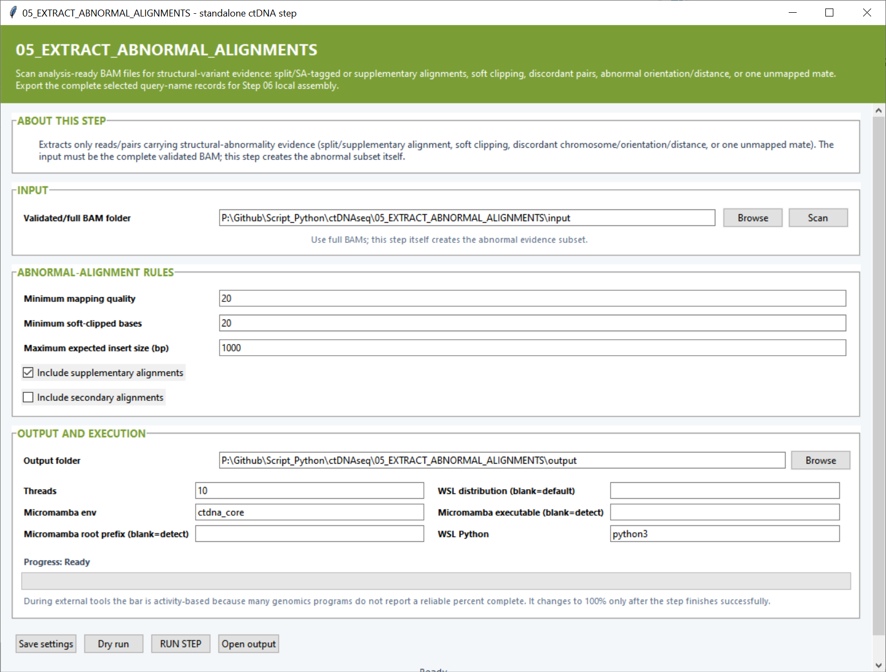

# Step 05 — Extract abnormal alignments

This step selects reads and read pairs carrying structural-variant evidence and exports their complete query-name records for local assembly in Step 06.

## Settings

| Setting | Default | What it controls |
|---|---:|---|
| **Validated/full BAM folder** | — | Folder containing the complete analysis-ready BAM files. **Scan** discovers samples and BAM indexes. |
| **Minimum mapping quality** | `20` | Minimum mapping confidence for evidence based on an aligned read. |
| **Minimum soft-clipped bases** | `20` | Soft-clipped length required for a read to be selected by the clipping rule. |
| **Maximum expected insert size (bp)** | `1000` | Proper chromosome-matched pairs beyond this distance are treated as abnormally separated. |
| **Include supplementary alignments** | On | Includes supplementary records, which often represent split-read breakpoint evidence. |
| **Include secondary alignments** | Off | Includes alternative secondary mappings in the exported evidence set. |
| **Output folder** | — | Destination for abnormal BAM/FASTQ subsets, evidence tables, plots and logs. |
| **Threads** | `10` | CPU budget for BAM scanning, extraction and conversion. |
| **Micromamba env** | `ctdna_core` | Environment containing samtools and the Python backend. |
| **Micromamba root prefix / executable** | Auto-detect | Optional direct paths to the Micromamba installation. |
| **WSL distribution** | Default WSL | Linux distribution used to run the backend. |
| **WSL Python** | `python3` | Python command used inside WSL. |

The selection includes split/SA-tagged reads, supplementary alignments, substantial soft clipping, discordant chromosome/orientation/distance patterns and pairs with one unmapped mate.

## Main outputs

Each sample receives an abnormal-pair BAM, abnormal R1/R2 FASTQs and a singleton FASTQ when applicable. Summary files include `abnormal_alignment_evidence.tsv`, parameter and result tables, and plots of abnormal-alignment fractions and evidence categories.
