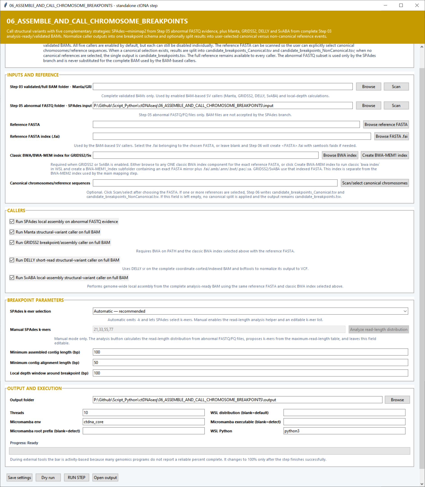

# Step 06 — Assemble reads and call chromosome breakpoints

This step combines local assembly with four BAM-based structural-variant callers. SPAdes and minimap2 work from the abnormal FASTQs created in Step 05, while Manta, GRIDSS2, DELLY and SvABA analyze the complete Step 03 BAM files. Their results are normalized into a common breakpoint table.

## Inputs and reference settings

| Setting | What it controls |
|---|---|
| **Step 03 validated/full BAM folder** | Complete coordinate-sorted and indexed BAMs used by Manta, GRIDSS2, DELLY, SvABA and local-depth calculations. **Scan** discovers the sample BAMs. |
| **Step 05 abnormal FASTQ folder** | Abnormal paired and singleton FASTQs used by the SPAdes local-assembly branch. |
| **Reference FASTA** | Genome sequence used by every enabled caller and for contig realignment. |
| **Reference FASTA index (.fai)** | Explicit samtools FASTA index. When blank, the step uses or creates the index beside the selected FASTA. |
| **Classic BWA/BWA-MEM index** | Any component of the classic BWA index associated with the reference. The shared prefix is recovered automatically for GRIDSS2 and SvABA. |
| **Canonical chromosomes/reference sequences** | Reference names classified as canonical. **Scan/select canonical chromosomes** reads the FASTA names and lets the user choose them. Selected names produce separate canonical and non-canonical breakpoint tables. |

**Create BWA-MEM1 index** builds the classic BWA index used by GRIDSS2 and SvABA.

## Caller settings

| Setting | Default | What it controls |
|---|---:|---|
| **Run SPAdes local assembly** | On | Assembles Step 05 abnormal reads, aligns the resulting contigs with minimap2 and extracts breakpoint evidence. |
| **Run Manta** | On | Calls structural variants from each complete BAM with Manta. |
| **Run GRIDSS2** | On | Uses split reads, read pairs and assembly evidence from the complete BAM. |
| **Run DELLY** | On | Runs DELLY short-read structural-variant calling and normalizes its VCF. |
| **Run SvABA** | On | Runs local-assembly structural-variant calling across the complete BAM. |

## Breakpoint settings

| Setting | Default | What it controls |
|---|---:|---|
| **SPAdes k-mer selection** | Automatic | Automatic lets SPAdes select suitable k-mers. Manual uses the list entered below. |
| **Manual SPAdes k-mers** | `21,33,55,77` | Comma-separated odd k-mer sizes used in manual mode. **Analyze read-length distribution** proposes values from the abnormal FASTQs. |
| **Minimum assembled contig length (bp)** | `100` | Shortest SPAdes contig retained for reference alignment. |
| **Minimum contig alignment length (bp)** | `50` | Minimum aligned contig span used as breakpoint evidence. |
| **Local depth window around breakpoint (bp)** | `100` | Number of surrounding bases used to measure local BAM depth at each breakpoint. |

## Output and execution settings

**Output folder** stores normalized calls, caller workspaces, plots and logs. **Threads** defaults to `10`. **Micromamba env** defaults to `ctdna_core`; the Micromamba root and executable can be supplied directly. **WSL distribution** selects the Linux distribution and **WSL Python** defaults to `python3`.

## Main outputs

The main handoff is `candidate_breakpoints.tsv`, or separate `candidate_breakpoints_Canonical.tsv` and `candidate_breakpoints_NonCanonical.tsv` files when canonical sequences are selected. The step also writes ranked breakpoint tables, assembled contigs, caller VCFs, local-depth and support measurements, parsing diagnostics, validation records and structural-variant summary plots.
