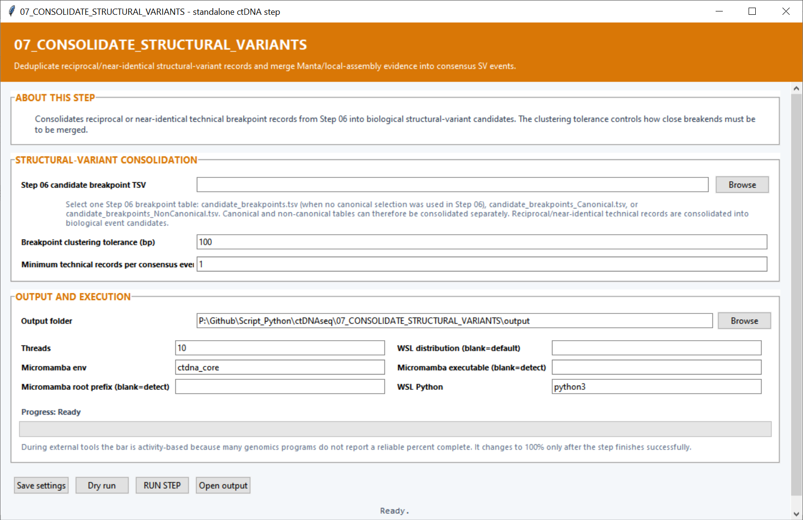

# Step 07 — Consolidate structural variants

This step merges reciprocal and near-identical technical breakpoint records from Step 06 into consensus structural-variant events.

## Settings

| Setting | Default | What it controls |
|---|---:|---|
| **Step 06 candidate breakpoint TSV** | — | Breakpoint table to consolidate. This can be the complete, canonical or non-canonical Step 06 table. |
| **Breakpoint clustering tolerance (bp)** | `100` | Maximum coordinate difference allowed at matching breakends when records are grouped into the same event. |
| **Minimum technical records per consensus event** | `1` | Smallest number of contributing caller or assembly records required to keep a consensus event. |
| **Output folder** | — | Destination for the consensus table, record mapping, plot, log and settings. |
| **Threads** | `10` | CPU budget available to the step. |
| **Micromamba env** | `ctdna_core` | Environment used for the backend analysis. |
| **Micromamba root prefix / executable** | Auto-detect | Optional direct locations for Micromamba. |
| **WSL distribution** | Default WSL | Linux distribution used by the backend. |
| **WSL Python** | `python3` | Python command run inside WSL. |

Increasing the clustering tolerance joins breakpoint descriptions that differ more in position. Increasing the minimum support retains events represented by more independent technical records.

## Main outputs

`consensus_structural_variants.tsv` contains one row per consolidated event. `structural_variant_record_to_consensus.tsv` maps every Step 06 record to its consensus event, and `consensus_sv_type_counts.png` summarizes the result.
