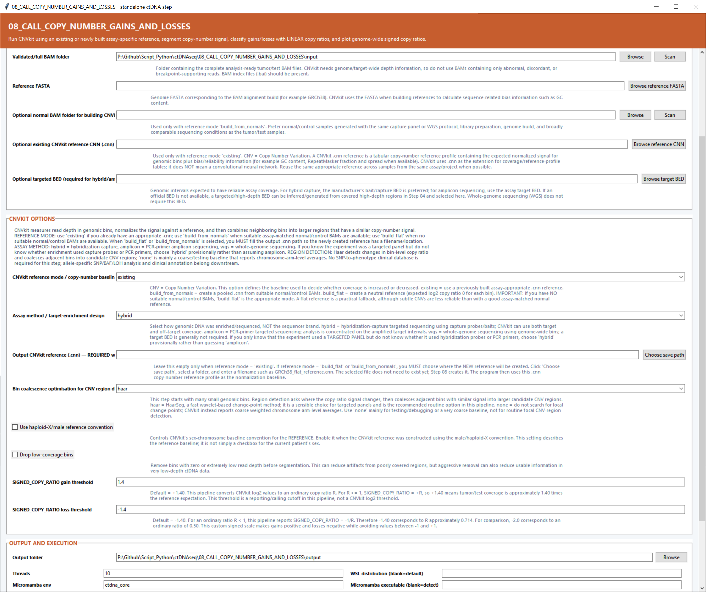

# Step 08 — Call copy-number gains and losses

This step uses CNVkit to measure coverage, normalize it against an assay-appropriate baseline, segment the copy-number signal and classify gains and losses on a signed ordinary-ratio scale.

## Inputs and reference settings

| Setting | What it controls |
|---|---|
| **Validated/full BAM folder** | Complete tumor or test BAMs analyzed by CNVkit. **Scan** discovers the samples and their indexes. |
| **Reference FASTA** | Reference genome matching the BAM coordinates. CNVkit also uses it for sequence-bias information while building a reference. |
| **Normal BAM folder** | Cohort of normal/control BAMs used when the reference mode is `build_from_normals`. |
| **Existing CNVkit reference CNN** | Previously prepared assay-specific `.cnn` baseline used in `existing` mode. |
| **Target BED** | Assay target intervals used by hybrid-capture and amplicon modes. |

## CNVkit settings

| Setting | Default | What it controls |
|---|---:|---|
| **CNVkit reference mode / copy-number baseline** | `existing` | `existing` reuses a `.cnn`; `build_from_normals` creates a pooled baseline from normal BAMs; `build_flat` creates a neutral reference. |
| **Assay method / target-enrichment design** | `hybrid` | Selects CNVkit behavior for hybrid capture, PCR amplicon sequencing or whole-genome sequencing. |
| **Output CNVkit reference (.cnn)** | Blank | Save location for a new reference created by `build_from_normals` or `build_flat`. |
| **Bin coalescence optimization / segmentation method** | `haar` | Algorithm used to identify change points and combine adjacent bins into copy-number segments. |
| **Use haploid-X/male reference convention** | Off | Applies CNVkit’s haploid-X reference baseline convention. |
| **Drop low-coverage bins** | Off | Removes bins with zero or extremely low coverage before segmentation. |
| **SIGNED_COPY_RATIO gain threshold** | `1.4` | Segments at or above this ordinary coverage ratio are labeled as gains. |
| **SIGNED_COPY_RATIO loss threshold** | `-1.4` | Negative signed boundary used to label losses; `-1.4` corresponds to an ordinary ratio of about `0.714`. |

## Output and execution settings

Choose the **Output folder** and the total **Threads** (`10` by default). **Micromamba env** is `ctdna_core`; Micromamba paths may be detected or entered. **WSL distribution** chooses the Linux distribution and **WSL Python** defaults to `python3`.

## Main outputs

The main result is `copy_number_segments.tsv`. CNVkit `.cnr`, `.cns` and called-segment files, the reference used or created, parameter tables, signed-ratio genome plots and cohort gain/loss summaries are written alongside it.
