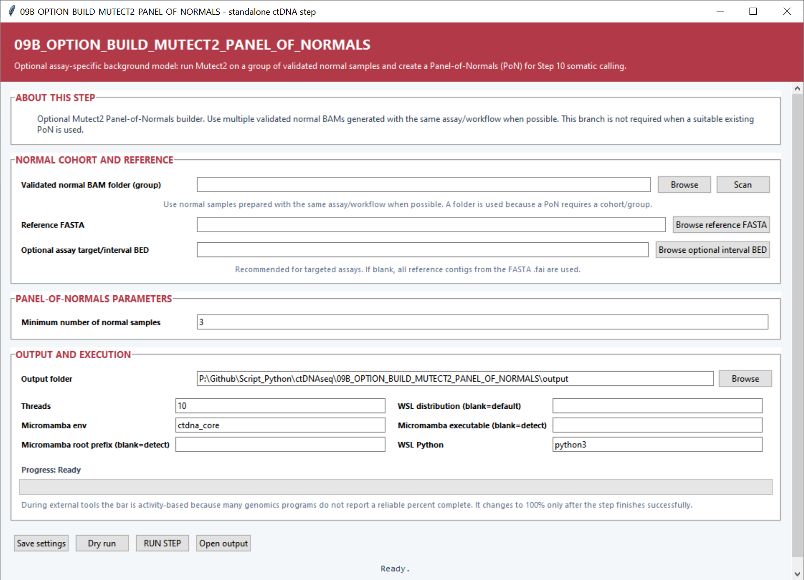

# Optional Step 09B — Build a Mutect2 Panel of Normals

This optional branch runs Mutect2 on a normal-sample cohort and combines recurrent technical signals into an assay-specific Panel of Normals for Step 10.

## Settings

| Setting | Default | What it controls |
|---|---:|---|
| **Validated normal BAM folder (group)** | — | Folder containing normal BAMs prepared with the same assay. **Scan** discovers and validates the cohort. |
| **Reference FASTA** | — | Reference genome used for every normal Mutect2 call and the final panel. |
| **Optional assay target/interval BED** | Blank | Restricts the normal calls and GenomicsDB import to the selected assay intervals. |
| **Minimum number of normal samples** | `3` | Smallest cohort accepted for panel construction. |
| **Output folder** | — | Destination for per-normal calls, GenomicsDB work, the combined PoN and summaries. |
| **Threads** | `10` | CPU budget for Mutect2 and cohort processing. |
| **Micromamba env** | `ctdna_core` | Entry environment whose wrappers call the GATK environment. |
| **Micromamba root prefix / executable** | Auto-detect | Optional direct Micromamba locations. |
| **WSL distribution** | Default WSL | Distribution used to run the Linux toolchain. |
| **WSL Python** | `python3` | Python backend command. |

## Main outputs

The finished panel is `panel_of_normals.vcf.gz`. The directory also contains one normal-only Mutect2 VCF per sample, `pon_normal_samples.tsv`, `pon_build_summary.tsv`, and logs for Mutect2, GenomicsDB import and panel creation.
