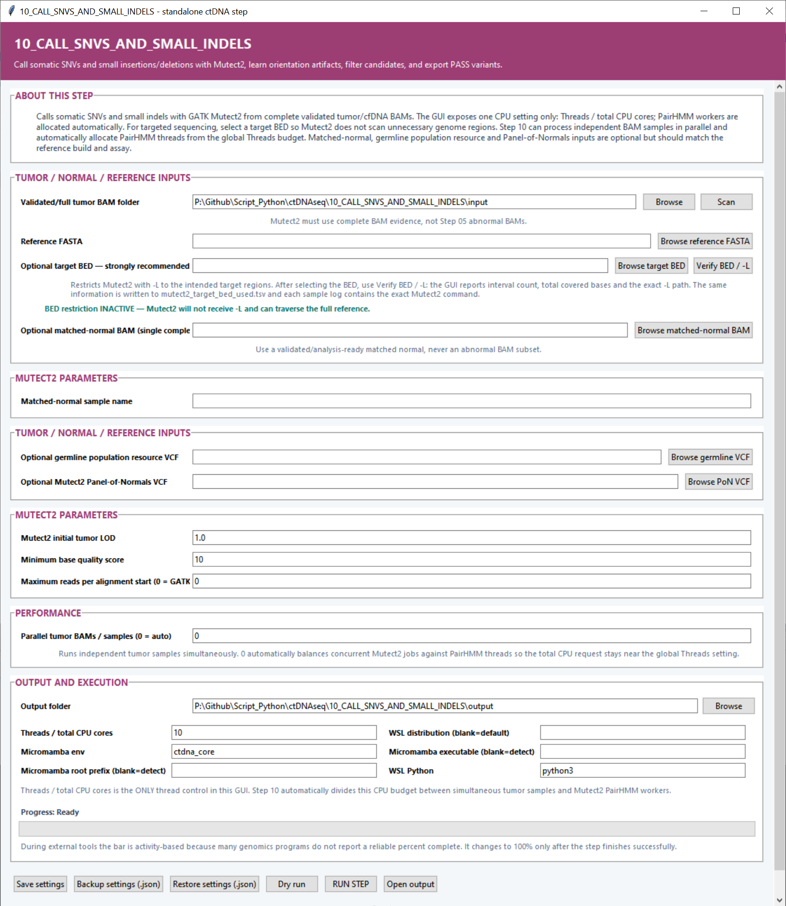

# Step 10 — Call SNVs and small indels

This step runs GATK Mutect2 on complete cfDNA or tumor BAM files, learns orientation artifacts, filters the candidates and exports PASS SNVs and small insertions/deletions.

## Tumor, normal and reference settings

| Setting | What it controls |
|---|---|
| **Validated/full tumor BAM folder** | Complete tumor or cfDNA BAMs processed as independent samples. **Scan** discovers BAMs and sample names. |
| **Reference FASTA** | Genome reference used for Mutect2 calling and filtering. |
| **Target BED** | Genomic intervals passed to Mutect2 for target-restricted calling. **Verify BED / `-L`** reports interval count, covered bases and the exact interval path. |
| **Matched-normal BAM** | A complete matched-normal BAM paired with the tumor analysis. |
| **Matched-normal sample name** | Read-group sample name used by Mutect2 to identify the matched normal. |
| **Germline population resource VCF** | Population allele-frequency resource used by Mutect2’s somatic model. |
| **Mutect2 Panel-of-Normals VCF** | Existing or Step 09B panel used to recognize recurrent assay/background calls. |

## Mutect2 and performance settings

| Setting | Default | What it controls |
|---|---:|---|
| **Mutect2 initial tumor LOD** | `1.0` | Evidence threshold used by Mutect2 when emitting initial tumor candidates. |
| **Minimum base quality score** | `10` | Bases below this quality are excluded from calling evidence. |
| **Maximum reads per alignment start** | `0` | Controls downsampling of reads sharing the same start. `0` keeps GATK’s configured behavior. |
| **Parallel tumor BAMs / samples** | `0` (automatic) | Number of independent samples processed simultaneously. Automatic mode balances sample jobs with PairHMM workers within the global CPU budget. |
| **Threads / total CPU cores** | `10` | Total CPU budget divided among concurrent samples and PairHMM computation. |

## Output and environment settings

**Output folder** stores per-sample VCFs, tables, figures and logs. **Micromamba env** defaults to `ctdna_core`; its GATK wrapper enters the dedicated GATK environment. The **WSL distribution**, **Micromamba root prefix**, **Micromamba executable** and **WSL Python** (`python3`) define how the Linux backend is launched.

**Backup settings (.json)** and **Restore settings (.json)** create portable configurations. **Dry run** checks inputs and commands before **RUN STEP** begins processing.

## Main outputs

Each sample receives an unfiltered Mutect2 VCF, a filtered VCF and a `PASS.vcf.gz`. Cohort outputs include `somatic_snvs_and_small_indels.tsv`, `small_variant_results.tsv`, parameter, target and parallelism tables, filter summaries, PASS counts and VAF-distribution plots.
