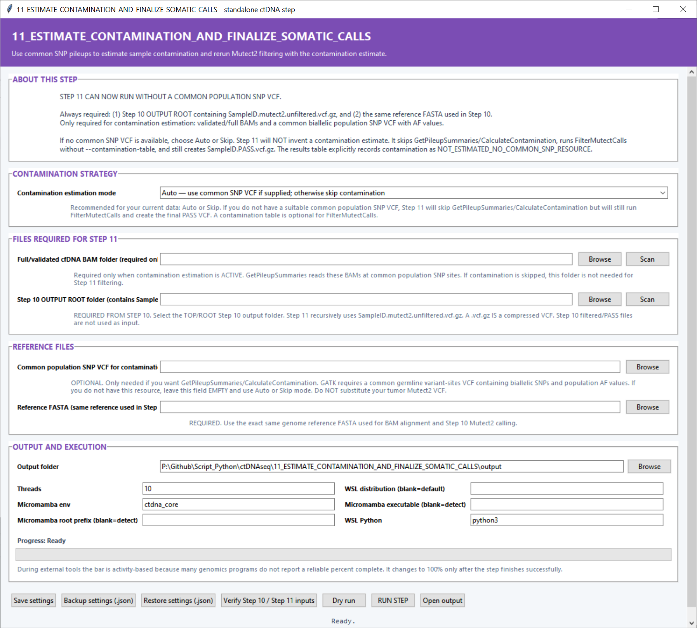

# Step 11 — Estimate contamination and finalize somatic calls

This step can estimate sample contamination from common population SNPs and then finalize the Step 10 Mutect2 calls. It produces the PASS VCFs used by downstream WBC classification and annotation.

## Settings

| Setting | Default | What it controls |
|---|---:|---|
| **Contamination estimation mode** | `Auto` | `Auto` estimates contamination when a common-SNP VCF is supplied and otherwise filters directly. `Estimate` runs the SNP pileup and contamination model. `Skip` runs final Mutect2 filtering without a contamination table. |
| **Full/validated cfDNA BAM folder** | Blank | BAMs used by GetPileupSummaries when contamination estimation is active. **Scan** discovers samples and pairs them with Step 10 calls. |
| **Step 10 OUTPUT ROOT folder** | — | Top-level Step 10 directory containing per-sample `*.mutect2.unfiltered.vcf.gz` files. The search is recursive. |
| **Common population SNP VCF** | Blank | Biallelic population SNP resource with allele frequencies used by GetPileupSummaries and CalculateContamination. |
| **Reference FASTA** | — | The reference genome used for BAM alignment and Step 10 calling. |
| **Output folder** | — | Destination for final VCFs, contamination tables, plots and logs. |
| **Threads** | `10` | CPU budget for sample processing and GATK tools. |
| **Micromamba env** | `ctdna_core` | Entry environment whose wrappers invoke GATK. |
| **Micromamba root prefix / executable** | Auto-detect | Optional direct Micromamba locations. |
| **WSL distribution** | Default WSL | Distribution used for Linux commands. |
| **WSL Python** | `python3` | Backend Python command. |

**Verify Step 10 / Step 11 inputs** checks sample matching and the selected resources. Settings can also be saved, backed up and restored as JSON.

## Main outputs

Each sample receives a final `SampleID.PASS.vcf.gz`. `contamination_and_final_filtering.tsv` summarizes the selected mode, estimates and filter results; `step11_inputs_used.tsv` records sample/file matching; and `contamination_estimates.png` compares estimates across samples.
