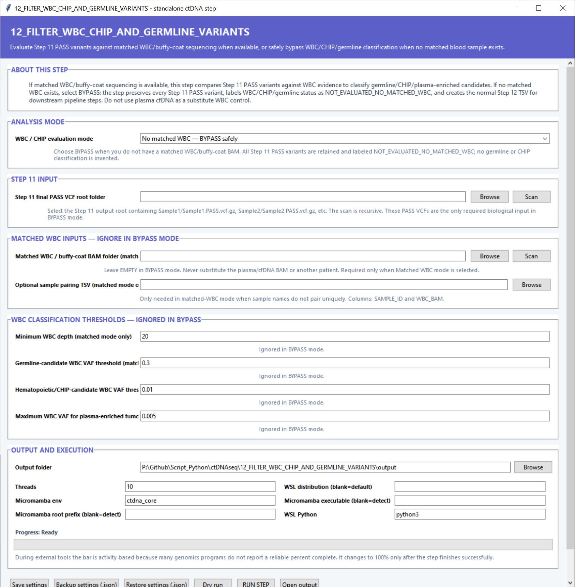

# Step 12 — Filter WBC, CHIP and germline variants

This step compares plasma variants with matched white-blood-cell or buffy-coat sequencing and classifies calls as germline candidates, hematopoietic/CHIP candidates or plasma-enriched tumor candidates.

## Analysis and input settings

| Setting | Default | What it controls |
|---|---:|---|
| **WBC / CHIP evaluation mode** | No matched WBC — bypass | `Matched WBC` performs blood-control classification. `Bypass` carries Step 11 PASS variants forward with an explicit unevaluated WBC status. |
| **Step 11 final PASS VCF root folder** | — | Root directory containing per-sample `*.PASS.vcf.gz` files. **Scan** finds the VCFs recursively. |
| **Matched WBC / buffy-coat BAM folder** | Blank | Complete matched blood-control BAMs used in matched mode. **Scan** discovers available WBC samples. |
| **Sample pairing TSV** | Blank | Explicit mapping used when sample names do not pair uniquely. The table contains `SAMPLE_ID` and `WBC_BAM`. |

## Classification thresholds

| Setting | Default | What it controls |
|---|---:|---|
| **Minimum WBC depth** | `20` | Blood-control depth required before a variant receives a WBC-based classification. |
| **Germline-candidate WBC VAF threshold** | `0.3` | WBC allele fraction at or above which a call is labeled as a germline candidate. |
| **Hematopoietic/CHIP-candidate WBC VAF threshold** | `0.01` | WBC allele fraction used to identify hematopoietic or CHIP-associated evidence. |
| **Maximum WBC VAF for plasma-enriched tumor candidate** | `0.005` | Highest WBC allele fraction accepted for the plasma-enriched tumor category. |

These four threshold fields are applied in matched-WBC mode.

## Output and execution settings

Choose an **Output folder** and **Threads** (`10`). **Micromamba env** defaults to `ctdna_core`, while the WSL distribution, Micromamba root, executable and **WSL Python** (`python3`) control backend launch. The form can be saved, backed up or restored as JSON before a dry run or full run.

## Main outputs

The downstream handoff is `wbc_chip_germline_classified_variants.tsv`. The step also creates `wbc_variant_classification_counts.png`, the sample-pairing or bypass manifest, settings, status and log files.
