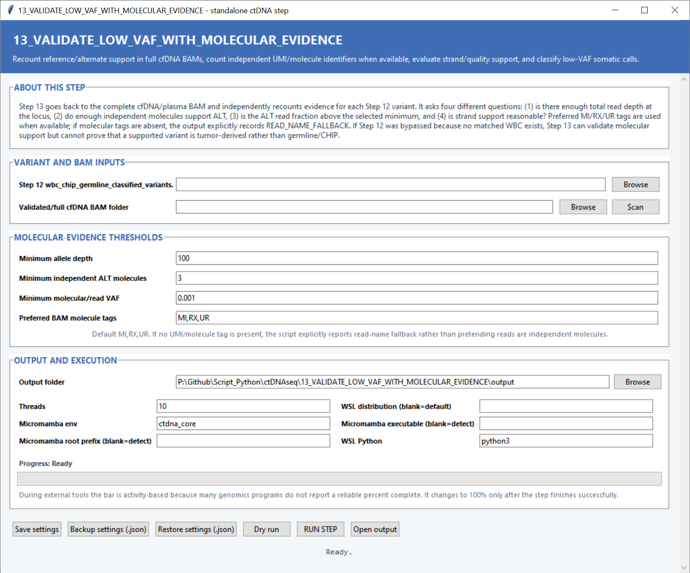

# Step 13 — Validate low-VAF calls with molecular evidence

This step revisits every Step 12 variant in the complete cfDNA BAM and independently measures total depth, alternate support, molecule support, VAF and strand balance.

## Input settings

| Setting | What it controls |
|---|---|
| **Step 12 `wbc_chip_germline_classified_variants.tsv`** | Variant list and WBC/CHIP/germline classifications to evaluate molecularly. |
| **Validated/full cfDNA BAM folder** | Complete plasma BAM files used for allele recounting. **Scan** discovers BAMs and sample names. |

## Molecular-evidence settings

| Setting | Default | What it controls |
|---|---:|---|
| **Minimum allele depth** | `100` | Total reference-plus-alternate depth required at the variant locus. |
| **Minimum independent ALT molecules** | `3` | Number of distinct molecular identifiers required to support the alternate allele. |
| **Minimum molecular/read VAF** | `0.001` | Smallest alternate fraction accepted, equivalent to 0.1% at the default. |
| **Preferred BAM molecule tags** | `MI,RX,UR` | Ordered list of BAM tags inspected for molecule identity. The first available tag is used for independent-molecule counting. |

## Output and execution settings

**Output folder** receives the validated table and QC records. **Threads** defaults to `10`; **Micromamba env** defaults to `ctdna_core`; and **WSL Python** defaults to `python3`. The WSL distribution and Micromamba paths can be selected explicitly. Settings may be saved, backed up and restored before using **Dry run** or **RUN STEP**.

## Main outputs

`molecularly_validated_somatic_variants.tsv` contains the allele and molecule counts plus the molecular QC status for every candidate. `step13_bam_matching.tsv` records sample matching, and `molecular_qc_status_counts.png` summarizes validation categories.
