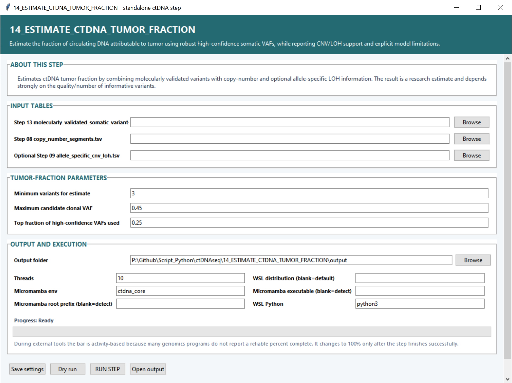

# Step 14 — Estimate ctDNA tumor fraction

This step estimates the fraction of circulating DNA attributable to tumor by combining high-confidence molecular VAFs with copy-number segments and optional allele-specific LOH information.

## Input settings

| Setting | What it controls |
|---|---|
| **Step 13 `molecularly_validated_somatic_variants.tsv`** | High-confidence variants and molecular VAFs used to find candidate clonal signals. |
| **Step 08 `copy_number_segments.tsv`** | Copy-number context used when interpreting variant allele fractions. |
| **Step 09 `allele_specific_cnv_loh.tsv`** | Optional allele-specific and LOH context for the copy-number segments. |

## Tumor-fraction settings

| Setting | Default | What it controls |
|---|---:|---|
| **Minimum variants for estimate** | `3` | Smallest number of qualifying variants required to calculate the sample estimate. |
| **Maximum candidate clonal VAF** | `0.45` | Upper VAF boundary for variants considered as candidate clonal tumor markers. |
| **Top fraction of high-confidence VAFs used** | `0.25` | Proportion of the highest qualifying VAFs included in the robust estimate. |

## Output and execution settings

Set the **Output folder**, CPU **Threads** (`10`), **Micromamba env** (`ctdna_core`), WSL distribution, optional Micromamba paths and **WSL Python** (`python3`). **Save settings**, **Dry run**, **RUN STEP** and **Open output** follow the same behavior as the preceding stages.

## Main outputs

`ctdna_fraction_estimate.tsv` contains the per-sample estimate and supporting counts. `estimated_ctdna_fraction.png` presents the estimated fractions graphically.
