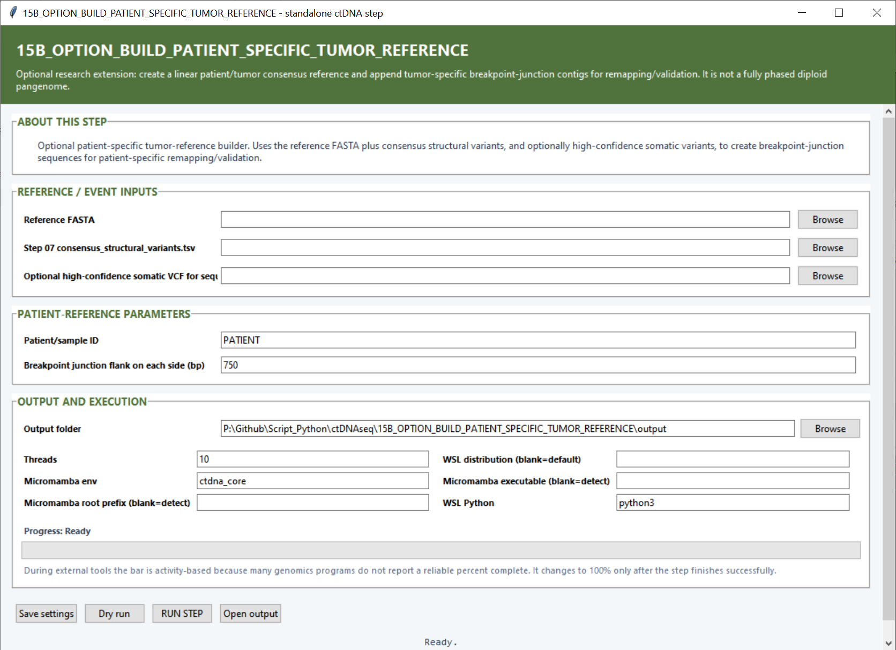

# Optional Step 15B — Build a patient-specific tumor reference

This branch creates a patient-specific augmented FASTA for remapping and breakpoint validation. It can apply high-confidence small variants to the linear reference and append synthetic contigs representing tumor breakpoint junctions.

## Reference and event settings

| Setting | What it controls |
|---|---|
| **Reference FASTA** | Starting genome sequence used to build the patient-specific reference. |
| **Step 07 `consensus_structural_variants.tsv`** | Breakpoint events converted into appended junction contigs. |
| **High-confidence somatic VCF** | Optional VCF applied with bcftools consensus to create the tumor consensus sequence. |

## Patient-reference settings

| Setting | Default | What it controls |
|---|---:|---|
| **Patient/sample ID** | `PATIENT` | Identifier used in FASTA names, output filenames and the reference manifest. |
| **Breakpoint junction flank on each side (bp)** | `750` | Amount of reference sequence extracted on both sides of each breakpoint and joined into the synthetic junction contig. |

## Output and execution settings

Choose an **Output folder** and **Threads** (`10`). **Micromamba env** defaults to `ctdna_core`; the WSL distribution and Micromamba root/executable fields select the backend installation; **WSL Python** defaults to `python3`.

## Main outputs

The step creates `SampleID.tumor_consensus_base.fa`, `SampleID.patient_specific_tumor_augmented.fa`, `patient_specific_reference_manifest.tsv`, the bcftools consensus log, saved settings and run status.
