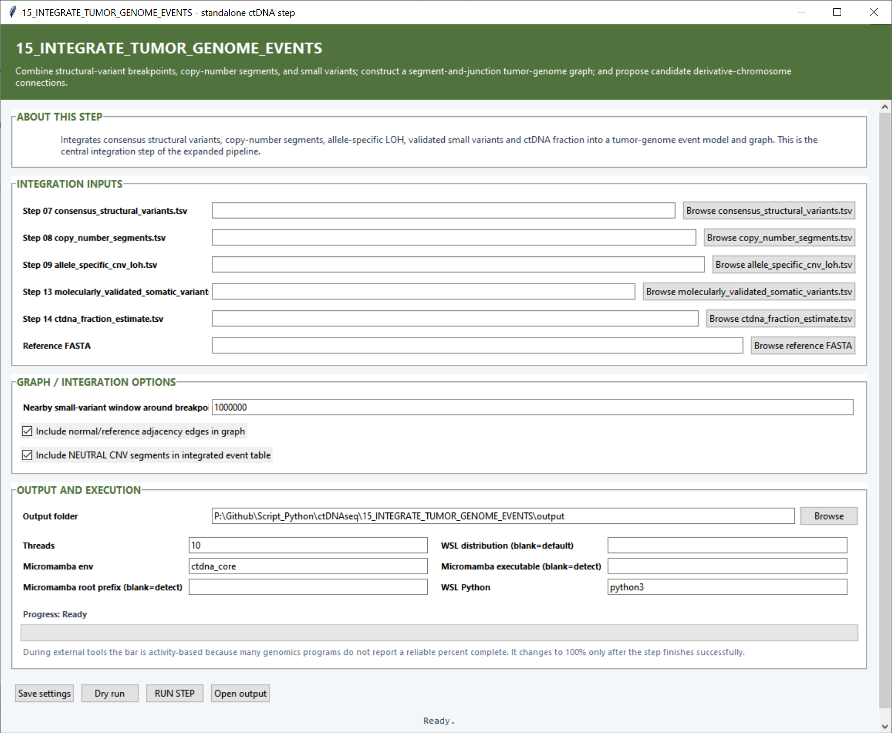

# Step 15 — Integrate tumor-genome events

This step joins structural variants, copy-number states, LOH, validated small variants and ctDNA fraction into an integrated event table and a segment-and-junction tumor-genome graph.

## Integration inputs

| Setting | What it controls |
|---|---|
| **Step 07 `consensus_structural_variants.tsv`** | Consolidated rearrangements and breakpoint junctions. |
| **Step 08 `copy_number_segments.tsv`** | Genome segments and their gain, neutral or loss state. |
| **Step 09 `allele_specific_cnv_loh.tsv`** | Allele-balance and LOH classifications for the CNV segments. |
| **Step 13 `molecularly_validated_somatic_variants.tsv`** | High-confidence SNVs and small indels. |
| **Step 14 `ctdna_fraction_estimate.tsv`** | Sample-level ctDNA fraction estimates. |
| **Reference FASTA** | Reference sequence used to define chromosome lengths, segments and normal adjacencies. |

## Graph and integration settings

| Setting | Default | What it controls |
|---|---:|---|
| **Nearby small-variant window around breakpoint (bp)** | `1000000` | Maximum genomic distance used to associate a validated small variant with a breakpoint neighborhood. |
| **Include normal/reference adjacency edges in graph** | On | Adds ordinary neighboring-segment connections alongside rearranged junctions. |
| **Include NEUTRAL CNV segments in integrated event table** | On | Keeps neutral segments so the event table and graph provide continuous genomic context. |

## Output and execution settings

The **Output folder** receives the integrated tables, graph and figures. **Threads** defaults to `10`, **Micromamba env** to `ctdna_core`, and **WSL Python** to `python3`. The WSL distribution and Micromamba locations can be entered when a specific backend installation is desired.

## Main outputs

The central files are `integrated_tumor_genome_events.tsv`, `candidate_derivative_chromosomes.tsv`, `tumor_genome_graph_nodes.tsv` and `tumor_genome_graph_edges.tsv`. Figures show the graph, events by chromosome and event-type counts; provenance tables record all input files and integration parameters.
