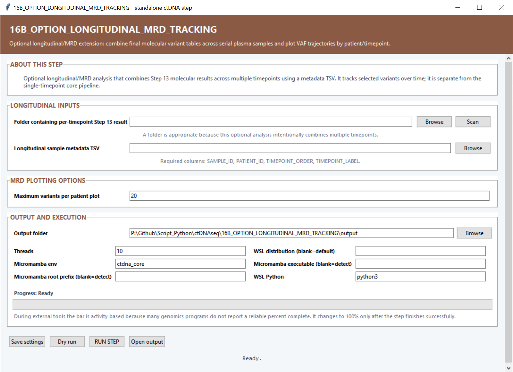

# Optional Step 16B — Longitudinal MRD tracking

This branch combines molecularly validated variant measurements from serial plasma samples and plots each patient’s variant allele-fraction trajectories across ordered timepoints.

## Longitudinal settings

| Setting | Default | What it controls |
|---|---:|---|
| **Folder containing per-timepoint Step 13 results** | — | Root directory containing `molecularly_validated_somatic_variants.tsv` files for the serial samples. **Scan** discovers the result tables. |
| **Longitudinal sample metadata TSV** | — | Assigns each sample to a patient and timepoint. Required columns are `SAMPLE_ID`, `PATIENT_ID`, `TIMEPOINT_ORDER` and `TIMEPOINT_LABEL`. |
| **Maximum variants per patient plot** | `20` | Maximum number of tracked variants drawn in each patient trajectory figure. |
| **Output folder** | — | Destination for combined measurements, matrices, patient plots and logs. |
| **Threads** | `10` | CPU budget available for combining and plotting the cohort. |
| **Micromamba env** | `ctdna_core` | Environment containing pandas, NumPy and Matplotlib. |
| **Micromamba root prefix / executable** | Auto-detect | Optional direct paths to Micromamba. |
| **WSL distribution** | Default WSL | Linux distribution used for backend work. |
| **WSL Python** | `python3` | Python command used inside WSL. |

## Main outputs

`longitudinal_variant_measurements.tsv` contains the long-form measurements, `longitudinal_variant_vaf_matrix.tsv` provides a sample-by-variant matrix, and each patient receives a `PatientID.longitudinal_variant_vaf.png` trajectory plot.
