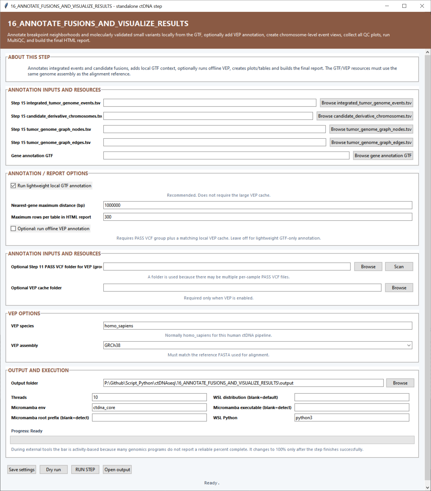

# Step 16 — Annotate fusions and visualize results

This step adds gene context to the integrated tumor-genome events, identifies candidate genomic fusions, produces chromosome-level views, gathers QC figures, runs MultiQC and builds the final HTML report.

## Annotation inputs

| Setting | What it controls |
|---|---|
| **Step 15 `integrated_tumor_genome_events.tsv`** | Combined structural, copy-number, LOH, small-variant and tumor-fraction event table. |
| **Step 15 `candidate_derivative_chromosomes.tsv`** | Candidate rearranged chromosome paths included in the report. |
| **Step 15 `tumor_genome_graph_nodes.tsv`** | Segment/node definitions used for graph-aware annotation and visualization. |
| **Step 15 `tumor_genome_graph_edges.tsv`** | Normal and rearranged junction edges used to reconstruct event relationships. |
| **Gene annotation GTF** | Gene and transcript coordinates used for local breakpoint and variant annotation. |

## Annotation and report settings

| Setting | Default | What it controls |
|---|---:|---|
| **Run lightweight local GTF annotation** | On | Annotates breakpoints and small variants directly from the selected GTF. |
| **Nearest-gene maximum distance (bp)** | `1000000` | Largest distance searched when assigning the nearest gene to an intergenic event. |
| **Maximum rows per table in HTML report** | `300` | Number of records displayed in each report table. Full TSV outputs remain separate. |
| **Run offline VEP annotation** | Off | Adds Ensembl VEP consequences using the local cache and PASS VCF collection. |
| **Step 11 PASS VCF folder for VEP** | Blank | Root folder containing the per-sample PASS VCF files supplied to VEP. **Scan** discovers the VCF group. |
| **VEP cache folder** | Blank | Local Ensembl VEP cache used for offline annotation. |
| **VEP species** | `homo_sapiens` | Species identifier passed to VEP. |
| **VEP assembly** | `GRCh38` | Genome assembly used to select the matching VEP cache data. |

## Output and execution settings

The **Output folder** receives annotated tables, figures and reports. **Threads** defaults to `10`; **Micromamba env** defaults to `ctdna_core`; and **WSL Python** defaults to `python3`. The WSL distribution, Micromamba root prefix and executable fields can select a specific backend installation.

## Main outputs

The final deliverable is `ctDNA_tumor_genome_report.html`. Supporting files include `annotated_integrated_tumor_genome_events.tsv`, `annotated_breakpoints.tsv`, `candidate_genomic_gene_fusions.tsv`, local GTF and optional VEP annotations, chromosome images, the event overview and `multiqc_report.html`.
