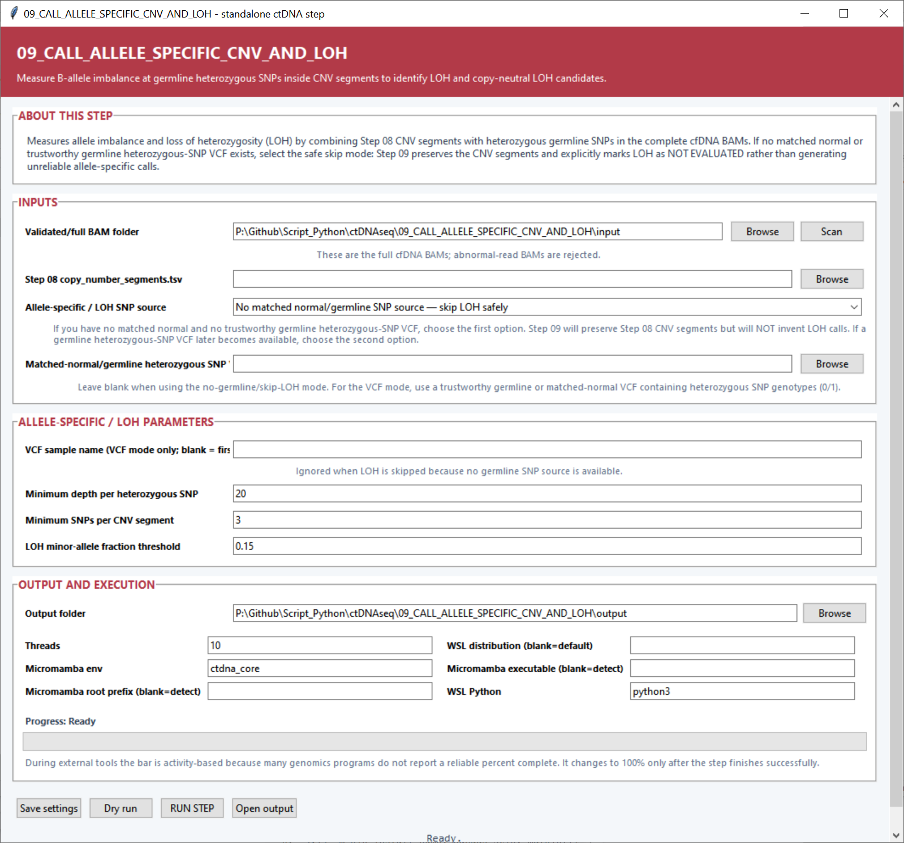

# ctDNAseq

`ctDNAseq` is a step-by-step Python toolkit for turning paired-end cell-free DNA sequencing reads into an integrated view of tumor-derived genomic events. The workflow begins with raw FASTQ files, follows the reads through trimming, alignment and quality control, and then brings together structural variants, copy-number changes, loss of heterozygosity, SNVs, small indels and molecular evidence. The final steps assemble those results into annotated tables, plots and an HTML report.

Every analysis step can be opened as a Windows desktop application or run from the command line. The graphical interfaces use the same layout throughout the project, so moving from one stage to the next feels familiar: select the input, review the settings, choose an output folder, run a dry run if desired, and start the analysis.

## What the workflow produces

The main path creates:

- quality reports and a validated FASTQ inventory;
- trimmed reads with UMI information preserved when present;
- coordinate-sorted, indexed, analysis-ready BAM files;
- mapping, depth and cfDNA fragment-size measurements;
- candidate and consensus structural variants;
- copy-number gain, loss and allele-specific LOH calls;
- somatic SNV and small-indel calls refined with contamination, WBC and molecular evidence;
- an estimate of ctDNA tumor fraction;
- an integrated tumor-genome event graph;
- gene and fusion annotations, chromosome views, MultiQC output and a final HTML report.

Three optional branches extend the main analysis: building a Mutect2 Panel of Normals, constructing a patient-specific tumor reference, and following molecular variants across longitudinal samples for MRD analysis.

## Workflow at a glance

| Stage | Purpose | Main handoff |
|---|---|---|
| 01–04 | Prepare reads, align them and measure sequencing quality | Analysis-ready BAM files and QC summaries |
| 05–07 | Find, assemble and consolidate chromosome breakpoints | `consensus_structural_variants.tsv` |
| 08–09 | Measure total and allele-specific copy number | `copy_number_segments.tsv` and `allele_specific_cnv_loh.tsv` |
| 09B–13 | Call and refine SNVs and small indels | `molecularly_validated_somatic_variants.tsv` |
| 14–15 | Estimate tumor fraction and integrate genomic events | Tumor-genome event tables and graph files |
| 16 | Annotate and present the results | `ctDNA_tumor_genome_report.html` |
| 15B, 16B | Patient-reference and longitudinal extensions | Augmented FASTA files and MRD trajectories |

## Installation

The project includes a Windows interface and a WSL computational environment. The installers live in [`00_INSTALL`](00_INSTALL).

### 1. Install the Windows GUI packages

From Windows, run:

```bat
00_INSTALL\Install_Windows_GUI_Dependencies.bat
```

This installs the Python packages used to draw the interfaces and local figures, including pandas, NumPy, Matplotlib and NetworkX.

### 2. Build the WSL analysis environments

From WSL, open the installer directory and run:

```bash
cd /mnt/p/Github/Script_Python/ctDNAseq/00_INSTALL
bash install_WSL1_environment.sh
```

The installer creates a central `ctdna_core` Micromamba environment and dedicated environments for GATK, Manta, GRIDSS2, DELLY, SvABA and VEP. It also installs transparent command wrappers so the Python scripts can call the complete toolchain from one workflow.

The core environment contains FastQC, MultiQC, Cutadapt, BWA, BWA-MEM2, samtools, bcftools, fgbio, SPAdes, minimap2, CNVkit, Nextflow and the Python analysis libraries.

### 3. Verify the connection and tools

Run the Windows verification helper:

```bat
00_INSTALL\TEST_WSL1_CONNECTION_V4_EXPLICIT_LABELS.bat
```

It checks WSL, Micromamba, the Python imports and every command used by the pipeline.

## Running a step

### Desktop interface

Launch a script without additional arguments:

```bash
python 01_FASTQ_QUALITY_CONTROL/01_FASTQ_QUALITY_CONTROL.py
```

The recurring controls are:

- **Browse** selects a folder or file.
- **Scan** discovers compatible inputs and pairs samples where needed.
- **Save settings** keeps the current choices for the next session.
- **Backup settings (.json)** and **Restore settings (.json)** make portable copies in steps that expose those controls.
- **Dry run** validates the inputs and shows the commands that will be used.
- **RUN STEP** starts the analysis.
- **Open output** opens the selected result folder.

The execution section also lets you set the CPU count, Micromamba environment, WSL distribution, Micromamba location and WSL Python command. Blank WSL and Micromamba path fields use automatic discovery.

### Command line and workflow engines

Each script also supports non-interactive execution with `--cli` or `--no-gui`:

```bash
python STEP.py --cli --input-dir INPUT_FOLDER --output-dir OUTPUT_FOLDER
```

For example:

```bash
python 04_BAM_MAPPING_AND_FRAGMENT_QC/04_BAM_MAPPING_AND_FRAGMENT_QC.py \
  --cli \
  --input-dir results/03_bam \
  --output-dir results/04_qc \
  --bam-qc-minimum-mapping-quality 20 \
  --bam-qc-fragment-maximum-length 800
```

Use the script help to see every setting accepted by a particular step:

```bash
python STEP.py --help
```

Boolean values are written explicitly as `true` or `false`. CLI runs start with the script defaults and can load a saved configuration with `--settings-file settings.json`. The effective configuration is recorded in the output directory as `cli_effective_settings.json`, making a run easy to reproduce in Nextflow or another workflow engine.

## Detailed workflow

### Step 01 — FASTQ quality control

Step 01 recursively scans a folder for FASTQ or FASTQ.GZ files, recognizes R1/R2 partners from their filenames, and checks read identifiers to confirm that the pairs belong together. It runs FastQC and turns the results into a compact inventory that the next step can use directly.

The output includes `fastq_inventory.tsv`, `fastq_files_detected.tsv`, `fastqc_basic_metrics.tsv`, `fastqc_module_status.tsv`, a text summary, and plots showing sequencing layout, raw yield, file sizes and FastQC module status.


### Step 02 — UMI extraction and read trimming

Step 02 prepares raw reads for alignment. Choose the library or adapter preset, then select whether the reads contain no inline UMI, a simplex UMI or a duplex UMI. For inline barcodes, the R1 and R2 UMI lengths tell the script how many bases to extract. Cutadapt then removes adapter read-through, trims low-quality sequence and filters reads by retained length and ambiguous-base fraction.

Library presets fill the editable adapter sequences, while the advanced option can retain the intermediate UMI-extracted FASTQ files. The principal outputs are processed paired or single-end FASTQ files, `processed_fastq_results.tsv`, `trimming_qc_metrics.tsv`, Cutadapt JSON records, and plots of retained reads and read-retention percentage.


### Step 03 — Map reads and create analysis-ready BAM files

Step 03 maps the processed reads to the selected reference with BWA-MEM2, coordinate-sorts the alignments, creates BAM indexes and records alignment statistics. The reference panel supports a prebuilt BWA-MEM2 index and provides separate controls to verify or create that index. FASTA support files such as `.fai` and `.dict` can be generated as part of the run.

When Step 02 preserved UMI metadata, the script can group related molecules with fgbio and create consensus reads before producing the final BAM. The GUI exposes the UMI grouping strategy, edit distance, minimum family size, consensus base quality and advanced error-rate filters.

Each sample receives an `analysis_ready.bam` with its index, flagstat and duplicate metrics. Summary outputs include `mapping_results.tsv`, `mapping_qc_metrics.tsv`, detected FASTQ and index-verification tables, UMI family and consensus metrics, plus mapping and properly-paired read plots.


### Step 04 — BAM mapping and cfDNA fragment quality control

Step 04 examines the complete BAM files from the alignment stage. It validates coordinate sorting, creates missing BAM indexes, measures mapping and depth statistics, counts soft-clipped and supplementary reads, identifies discordant pairs and builds cfDNA fragment-length distributions.

The fragment settings define the analyzed size range and separate short fragments from the mononucleosome-sized population. Genome-wide fixed-bin depth can be calculated for broader coverage views. For targeted assays, the script can use a supplied BED file or infer high-depth regions from the BAMs, merge nearby bases and produce a consensus inferred-target BED across samples.

The result folder contains `bam_mapping_and_fragment_qc_metrics.tsv`, `bam_qc_results.tsv`, validation records, per-sample fragment tables and plots, depth histograms, genome-bin plots, inferred-region BED/TSV files, and cohort plots for mean depth, fragment length and abnormal-alignment fractions.


### Step 05 — Extract abnormal alignments

Step 05 searches the full BAM files for reads that carry structural-variant evidence. This includes split or supplementary alignments, substantial soft clipping, discordant chromosome/orientation/distance patterns and pairs in which one mate is unmapped. Mapping quality, soft-clip length and expected insert size define the selection rules.

For every selected query name, the script exports the complete read record so the next stage has coherent pairs for local assembly. Outputs include abnormal-pair BAM files, paired abnormal FASTQs, singleton FASTQs, `abnormal_alignment_evidence.tsv`, result and parameter tables, and plots of abnormal-read fractions and evidence categories.


### Step 06 — Assemble reads and call chromosome breakpoints

Step 06 combines five complementary views of structural variation. SPAdes assembles the abnormal FASTQ evidence from Step 05 and minimap2 aligns the contigs back to the reference. Manta, GRIDSS2, DELLY and SvABA analyze the complete Step 03 BAM files. Their records are normalized into one breakpoint schema with caller identity, read support and local depth.

The interface lets you activate callers independently, choose automatic or manual SPAdes k-mers, set minimum contig and alignment lengths, and define the local depth window. Reference sequences can be selected as canonical so the results are also separated into canonical and non-canonical breakpoint tables.

The central output is `candidate_breakpoints.tsv` or the canonical/non-canonical pair of tables. Ranked and all-caller variants are also written, alongside assembled contigs, caller VCFs, validation and parameter tables, parsing diagnostics, and plots describing callers, SV types, chromosome pairs, support scores and assembled contig lengths.


### Step 07 — Consolidate structural variants

The callers in Step 06 may describe the same event with reversed breakends or slightly different coordinates. Step 07 clusters those technical records within the chosen breakpoint tolerance and converts them into one biological consensus event. A minimum supporting-record count can be used to define how much technical evidence is carried into the consensus set.

The outputs are `consensus_structural_variants.tsv`, a record-to-consensus mapping table, the step log and a plot of consensus SV types.


### Step 08 — Call copy-number gains and losses

Step 08 runs CNVkit on complete tumor or test BAM files. The analysis can reuse an existing assay-specific `.cnn` reference, build a pooled reference from normal BAMs, or create a flat reference. Hybrid-capture, amplicon and whole-genome designs are supported, with target intervals selected for enriched assays.

After coverage normalization, CNVkit segments neighboring bins. The segmentation method, sex-chromosome convention and low-coverage-bin handling are available in the GUI. The workflow converts CNVkit log2 values into a signed ordinary copy-ratio scale: gains are positive and losses are negative, with editable thresholds for both classes.

The main handoff is `copy_number_segments.tsv`. The step also writes CNVkit `.cnr` and `.cns` files, the reference used or built, parameter and result tables, per-sample genome profiles and a cohort gain/loss count plot.


### Step 09 — Call allele-specific CNV and LOH

Step 09 combines the copy-number segments from Step 08 with heterozygous germline SNPs and allele counts from the full cfDNA BAM files. Within each segment, it measures B-allele balance and classifies regions showing loss of heterozygosity, including copy-neutral LOH patterns.

The analysis uses configurable minimum SNP depth, minimum SNPs per segment and a minor-allele-fraction threshold. The GUI also provides a direct path for carrying the copy-number segments forward when the analysis is being run without a germline SNP source.

The resulting `allele_specific_cnv_loh.tsv` summarizes segment-level allele balance and LOH status. `allele_specific_snp_baf.tsv` keeps the individual SNP measurements, and `loh_classification_counts.png` summarizes the classifications.



### Optional Step 09B — Build a Mutect2 Panel of Normals

Step 09B builds an assay-specific background model from a cohort of validated normal BAM files. Mutect2 is run on each normal sample, the individual calls are imported into GenomicsDB, and GATK combines them into `panel_of_normals.vcf.gz` for Step 10.

The panel can cover the whole reference or a supplied target BED. `pon_normal_samples.tsv` and `pon_build_summary.tsv` record the cohort and build results, while per-normal Mutect2 logs preserve the processing details.


### Step 10 — Call SNVs and small indels

Step 10 runs GATK Mutect2 on complete cfDNA or tumor BAM files. It accepts a matched-normal BAM, population germline resource, Panel of Normals and target BED. The interface exposes the initial tumor LOD, minimum base quality and per-alignment-start handling, and it balances independent sample jobs with PairHMM workers from the global CPU budget.

For each sample, the script writes an unfiltered Mutect2 VCF, a filtered VCF and a PASS-only VCF. It also produces `somatic_snvs_and_small_indels.tsv`, `small_variant_results.tsv`, parameter and parallelism records, target-BED provenance, filter summaries, and plots of PASS counts, VAF distributions and filtering reasons.


### Step 11 — Estimate contamination and finalize somatic calls

Step 11 uses common biallelic population SNPs to measure contamination in each sample, then feeds that estimate back into Mutect2 filtering. The automatic mode uses the common-SNP resource when it is supplied and otherwise proceeds directly to final filtering. The input selector points to the Step 10 output root so it can find the per-sample unfiltered VCFs recursively.

Every sample receives a final `SampleID.PASS.vcf.gz`. `contamination_and_final_filtering.tsv` records the filtering result and contamination status, `step11_inputs_used.tsv` captures the file pairing, and `contamination_estimates.png` presents the estimates across the cohort.


### Step 12 — Classify WBC, CHIP and germline variants

Step 12 compares the final Step 11 plasma variants with matched white-blood-cell or buffy-coat sequencing. It measures depth and VAF in the blood control and labels variants as germline candidates, hematopoietic/CHIP candidates or plasma-enriched tumor candidates according to the selected thresholds.

Sample names can be paired automatically or with a two-column pairing TSV containing `SAMPLE_ID` and `WBC_BAM`. The alternative analysis mode carries all Step 11 variants forward with an explicit unevaluated WBC status, which keeps the downstream file structure identical across cohorts.

The main output is `wbc_chip_germline_classified_variants.tsv`, accompanied by a classification-count plot, pairing or bypass manifest, settings and run log.


### Step 13 — Validate low-VAF calls with molecular evidence

Step 13 returns to the complete cfDNA BAMs and independently recounts reference and alternate support for every Step 12 variant. It asks whether the locus has enough total depth, whether enough independent molecules support the alternate allele, whether the molecular or read VAF reaches the selected level, and whether strand support is balanced.

Molecule identities are read from the preferred BAM tags, listed by default as `MI,RX,UR`. The thresholds for allele depth, independent alternate molecules and VAF are all adjustable from the interface.

The validated calls are written to `molecularly_validated_somatic_variants.tsv`. The output also contains BAM-to-sample matching records, status counts, saved settings and a summary plot of molecular QC classifications.


### Step 14 — Estimate ctDNA tumor fraction

Step 14 combines the high-confidence molecular variants from Step 13 with copy-number segments and optional allele-specific LOH information. It selects candidate clonal variants below the configured maximum VAF, takes the upper fraction of the high-confidence VAF distribution, and derives a robust sample-level ctDNA fraction estimate.

The settings define the minimum number of variants, maximum candidate clonal VAF and proportion of top VAFs used. Results are written to `ctdna_fraction_estimate.tsv` and visualized in `estimated_ctdna_fraction.png`.


### Step 15 — Integrate tumor-genome events

Step 15 is the central integration stage. It joins the structural variants from Step 07, copy-number segments from Step 08, LOH calls from Step 09, validated small variants from Step 13 and tumor-fraction estimates from Step 14. From those pieces it builds a segment-and-junction graph representing the observed tumor genome.

Small variants within the selected distance of a breakpoint are linked to that neighborhood. Normal reference adjacencies and neutral CNV segments can be included to create a fuller graph and event table.

The step writes `integrated_tumor_genome_events.tsv`, `candidate_derivative_chromosomes.tsv`, `tumor_genome_graph_nodes.tsv` and `tumor_genome_graph_edges.tsv`. It also creates a graph image, chromosome event plot, event-type summary and complete input/parameter provenance tables.


### Optional Step 15B — Build a patient-specific tumor reference

Step 15B creates an augmented reference for patient-specific remapping and validation. It starts from the reference FASTA, applies high-confidence somatic sequence changes when a VCF is supplied, and appends breakpoint-junction contigs built from the consensus structural variants. The flank length controls how much reference sequence is included on either side of each junction.

The output includes a tumor consensus FASTA, `SampleID.patient_specific_tumor_augmented.fa`, a manifest describing every added sequence and a bcftools consensus log.


### Step 16 — Annotate fusions and visualize the results

Step 16 turns the integrated model into a readable biological report. It uses a gene annotation GTF to place breakpoints and small variants in local gene context, identifies candidate genomic gene fusions, creates chromosome-level event views and collects the QC figures produced throughout the workflow. Offline VEP annotation can be added from a local cache and the Step 11 PASS VCFs.

The report settings control the nearest-gene search distance and the number of rows shown in each HTML table. The result folder contains annotated event and breakpoint tables, `candidate_genomic_gene_fusions.tsv`, local GTF and optional VEP variant annotations, chromosome images, an event overview, `multiqc_report.html`, and the final `ctDNA_tumor_genome_report.html`.


### Optional Step 16B — Longitudinal MRD tracking

Step 16B combines Step 13 molecular result tables from serial plasma samples. A metadata TSV assigns each sample to a patient and orders the timepoints with four columns: `SAMPLE_ID`, `PATIENT_ID`, `TIMEPOINT_ORDER` and `TIMEPOINT_LABEL`.

The script creates `longitudinal_variant_measurements.tsv`, a wide `longitudinal_variant_vaf_matrix.tsv`, and a VAF trajectory plot for each patient. The maximum-variants setting keeps each patient plot focused on the most informative tracked variants.


## Settings, logs and reproducibility

Each step keeps its own settings beside the script and writes the effective run configuration into the output. Step logs, `step_status.json`, input manifests and parameter tables preserve the connection between source files, selected options and generated results. Together, these records make it straightforward to repeat a desktop run from the CLI or place the same step inside a larger workflow.

For a typical project, use a separate output directory for every stage and feed the named handoff table or folder into the next script. This keeps the analysis history readable while allowing individual stages to be rerun with updated settings.
