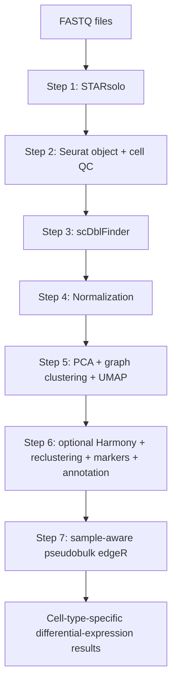

# single-cell RNA-seq pipeline

## Scientific purpose

This repository implements a **stepwise single-cell RNA-seq (scRNA-seq) workflow** that separates alignment/count generation, Seurat object construction, cell-level quality control, doublet detection, normalization, clustering/annotation, and sample-aware pseudobulk differential-expression analysis into independent stages.

The design is deliberately modular: each stage reads from its local `Input/` directory and writes its products to `Output/`. This makes the analysis auditable because the output of each stage can be inspected before it is accepted as the input of the next stage.


---

## Pipeline overview



### Files covered by this README

| Stage | Script |
|---|---|
| Package setup | `00_Install/00_Install_R_Packages_scRNAseq.R` |
| Step 1 | `Starsolo_Rscript.R` |
| Step 2 | `Seurat_QC_Rscript.R` |
| Step 3 | `Doublet_Detection.R` |
| Step 4 | `Normalization_Rscript.R` |
| Step 5 | `Clustering_Rscript.R` |
| Step 6 | `Integration_Annotation.R` |
| Step 7 | `Pseudobulk_DE.R` |

Step 5 creates the PCA reduction, initial graph clusters, and initial UMAP. Step 6 reads that clustered object, optionally creates a Harmony reduction, recalculates neighbors/clusters/UMAP, finds markers, and assigns cell-type labels.

---

# 0. R package installation

Run:

```bash
Rscript 00_Install/00_Install_R_Packages_scRNAseq.R
```

The installer includes the R ecosystem needed for the current workflow: Seurat/SeuratObject, `sctransform`, `glmGamPoi`, `scDblFinder`, `SingleCellExperiment`, `SummarizedExperiment`, `harmony`, `presto`, `SingleR`, `celldex`, `BiocParallel`, `edgeR`, and supporting packages.

### Installer parameters

| Parameter | Default | Meaning |
|---|---:|---|
| `INSTALL_OPTIONAL_BPCELLS` | `FALSE` | If `TRUE`, also attempts to install BPCells. It is not required by the core scripts documented here. |
| `INSTALL_OPTIONAL_SPATIAL_RCTD` | `FALSE` | If `TRUE`, installs `spacexr` from GitHub for optional spatial RCTD workflows. |
| `UPDATE_ALREADY_INSTALLED_PACKAGES` | `FALSE` | If `FALSE`, only missing packages are installed. |

The script writes `R_package_installation_verification.csv` and stops if a required package remains unavailable.

### Quality-control role

This is an **environment QC** step rather than biological QC. It verifies that all requested namespaces can be loaded and records their versions. A reproducible analysis should retain this table together with `sessionInfo()` from each analytical step.

---

# Input metadata

Step 2 optionally reads either:

- `Input/sample_metadata.csv`, or
- `Input/sample_metadata.tabtxt`

with `sample_metadata.csv` taking priority when both are present.

At minimum the metadata file must contain:

```text
sample_id
```

Typical additional columns are:

```text
condition
batch
patient
sex
region
```

Example:

```csv
sample_id,condition,batch,patient
Sample01,Control,B1,P01
Sample02,Treatment,B1,P02
```

The exact values in these columns propagate into the Seurat object and can later be used for Harmony correction, UMAP coloring, sample-aware design matrices, or pseudobulk contrasts.

---

# 1. STARsolo alignment and UMI counting

**Script:** `1_StarSolo/Starsolo_Rscript.R`

## Purpose

This stage converts paired 10x-style FASTQ data into sparse gene-by-barcode UMI count matrices. Under native Windows R, the script executes STAR through a selected WSL distribution and converts Windows paths to Linux/WSL paths automatically.

The script automatically detects:

- gzipped R1 FASTQ files;
- their corresponding R2 files;
- exactly one STAR genome index containing `Genome`, `SA`, and `SAindex`;
- exactly one barcode whitelist;
- multiple sequencing lanes belonging to the same inferred sample.

STARsolo is called with **R2 first** (cDNA/transcript read) and **R1 second** (cell-barcode/UMI read).

## Main parameters

| Parameter | Default | Scientific / computational meaning |
|---|---:|---|
| `STAR_EXECUTABLE` | `/usr/local/bin/STAR` | Linux/WSL path to the STAR executable. |
| `WSL_DISTRIBUTION` | `Debian` | WSL distribution used when the R script is executed from Windows. |
| `THREADS` | `12` | Number of STAR computational threads. Affects runtime, not the biological definition of cells. |
| `CHEMISTRY` | `10x_3p_v3` | Defines cell-barcode and UMI positions. `10x_3p_v3` = 16-bp barcode + 12-bp UMI; `10x_3p_v2` = 16-bp barcode + 10-bp UMI. A wrong chemistry setting can corrupt barcode/UMI interpretation. |
| `CREATE_BAM` | `FALSE` | If `TRUE`, also writes an unsorted BAM. This can require substantial disk space. |
| `CELL_FILTER_METHOD` | `EmptyDrops_CR` | STARsolo cell-calling mode used by `--soloCellFilter`. |

Additional STARsolo settings in the script include:

```text
--soloCBmatchWLtype 1MM_multi_Nbase_pseudocounts
--soloUMIfiltering MultiGeneUMI_CR
--soloUMIdedup 1MM_CR
--clipAdapterType CellRanger4
--outFilterScoreMin 30
--soloFeatures Gene GeneFull Velocyto
```

## Main outputs

For each sample, the script expects:

```text
<SAMPLE>_Solo.out/Gene/filtered/matrix.mtx
<SAMPLE>_Solo.out/Gene/filtered/barcodes.tsv
<SAMPLE>_Solo.out/Gene/filtered/features.tsv
<SAMPLE>_Solo.out/Gene/raw/matrix.mtx
<SAMPLE>_Solo.out/Gene/Summary.csv
```

It also writes:

```text
detected_FASTQ_manifest.csv
STARsolo_output_manifest.csv
run_log.txt
sessionInfo.txt
```

The script stops if required STARsolo output files are absent.

## QC enabled by this step

This stage provides several *technical integrity controls*:

1. **R1/R2 pairing check** — every R1 must resolve to exactly one R2.
2. **Genome-index validation** — exactly one valid STAR index must be found.
3. **Whitelist validation** — exactly one barcode whitelist must be identified.
4. **Chemistry consistency** — the selected chemistry determines barcode/UMI coordinates.
5. **Expected-output validation** — the run is rejected if core STARsolo matrix files are missing.
6. **STARsolo summary review** — `Summary.csv` should be inspected before downstream analysis.

### Synthetic example of a STARsolo summary

The exact STARsolo `Summary.csv` fields depend on STAR/STARsolo output conventions. A plausible *illustrative* summary might look like:

| Metric | Synthetic value |
|---|---:|
| Number of Reads | 84,200,000 |
| Reads with valid barcodes | 96.1% |
| Reads mapped to genome | 91.7% |
| Reads mapped to unique genes | 72.8% |
| Estimated cells | 6,420 |
| Median UMI per cell | 5,840 |
| Median genes per cell | 2,190 |

These values are **not expected thresholds**; they only show the type of run-level information one should inspect.

### Visual output

This script does **not** currently generate a dedicated QC plot. Its principal outputs are matrices, STARsolo summaries, and manifests. For an auditable production workflow, FASTQ-level QC such as FastQC/MultiQC would normally be reviewed separately; that functionality is not present in this script.

---

# 2. Seurat import and cell-level QC

**Script:** `2_Seurat/Seurat_QC_Rscript.R`

## Purpose

This stage locates filtered STARsolo or Cell Ranger-style matrix directories, constructs one Seurat object per sample, merges samples, calculates QC metrics, applies cell filters, and records both pre-filter and post-filter states.

Recognized matrix layouts include:

```text
Solo.out/Gene/filtered/
filtered_feature_bc_matrix/
```

with:

```text
matrix.mtx[.gz]
barcodes.tsv[.gz]
features.tsv[.gz] or genes.tsv[.gz]
```

## Parameters

| Parameter | Default | Interpretation |
|---|---:|---|
| `MIN_FEATURES` | `200` | Minimum genes/features detected per cell. Very low values often indicate empty/low-complexity droplets. |
| `MAX_FEATURES` | `7500` | Maximum detected genes per cell. Extremely high values can reflect doublets/multiplets or unusually complex cells. |
| `MIN_COUNTS` | `500` | Minimum total UMI count per cell. |
| `MAX_COUNTS` | `Inf` | No upper UMI cutoff is applied by default. |
| `MAX_PERCENT_MT` | `20` | Cells with mitochondrial percentage above 20% are removed. |
| `MIN_CELLS_PER_GENE` | `3` | A gene must be detected in at least three cells to be retained when the Seurat object is created. |
| `MITOCHONDRIAL_PATTERN` | `^MT-` | Human mitochondrial gene-name pattern used to calculate `percent.mt`. |
| `RIBOSOMAL_PATTERN` | `^RP[SL]` | Human ribosomal protein gene-name pattern used to calculate `percent.ribo`. |

`percent.ribo` is measured and visualized but is **not used as a filtering criterion** in this script.

## Cell filter

A cell is retained when:

```text
nFeature_RNA >= MIN_FEATURES
nFeature_RNA <= MAX_FEATURES
nCount_RNA   >= MIN_COUNTS
nCount_RNA   <= MAX_COUNTS
percent.mt   <= MAX_PERCENT_MT
```

## Outputs

```text
detected_matrix_manifest.csv
seurat_before_QC.rds
cell_QC_metrics_before_filtering.csv
QC_violin_plots_before_filtering.pdf
QC_scatter_plots_before_filtering.pdf
cell_QC_metrics_after_filtering.csv
cell_counts_by_sample.csv
QC_violin_plots_after_filtering.pdf
seurat_QC_filtered.rds
QC_parameters.csv
run_log.txt
sessionInfo.txt
```

## QC enabled by this step

This is the principal **cell-quality gate**.

The before/after tables make filtering quantitatively auditable. The violin plots display:

- `nFeature_RNA`
- `nCount_RNA`
- `percent.mt`
- `percent.ribo`

grouped by sample.

The scatter plots display:

- `nCount_RNA` versus `percent.mt`
- `nCount_RNA` versus `nFeature_RNA`

A scientifically important point is that fixed thresholds should not be accepted blindly. The distributions should be inspected per sample because tissue type, dissociation protocol, sequencing depth, and expected cell biology can legitimately change these metrics.

### Synthetic example

```csv
sample_id,cells_before_QC,cells_after_QC,cells_removed
Sample01,6420,5710,710
Sample02,5980,5335,645
Sample03,7010,6175,835
Sample04,6250,5600,650
```

Expected visual style:

The corresponding script output is `2_Seurat/Output/QC_violin_plots_before_filtering.pdf`.

The actual script's violin PDF contains multiple QC metrics, while the image above shows one representative metric.

The corresponding script output is `2_Seurat/Output/QC_scatter_plots_before_filtering.pdf`.

In the real output, the horizontal mitochondrial cutoff is determined by `MAX_PERCENT_MT`.

---

# 3. Doublet detection

**Script:** `3_Doublet_Detection/Doublet_Detection.R`

## Purpose

This stage identifies probable doublets/multiplets with `scDblFinder`. For Seurat v5 objects it first joins split RNA count layers when necessary, converts the RNA assay to a `SingleCellExperiment`, verifies that a raw `counts` assay exists, and runs `scDblFinder` **with the sample identifier supplied to the algorithm**.

## Parameters

| Parameter | Default | Interpretation |
|---|---:|---|
| `SAMPLE_COLUMN` | `sample_id` | Metadata field used to distinguish samples during doublet detection. |
| `EXPECTED_DOUBLET_RATE` | `NULL` | `NULL` allows `scDblFinder` to estimate an appropriate doublet rate. A numeric value overrides that behavior. |
| `RANDOM_SEED` | `12345` | Reproducibility seed. |

## Outputs

```text
seurat_with_doublet_calls.rds
seurat_singlets.rds
doublet_scores_and_calls.csv
doublet_summary_by_sample.csv
scDblFinder_score_distribution.png
scDblFinder_score_distribution.pdf
run_log.txt
sessionInfo.txt
```

`seurat_singlets.rds` is the natural input to the normalization step.

## QC enabled by this step

The stage provides two complementary checks:

1. `doublet_summary_by_sample.csv` — checks whether one sample has a markedly different doublet burden.
2. `scDblFinder_score_distribution.*` — visualizes score distributions and calls.

A high or sample-specific doublet fraction should trigger review of cell loading, capture yield, chemistry, and upstream sample-specific QC.

### Synthetic example

```csv
sample_id,scDblFinder_class,Freq
Sample01,singlet,5450
Sample01,doublet,260
Sample02,singlet,5095
Sample02,doublet,240
Sample03,singlet,5860
Sample03,doublet,315
```

Expected visual style:

The corresponding script output is `3_Doublet_Detection/Output/scDblFinder_score_distribution.png`.

The real script facets the histogram by sample.

---

# 4. Normalization and highly variable genes

**Script:** `4_Normalization/Normalization_Rscript.R`

## Purpose

This stage supports two normalization strategies:

```text
SCTransform
LogNormalize
```

The default is `SCTransform` with `vst.flavor = "v2"` and `glmGamPoi` available for faster fitting.

## Parameters

| Parameter | Default | Interpretation |
|---|---:|---|
| `NUMBER_WORKERS` | `4` | Number of Windows `future::multisession` workers. This is a performance setting, not a biological parameter. |
| `FUTURE_MAX_SIZE_GB` | `40` | Maximum allowed size of globals exported to a future operation. It is not a reservation of 40 GB of RAM. |
| `NORMALIZATION_METHOD` | `SCTransform` | Selects SCTransform or conventional LogNormalize workflow. |
| `NUMBER_VARIABLE_FEATURES` | `3000` | Target number of highly variable genes/features. |
| `VARIABLES_TO_REGRESS` | `percent.mt` | Metadata variables regressed during normalization when present. |
| `RANDOM_SEED` | `12345` | Reproducibility seed. |
| `SCT_MODEL_CELLS` | `5000` | Maximum number of cells used to fit the SCTransform model. |
| `SCT_RETURN_ONLY_VARIABLE_GENES` | `TRUE` | Restricts stored SCT residuals to variable genes, reducing memory use. |

### SCTransform branch

The script creates a new `SCT` assay using:

```text
vst.flavor = v2
ncells = min(SCT_MODEL_CELLS, total cells)
variable.features.n = NUMBER_VARIABLE_FEATURES
vars.to.regress = valid requested regressors
```

### LogNormalize branch

The alternative branch performs:

1. `NormalizeData(..., scale.factor = 10000)`
2. `FindVariableFeatures(..., selection.method = "vst")`
3. `ScaleData(...)`

## Outputs

```text
seurat_normalized_SCT.rds
```

or:

```text
seurat_normalized_LogNormalize.rds
```

plus:

```text
highly_variable_genes.csv
variable_features.png
variable_features.pdf
normalization_summary.csv
run_log.txt
sessionInfo.txt
```

## QC enabled by this step

The variable-feature plot provides a direct check that a limited set of genes exhibits higher-than-background biological variability and is selected for dimensional reduction.

The summary records:

- normalization method;
- default assay;
- number of variable genes;
- regressors actually used;
- whether `glmGamPoi` was available;
- number of workers;
- number of model cells;
- elapsed time.

### Scientific caution: regression

`percent.mt` is regressed by default. This can be useful when mitochondrial fraction primarily represents technical stress, but mitochondrial biology can also be condition- or cell-type-associated. Regression should therefore be justified for the experiment rather than treated as an automatic requirement.

### Synthetic example

```csv
normalization_method,default_assay,number_variable_features,variables_regressed,glmGamPoi_installed,workers_used,SCT_model_cells
SCTransform,SCT,3000,percent.mt,TRUE,4,5000
```

Expected visual style:

The corresponding script output is `4_Normalization/Output/variable_features.png`.

---

# 5. PCA, graph clustering, and UMAP

**Script:** `5_Clustering/Clustering_Rscript.R`

## Purpose

Step 5 reads exactly one normalized Seurat RDS from `5_Clustering/Input`. It selects the `SCT` assay when present and otherwise uses `RNA`. For an RNA object without a `scale.data` layer, the script runs `ScaleData` before dimensional reduction.

The stage then performs:

```text
RunPCA
FindNeighbors
FindClusters
RunUMAP
```

using the PCA reduction. The PCA created here is the reduction required by Step 6.

## Parameters

| Parameter | Default | Meaning |
|---|---:|---|
| `NUMBER_PCS` | `50` | Number of principal components requested from `RunPCA`. |
| `DIMS_TO_USE` | `1:30` | Available PCA dimensions used for neighbors, clustering, and UMAP. |
| `CLUSTER_RESOLUTION` | `0.5` | Resolution passed to `FindClusters`. |
| `RANDOM_SEED` | `12345` | Seed supplied to clustering and UMAP. |

## Outputs

```text
seurat_clustered.rds
UMAP_by_cluster.png/.pdf
UMAP_by_sample.png/.pdf            # when sample_id is present
PCA_elbow_plot.pdf
cluster_counts_by_sample.csv
clustering_parameters.csv
run_log.txt
sessionInfo.txt
```

`seurat_clustered.rds` contains the PCA, nearest-neighbor graph, initial Seurat clusters, and UMAP generated by this step. The Step 6 input description correctly identifies this file as its upstream object.

---

# 6. Optional Harmony integration, reclustering, markers, and annotation

**Script:** `6_Integration_Annotation/Integration_Annotation.R`

## Purpose

This stage:

1. optionally applies Harmony to PCA coordinates;
2. always recalculates nearest neighbors;
3. always recalculates graph-based Seurat clusters;
4. recalculates UMAP;
5. performs positive marker-gene detection;
6. applies an explicit p-value or adjusted-p-value threshold;
7. assigns manual, SingleR, or cluster-only labels;
8. exports several UMAP views and audit tables.

## Parameters in the current script

| Parameter | Default | Interpretation |
|---|---:|---|
| `CPU_CORES` | `4` | Base worker/thread count. |
| `FAST_UMAP` | `TRUE` | Enables `uwot.sgd`; faster approximate UMAP optimization. |
| `FUTURE_MAX_SIZE_GB` | `8` | Per-future global-export size ceiling; not reserved RAM. |
| `MAX_CELLS_PER_CLUSTER` | `2000` | Caps cells per identity used for marker testing. `Inf` removes the cap. |
| `INTEGRATION_METHOD` | `None` | `"Harmony"` or `"None"`. |
| `BATCH_COLUMN` | `batch` | Metadata variable corrected by Harmony if Harmony is enabled. |
| `DIMS_TO_USE` | `1:30` | PCA/Harmony dimensions used for neighbor graph, clustering, and UMAP. |
| `CLUSTER_RESOLUTION` | `0.5` | Graph-clustering granularity. Higher values generally yield more/smaller clusters. |
| `RANDOM_SEED` | `12345` | Reproducibility seed. |
| `UMAP_GROUP_COLUMNS` | `sample_id`, `patient`, `condition` | Metadata columns used only to color/export UMAPs. |
| `ANNOTATION_METHOD` | `Manual` | `"Manual"`, `"SingleR"`, or `"ClustersOnly"`. |
| `SINGLER_REFERENCE` | `HumanPrimaryCellAtlas` | Reference used if `ANNOTATION_METHOD = "SingleR"`. Alternative supported value: `BlueprintEncode`. |
| `MIN_MARKER_FRACTION` | `0.10` | Gene must be detected in at least 10% of either comparison group before marker testing. |
| `MARKER_SIGNIFICANCE_TYPE` | `adjusted_pvalue` | Selects filtering on `p_val_adj` rather than raw `p_val`. |
| `MARKER_SIGNIFICANCE_THRESHOLD` | `0.01` | Significance cutoff. |
| `MIN_MARKER_FC` | `1.5` | Minimum real fold-change threshold. Internally converted to `log2(1.5)`. |
| `MARKER_WORKERS` | `CPU_CORES` | Workers used for marker calculation. |
| `SINGLER_WORKERS` | `CPU_CORES` | Workers used by SingleR/BiocParallel. |
| `UMAP_THREADS` | `CPU_CORES` | UMAP native threads. |

## Harmony safeguard

If Harmony is requested, the script validates the `batch` metadata. It also checks a simple form of **batch–condition confounding** and stops if every batch contains only one condition, because in that design technical batch and biological condition cannot be cleanly separated.

Harmony changes the low-dimensional representation used downstream; it does not replace the RNA count matrix.

## Clustering and UMAP

Regardless of whether Harmony is applied, the script recalculates:

```text
FindNeighbors
FindClusters
RunUMAP
```

using either the Harmony reduction or PCA.

This is important: `CLUSTER_RESOLUTION` affects cluster assignment, while UMAP is a separate two-dimensional embedding. Changing resolution can change cluster labels without greatly changing the geometric arrangement of UMAP points.

## Marker analysis

Markers are called with a positive Wilcoxon test (`only.pos = TRUE`).

The exported marker table contains explicit columns such as:

```text
p_val
avg_log2FC
FC
fraction_cells_expressing_in_cluster
fraction_cells_expressing_in_all_other_cells
p_val_adj
cluster
gene
```

where:

```text
FC = 2^avg_log2FC
```

and:

- `fraction_cells_expressing_in_cluster` is the fraction of cells in the tested cluster in which the gene is detected;
- `fraction_cells_expressing_in_all_other_cells` is the fraction outside that cluster in which the gene is detected.

### Synthetic marker result

```csv
p_val,avg_log2FC,FC,fraction_cells_expressing_in_cluster,fraction_cells_expressing_in_all_other_cells,p_val_adj,cluster,gene
1.2e-60,2.11,4.32,0.94,0.18,2.3e-56,0,CD3D
4.5e-48,1.72,3.29,0.88,0.11,7.2e-44,0,TRBC1
2.1e-70,2.56,5.90,0.91,0.07,4.4e-66,3,MS4A1
```

These are synthetic values.

## Manual annotation

With `ANNOTATION_METHOD = "Manual"`, if no valid annotation CSV is present the script writes:

```text
cluster_annotations_template.csv
```

Example:

```csv
cluster,cell_type
0,T cells
1,NK cells
2,Monocytes
3,B cells
```

The script verifies that annotation cluster IDs exactly match the current clustering. A stale annotation file from a previous clustering solution is rejected.

## Outputs

Major outputs include:

```text
seurat_integrated_annotated.rds
cluster_cell_counts.csv
cluster_markers_before_significance_filter.csv
cluster_markers.csv
cluster_annotations_template.csv        # when needed
SingleR_cluster_predictions.csv          # when SingleR is used
UMAP_by_Seurat_clusters.png/.pdf
UMAP_annotated_cell_types.png/.pdf
UMAP_by_sample_id.png/.pdf
UMAP_by_patient.png/.pdf
UMAP_by_condition.png/.pdf
cell_type_counts_by_sample.csv
cell_cluster_assignments.csv
integration_annotation_summary.csv
run_log.txt
sessionInfo.txt
```

## QC enabled by this step

This stage adds several strong analytical controls:

- confirms PCA exists before clustering;
- checks the requested dimensions actually exist;
- validates Harmony metadata;
- detects simple batch/condition confounding;
- recalculates graph/clusters/UMAP even when Harmony is disabled;
- records cluster sizes;
- applies explicit marker FC, prevalence, and significance filters;
- validates manual annotation cluster IDs;
- exports UMAPs by biological and technical metadata;
- records timing, worker settings, reduction used, number of clusters, marker counts, and whether RNA normalization had to be added.

### Synthetic example: UMAP by cluster

The corresponding script output is `6_Integration_Annotation/Output/UMAP_by_Seurat_clusters.png`.

### Synthetic example: same embedding colored by condition

The corresponding script output is `6_Integration_Annotation/Output/UMAP_by_condition.png` when `condition` is present in the metadata.

These two figures illustrate an important QC concept: **the coordinates are the same; only the metadata used for coloring changes**. A strong sample- or batch-specific partition can indicate technical structure. A condition-specific pattern may be biological, confounded, or both, so it must be interpreted in the context of the experimental design.

---

# 7. Sample-aware pseudobulk differential expression

**Script:** `7_Pseudobulk_DE/Pseudobulk_DE.R`

## Purpose

This stage performs **cell-type-specific pseudobulk differential-expression analysis with edgeR**.

For each annotated cell type, raw RNA UMI counts are summed by biological sample. Differential expression is then tested using the sample-level pseudobulk profiles rather than treating individual cells as independent biological replicates.

This is a critical design feature: cells from the same sample are not independent replicates.

## Parameters

| Parameter | Default | Interpretation |
|---|---:|---|
| `SAMPLE_COLUMN` | `sample_id` | Biological sample identifier. |
| `CELL_TYPE_COLUMN` | `cell_type` | Cell-type label produced by annotation. |
| `TEST_VARIABLE` | `condition` | Sample-level variable tested for DE. |
| `REFERENCE_LEVEL` | `AUTO` | Reference group. Automatic selection is allowed only when unambiguous. |
| `TEST_LEVEL` | `AUTO` | Test group. |
| `DESIGN_FORMULA` | `~ condition` | edgeR design formula. Can include additional sample-level covariates, e.g. `~ patient + condition`, provided the design remains identifiable/full rank. |
| `MINIMUM_CELLS_PER_SAMPLE_CELLTYPE` | `20` | A sample contributes to a given cell-type pseudobulk only when at least 20 cells of that type are available. |
| `MINIMUM_SAMPLES_PER_GROUP` | `2` | Minimum eligible biological samples in both reference and test groups. |
| `FDR_THRESHOLD` | `0.05` | False-discovery-rate threshold. |
| `MINIMUM_REAL_FC` | `1.2` | Minimum absolute biological effect size. Converted to `log2(1.2)`. |

## Contrast behavior

When `REFERENCE_LEVEL` and `TEST_LEVEL` are both `AUTO` and `condition` contains exactly two observed levels, the first observed level becomes reference and the second becomes test.

The chosen comparison is always exported to:

```text
pseudobulk_contrast_used.csv
```

For a critical analysis, explicit levels are preferable, for example:

```r
REFERENCE_LEVEL <- "Control"
TEST_LEVEL <- "Treatment"
```

## edgeR workflow

For each cell type the script:

1. requires enough cells per sample;
2. requires enough eligible samples in both groups;
3. aggregates raw RNA counts by sample;
4. constructs the design matrix;
5. verifies that the design matrix is full rank;
6. identifies the exact requested coefficient;
7. uses `filterByExpr`;
8. calculates normalization factors;
9. estimates dispersion robustly;
10. fits a quasi-likelihood generalized linear model;
11. performs a quasi-likelihood F test;
12. calculates FDR and real fold change.

The real fold-change column is:

```text
FC_test_over_reference = 2^logFC
```

Thus:

```text
logFC > 0  -> higher expression in TEST_LEVEL
logFC < 0  -> lower expression in TEST_LEVEL
```

## Outputs

```text
pseudobulk_contrast_used.csv
cell_type_composition_by_sample.csv
DE_<cell_type>.csv
Pseudobulk_counts_<cell_type>.csv
Volcano_<cell_type>.png
Volcano_<cell_type>.pdf
DE_all_cell_types_combined.csv
pseudobulk_analysis_summary.csv
pseudobulk_run_summary.csv
run_log.txt
sessionInfo.txt
```

## QC enabled by this step

This stage introduces **replicate-aware statistical QC**:

- verifies all required metadata exist;
- verifies sample-level covariates are constant within each sample;
- verifies raw RNA counts are present;
- joins multiple Seurat v5 count layers when necessary;
- excludes sample/cell-type combinations with too few cells;
- excludes contrasts with insufficient biological replicates;
- stops on rank-deficient/confounded design matrices;
- identifies the exact test coefficient instead of guessing;
- records the exact contrast and thresholds;
- reports analyzed versus skipped cell types.

`MINIMUM_SAMPLES_PER_GROUP = 2` is the script's minimum acceptance criterion, not a claim that two biological replicates per group provide strong power. In real studies, additional independent biological replicates are generally desirable for stable dispersion estimates and inference.

### Synthetic analysis summary

```csv
cell_type,status,reference_level,test_level,reference_samples,test_samples,eligible_samples,tested_genes,significant_genes
T_cells,ANALYZED,Control,Treatment,5,5,10,12640,318
B_cells,ANALYZED,Control,Treatment,5,5,10,11320,96
NK_cells,ANALYZED,Control,Treatment,5,5,10,10985,142
Dendritic_cells,SKIPPED_INSUFFICIENT_REPLICATES,Control,Treatment,1,2,3,0,0
```

### Synthetic differential-expression result

```csv
gene,cell_type,contrast,logFC,FC_test_over_reference,PValue,FDR,significant,direction
IFIT3,T_cells,Treatment/Control,1.42,2.68,2.0e-09,3.2e-06,TRUE,UP_IN_TEST
CXCR4,T_cells,Treatment/Control,-0.88,0.54,8.3e-07,0.0011,TRUE,DOWN_IN_TEST
IL7R,T_cells,Treatment/Control,0.12,1.09,0.18,0.42,FALSE,NOT_SIGNIFICANT
```

All values above are synthetic.

Expected volcano-plot style:

Step 7 writes one `Volcano_<cell_type>.png` file for each analyzed cell type.

The vertical dashed lines correspond to the absolute fold-change threshold and the horizontal dashed line corresponds to the FDR threshold.

---

# Quality-control architecture of the complete stepped workflow

The principal advantage of the stepped design is that QC is not concentrated in a single final plot. Each transformation produces an intermediate object and audit files that can be examined before the next stage.

| QC layer | What is checked | Main outputs |
|---|---|---|
| Input integrity | FASTQ pairing, genome index, barcode whitelist | FASTQ manifest, STARsolo manifest |
| Alignment/count generation | STARsolo mapping/cell-calling summary and required output files | `Summary.csv`, filtered/raw matrices |
| Cell QC | genes/cell, UMI/cell, mitochondrial %, ribosomal % | pre/post QC tables, violin/scatter PDFs |
| Doublet QC | doublet score and per-sample doublet calls | score histogram, summary table |
| Normalization QC | variable-feature selection, model/regression settings | variable-feature plot, normalization summary |
| Dimensional and initial cluster QC | Step 5 creates PCA, graph clusters, and UMAP | PCA elbow plot, cluster/sample UMAPs, cluster counts, clustering parameters |
| Integration QC | batch metadata and simple batch-condition confounding check | integration summary, metadata-colored UMAPs |
| Cluster QC | cluster resolution, cluster sizes, marker specificity | cluster UMAP, cluster-count table, marker table |
| Annotation QC | annotation IDs must match current clusters | annotation template/predictions, annotated UMAP |
| Replicate/statistical QC | sample-level metadata consistency, sufficient cells/replicates, full-rank design | pseudobulk summaries, exact contrast file |
| DE QC | FDR + effect-size thresholds | cell-type DE tables and volcano plots |
| Reproducibility | package versions, seeds, parameters, logs | `sessionInfo.txt`, `run_log.txt`, summary CSVs |

---

# Recommended decision points between steps

The scripts technically allow one step to feed the next, but scientific analysis should include explicit review checkpoints.

## After Step 1

Proceed only after confirming that:

- each expected sample was detected;
- read pairs are complete;
- STARsolo completed for every sample;
- mapping/cell-calling summaries are plausible for the experiment;
- no sample is an extreme technical outlier without an explanation.

## After Step 2

Review pre/post-filter plots and `cell_counts_by_sample.csv`.

Investigate:

- unusually low genes/cell;
- very high genes/cell;
- high mitochondrial fractions;
- large between-sample differences in retained-cell fraction.

Do not change thresholds solely to make all samples look similar.

## After Step 3

Review the doublet fraction by sample and score distributions. A strong sample-specific shift may indicate a sample-loading or capture-quality issue.

## After Step 4

Check:

- that the intended normalization method was used;
- that the expected number of variable genes was recovered;
- whether regressing `percent.mt` is scientifically justified;
- whether variable genes are dominated by unwanted technical programs.

## After Step 5

Review the PCA elbow plot, initial cluster UMAP, sample-colored UMAP, cluster sizes, and the dimensions recorded in `clustering_parameters.csv`. Step 6 receives `seurat_clustered.rds` and currently requests the first 30 available PCA dimensions.

## After Step 6

Review multiple versions of the **same UMAP coordinates**:

- clusters;
- annotated cell types;
- sample;
- patient;
- condition.

A cluster should not be accepted solely because it appears visually separated. Inspect marker identity, marker prevalence, effect size, cluster size, sample contribution, and biological plausibility.

If Harmony is enabled, verify that technical mixing improves without erasing expected biological structure.

## After Step 7

Confirm:

- the exact `TEST_LEVEL / REFERENCE_LEVEL` contrast;
- the number of biological samples contributing to every cell type;
- skipped cell types and why they were skipped;
- the design formula;
- effect size together with FDR;
- whether DE signals are driven by one sample rather than a reproducible group effect.

---

# Example project layout

```text
scRNAseq/
│
├── 00_Install/
│   └── 00_Install_R_Packages_scRNAseq.R
│
├── 1_StarSolo/
│   ├── Starsolo_Rscript.R
│   ├── Input/
│   └── Output/
│
├── 2_Seurat/
│   ├── Seurat_QC_Rscript.R
│   ├── Input/
│   └── Output/
│
├── 3_Doublet_Detection/
│   ├── Doublet_Detection.R
│   ├── Input/
│   └── Output/
│
├── 4_Normalization/
│   ├── Normalization_Rscript.R
│   ├── Input/
│   └── Output/
│
├── 5_Clustering/
│   ├── Clustering_Rscript.R
│   ├── Input/
│   └── Output/
│
├── 6_Integration_Annotation/
│   ├── Integration_Annotation.R
│   ├── Input/
│   └── Output/
│
└── 7_Pseudobulk_DE/
    ├── Pseudobulk_DE.R
    ├── Input/
    └── Output/
```

The output RDS from one stage should be copied or linked into the next stage's `Input/` folder according to the project's workflow.

---

# Running the scripts

The scripts can be run from RStudio or from the command line, for example:

```bash
Rscript 2_Seurat/Seurat_QC_Rscript.R
```

Several scripts also contain a Windows-specific `setwd("C:\\scRNAseq\\...")` near the beginning. If the repository is installed elsewhere, edit or remove that line before execution; otherwise R can fail before the script-relative path logic is reached.

Step 1 additionally requires STAR to be installed inside the selected Linux/WSL environment and available at the path configured by `STAR_EXECUTABLE`.

---

# Reproducibility

The scripts record `sessionInfo()` and/or `run_log.txt`, and several stages use fixed random seeds.

For a reproducible analysis, archive:

1. the exact script version;
2. input metadata;
3. all parameter CSV/summary files;
4. `sessionInfo.txt`;
5. `run_log.txt`;
6. the exact reference genome/index and barcode whitelist used by STARsolo;
7. manual annotation mapping files;
8. the exact pseudobulk contrast and design formula.

A fixed seed improves computational reproducibility, but it does not make an analysis biologically reproducible. Independent biological replication remains essential.

---

# Scientific interpretation boundaries

This pipeline performs computational QC and statistical analysis, but it cannot by itself determine whether an experiment is biologically valid.

In particular:

- a UMAP is a visualization, not a statistical test;
- cluster resolution is an analytical choice, not a biological truth;
- marker significance does not by itself establish cell identity;
- Harmony should only correct genuine unwanted technical variation;
- pseudobulk inference depends on independent biological samples, not on the number of cells alone;
- fold change, FDR, prevalence, sample consistency, and domain biology should be interpreted together.

---

# Synthetic example figures

All figures below are generated from random synthetic data and exist only to show the *kind of visual output* produced by the workflow.

| Pipeline stage | Example |
|---|---|
| Step 2 QC | `2_Seurat/Output/QC_violin_plots_before_filtering.pdf` |
| Step 2 QC | `2_Seurat/Output/QC_scatter_plots_before_filtering.pdf` |
| Step 3 doublets | `3_Doublet_Detection/Output/scDblFinder_score_distribution.png` |
| Step 4 normalization | `4_Normalization/Output/variable_features.png` |
| Step 5 clustering | `5_Clustering/Output/UMAP_by_cluster.png` |
| Step 5 sample view | `5_Clustering/Output/UMAP_by_sample.png` |
| Step 6 reclustering | `6_Integration_Annotation/Output/UMAP_by_Seurat_clusters.png` |
| Step 6 metadata view | `6_Integration_Annotation/Output/UMAP_by_condition.png` |
| Step 7 pseudobulk DE | `7_Pseudobulk_DE/Output/Volcano_<cell_type>.png` |

---

## Status note

This README documents the behavior and parameters present in the supplied scripts. It does **not** claim that every exact latest script version has been validated end-to-end on a complete biological dataset. The current files should be runtime-tested as a chained workflow before being designated a production release.
