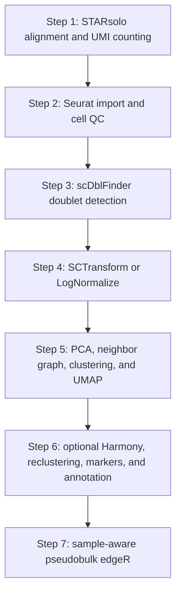

# Chromium single-cell RNA-seq pipeline

This directory contains a seven-step single-cell RNA-seq pipeline for Chromium/10x data. The workflow begins with paired FASTQ files, creates gene-by-cell count matrices, constructs and filters a Seurat object, identifies doublets, normalizes expression values, calculates PCA and clusters, assigns cell types, and performs cell-type-specific pseudobulk differential expression.

## Pipeline map



## Directory layout

| Stage | Directory | Script |
| --- | --- | --- |
| Package installation | `00_Install` | `00_Install_R_Packages_scRNAseq.R` |
| Step 1 | `1_StarSolo` | `Starsolo_Rscript.R` |
| Step 2 | `2_Seurat` | `Seurat_QC_Rscript.R` |
| Step 3 | `3_Doublet_Detection` | `Doublet_Detection.R` |
| Step 4 | `4_Normalization` | `Normalization_Rscript.R` |
| Step 5 | `5_Clustering` | `Clustering_Rscript.R` |
| Step 6 | `6_Integration_Annotation` | `Integration_Annotation.R` |
| Step 7 | `7_Pseudobulk_DE` | `Pseudobulk_DE.R` |

Each analytical stage uses an `Input` directory beside its script and writes results to an `Output` directory beside the script. The scripts record messages in `run_log.txt` and save the R environment in `sessionInfo.txt`.

## Data passed between stages

| From | Main output | Used by |
| --- | --- | --- |
| Step 1 | `<sample>_Solo.out/Gene/filtered/` | Step 2 matrix import |
| Step 2 | `seurat_QC_filtered.rds` | Step 3 doublet detection |
| Step 3 | `seurat_singlets.rds` | Step 4 normalization |
| Step 4 | `seurat_normalized_SCT.rds` or `seurat_normalized_LogNormalize.rds` | Step 5 clustering |
| Step 5 | `seurat_clustered.rds` | Step 6 integration and annotation |
| Step 6 | `seurat_integrated_annotated.rds` | Step 7 pseudobulk analysis |

---

# Package installation

**Script:** `00_Install/00_Install_R_Packages_scRNAseq.R`

The package script configures CRAN, Satija Lab R-universe, and bnprks R-universe repositories. It installs the CRAN/R-universe and Bioconductor packages referenced by the analytical scripts and writes a package/version table.

## Settings

| Setting | Default | Description |
| --- | ---: | --- |
| `INSTALL_OPTIONAL_BPCELLS` | `FALSE` | Adds BPCells to the CRAN package list. |
| `INSTALL_OPTIONAL_SPATIAL_RCTD` | `FALSE` | Adds installation of `spacexr` from GitHub. |
| `UPDATE_ALREADY_INSTALLED_PACKAGES` | `FALSE` | Controls whether installed packages are included in installation requests. |

## Package groups

The CRAN/R-universe group includes Seurat, SeuratObject, Matrix, sctransform, ggplot2, patchwork, data.table, dplyr, future, future.apply, harmony, uwot, RcppAnnoy, irlba, igraph, presto, remotes, jsonlite, R.utils, and rstudioapi.

The Bioconductor group includes SingleCellExperiment, SummarizedExperiment, S4Vectors, MatrixGenerics, DelayedArray, scDblFinder, scuttle, scran, glmGamPoi, edgeR, DESeq2, limma, SingleR, celldex, BiocParallel, ExperimentHub, and AnnotationHub.

## Output

`R_package_installation_verification.csv` contains the package category, package name, installation status, and installed version.

---

# Step 1 — STARsolo alignment and UMI counting

**Script:** `1_StarSolo/Starsolo_Rscript.R`

Step 1 converts paired 10x FASTQ files into sparse gene-by-cell-barcode matrices with STARsolo.

## Inputs

The script searches recursively under `1_StarSolo/Input` for:

- paired `R1` and `R2` files ending in `.fastq.gz`;
- one STAR genome-index directory containing `Genome`, `SA`, and `SAindex`;
- one barcode whitelist whose filename contains `whitelist` or `barcodes` and ends in `.txt` or `.txt.gz`.

The sample identifier is derived from the R1 filename. FASTQ pairs from multiple lanes with the same derived sample identifier are grouped into one STARsolo call.

## Settings

| Setting | Default | Description |
| --- | ---: | --- |
| `STAR_EXECUTABLE` | `/usr/local/bin/STAR` | Linux path to STAR. |
| `WSL_DISTRIBUTION` | `Debian` | WSL distribution used by native Windows R. |
| `THREADS` | `12` | STAR thread count. |
| `CHEMISTRY` | `10x_3p_v3` | Barcode and UMI coordinate preset. |
| `CREATE_BAM` | `FALSE` | Controls unsorted BAM creation. |
| `CELL_FILTER_METHOD` | `EmptyDrops_CR` | STARsolo cell-calling method. |

`10x_3p_v3` uses a 16-base cell barcode and 12-base UMI. `10x_3p_v2` uses a 16-base cell barcode and 10-base UMI.

## Processing

STAR receives R2 as the cDNA read and R1 as the barcode/UMI read. The command uses `CB_UMI_Simple`, the selected barcode and UMI coordinates, whitelist matching with `1MM_multi_Nbase_pseudocounts`, Cell Ranger-style UMI processing, `EmptyDrops_CR` cell filtering, Cell Ranger 4 adapter clipping, and the `Gene`, `GeneFull`, and `Velocyto` feature modes.

On Windows, paths are converted with `wslpath` and STAR runs through the selected WSL distribution. On Linux, the command runs through `bash`.

## Outputs

For each sample, STARsolo creates:

```text
Output/<sample>/<sample>_Solo.out/Gene/filtered/matrix.mtx
Output/<sample>/<sample>_Solo.out/Gene/filtered/barcodes.tsv
Output/<sample>/<sample>_Solo.out/Gene/filtered/features.tsv
Output/<sample>/<sample>_Solo.out/Gene/raw/matrix.mtx
Output/<sample>/<sample>_Solo.out/Gene/Summary.csv
```

`detected_FASTQ_manifest.csv` records the detected pairs. `STARsolo_output_manifest.csv` records the filtered matrix directory, raw matrix directory, and summary file for every sample.

---

# Step 2 — Seurat import and cell QC

**Script:** `2_Seurat/Seurat_QC_Rscript.R`

Step 2 locates 10x-style sparse matrices, creates one Seurat object per sample, merges the objects, calculates cell-level metrics, and applies the configured cell filters.

## Matrix layouts

The matrix-directory scan recognizes STARsolo and Cell Ranger-style locations containing:

```text
matrix.mtx or matrix.mtx.gz
barcodes.tsv or barcodes.tsv.gz
features.tsv, features.tsv.gz, genes.tsv, or genes.tsv.gz
```

The matrix manifest records the detected directory and sample identifier.

## Sample metadata

Metadata can be read from `sample_metadata.csv` or `sample_metadata.tabtxt`. The `sample_id` column connects metadata rows with the imported sample objects. Additional columns such as condition, batch, patient, sex, or region become cell-level Seurat metadata.

## Settings and cell filter

| Setting | Default |
| --- | ---: |
| `MIN_FEATURES` | `200` |
| `MAX_FEATURES` | `7500` |
| `MIN_COUNTS` | `500` |
| `MAX_COUNTS` | `Inf` |
| `MAX_PERCENT_MT` | `20` |
| `MIN_CELLS_PER_GENE` | `3` |
| `MITOCHONDRIAL_PATTERN` | `^MT-` |
| `RIBOSOMAL_PATTERN` | `^RP[SL]` |

The filter retains cells satisfying all feature, count, and mitochondrial-percentage boundaries. Ribosomal percentage is calculated and stored with the other metrics.

## Outputs

```text
detected_matrix_manifest.csv
seurat_before_QC.rds
cell_QC_metrics_before_filtering.csv
QC_violin_plots_before_filtering.pdf
QC_scatter_plots_before_filtering.pdf
cell_QC_metrics_after_filtering.csv
cell_counts_by_sample.csv
QC_violin_plots_after_filtering.pdf
seurat_QC_filtered.rds
QC_parameters.csv
```

## Example visual results

`QC_violin_plots_before_filtering.pdf` and `QC_violin_plots_after_filtering.pdf` display the distributions of `nFeature_RNA`, `nCount_RNA`, `percent.mt`, and `percent.ribo` for each sample. The before/after figures show how the cell distributions change when the filter is applied.

`QC_scatter_plots_before_filtering.pdf` contains `nCount_RNA` versus `percent.mt` and `nCount_RNA` versus `nFeature_RNA`. Each point represents one cell.

---

# Step 3 — Doublet detection

**Script:** `3_Doublet_Detection/Doublet_Detection.R`

Step 3 reads one QC-filtered Seurat object, joins split RNA count layers when present, converts the RNA assay to a SingleCellExperiment, and applies `scDblFinder`.

## Settings

| Setting | Default | Description |
| --- | ---: | --- |
| `SAMPLE_COLUMN` | `sample_id` | Metadata column passed to `scDblFinder` as the sample identifier. |
| `EXPECTED_DOUBLET_RATE` | `NULL` | Uses the scDblFinder rate calculation; a numeric value supplies an explicit rate. |
| `RANDOM_SEED` | `12345` | Random seed. |

The scDblFinder score and class are copied back into the Seurat metadata. A second Seurat object is created from cells classified as singlets.

## Outputs

```text
seurat_with_doublet_calls.rds
seurat_singlets.rds
doublet_scores_and_calls.csv
doublet_summary_by_sample.csv
scDblFinder_score_distribution.png
scDblFinder_score_distribution.pdf
```

## Example visual result

`scDblFinder_score_distribution.png` displays score histograms separated by sample and colored by the singlet/doublet classification. The horizontal axis is the scDblFinder score and the vertical axis is the number of cells.

---

# Step 4 — Normalization and variable features

**Script:** `4_Normalization/Normalization_Rscript.R`

Step 4 reads the singlet Seurat object and applies either SCTransform or the LogNormalize workflow.

## Settings

| Setting | Default | Description |
| --- | ---: | --- |
| `NUMBER_WORKERS` | `4` | Future multisession worker count. |
| `FUTURE_MAX_SIZE_GB` | `40` | Future global-size setting. |
| `NORMALIZATION_METHOD` | `SCTransform` | Selects `SCTransform` or `LogNormalize`. |
| `NUMBER_VARIABLE_FEATURES` | `3000` | Number of variable features requested. |
| `VARIABLES_TO_REGRESS` | `percent.mt` | Metadata fields passed to normalization regression when present. |
| `RANDOM_SEED` | `12345` | Random seed. |
| `SCT_MODEL_CELLS` | `5000` | Maximum cells used to fit the SCTransform model. |
| `SCT_RETURN_ONLY_VARIABLE_GENES` | `TRUE` | Controls the feature set returned by SCTransform. |

## SCTransform branch

The SCTransform branch calls `SCTransform` with `vst.flavor = "v2"`, the configured variable-feature count, model-cell count, and available regression variables. The resulting SCT assay becomes the default assay.

## LogNormalize branch

The LogNormalize branch applies `NormalizeData`, identifies variable features with `FindVariableFeatures`, and scales the selected features with `ScaleData`. The RNA assay remains the default assay.

## Outputs

```text
seurat_normalized_SCT.rds
```

or:

```text
seurat_normalized_LogNormalize.rds
```

together with:

```text
highly_variable_genes.csv
variable_features.png
variable_features.pdf
normalization_summary.csv
```

## Example visual result

`variable_features.png` plots standardized variance against average expression. Variable genes are highlighted, and the most variable genes are labeled. The figure represents the feature set carried into dimensional reduction.

---

# Step 5 — PCA, graph clustering, and UMAP

**Script:** `5_Clustering/Clustering_Rscript.R`

Step 5 reads one normalized Seurat object. It uses the SCT assay when present and otherwise uses RNA. An RNA assay without scaled data is scaled before PCA.

## Settings

| Setting | Default | Description |
| --- | ---: | --- |
| `NUMBER_PCS` | `50` | Number of principal components requested. |
| `DIMS_TO_USE` | `1:30` | PCA dimensions used by neighbors, clusters, and UMAP. |
| `CLUSTER_RESOLUTION` | `0.5` | Graph-clustering resolution. |
| `RANDOM_SEED` | `12345` | Seed used by clustering and UMAP. |

## Processing

The script calls `RunPCA`, restricts the dimension list to available principal components, constructs the graph with `FindNeighbors`, assigns clusters with `FindClusters`, and creates the UMAP with `RunUMAP`.

## Outputs

```text
seurat_clustered.rds
UMAP_by_cluster.png
UMAP_by_cluster.pdf
UMAP_by_sample.png
UMAP_by_sample.pdf
PCA_elbow_plot.pdf
cluster_counts_by_sample.csv
clustering_parameters.csv
```

The sample-colored UMAP is created when `sample_id` exists in the object metadata.

## Example visual results

`PCA_elbow_plot.pdf` shows principal-component number on the horizontal axis and component standard deviation on the vertical axis.

`UMAP_by_cluster.png` displays one point per cell, colored by `seurat_clusters`, with cluster numbers placed on the corresponding groups.

`UMAP_by_sample.png` uses the same UMAP coordinates and colors cells by `sample_id`. The two UMAP files present the cluster and sample metadata on the same two-dimensional cell arrangement.

---

# Step 6 — Integration, reclustering, markers, and annotation

**Script:** `6_Integration_Annotation/Integration_Annotation.R`

Step 6 reads `seurat_clustered.rds` and uses the PCA reduction created by Step 5. It can retain PCA as the downstream representation or calculate Harmony coordinates from a metadata batch column. Neighbors, clusters, and UMAP are recalculated from the selected representation.

## Settings

| Setting | Default | Description |
| --- | ---: | --- |
| `CPU_CORES` | `4` | Base worker count. |
| `FAST_UMAP` | `TRUE` | Controls `uwot.sgd` in UMAP. |
| `FUTURE_MAX_SIZE_GB` | `8` | Future global-size setting. |
| `MAX_CELLS_PER_CLUSTER` | `2000` | Maximum cells per cluster used by marker testing. |
| `INTEGRATION_METHOD` | `None` | Selects `None` or `Harmony`. |
| `BATCH_COLUMN` | `batch` | Metadata column used by Harmony. |
| `DIMS_TO_USE` | `1:30` | PCA or Harmony dimensions used downstream. |
| `CLUSTER_RESOLUTION` | `0.5` | Resolution for the recalculated clusters. |
| `RANDOM_SEED` | `12345` | Seed for clustering, UMAP, and annotation processes. |
| `UMAP_GROUP_COLUMNS` | `sample_id`, `patient`, `condition` | Metadata columns used to create additional UMAP views. |
| `ANNOTATION_METHOD` | `Manual` | Selects `Manual`, `SingleR`, or `ClustersOnly`. |
| `SINGLER_REFERENCE` | `HumanPrimaryCellAtlas` | SingleR reference; `BlueprintEncode` is also implemented. |
| `MIN_MARKER_FRACTION` | `0.10` | Minimum expression fraction for marker testing. |
| `MARKER_SIGNIFICANCE_TYPE` | `adjusted_pvalue` | Selects `p_val_adj` or `p_val` filtering. |
| `MARKER_SIGNIFICANCE_THRESHOLD` | `0.01` | Marker significance cutoff. |
| `MIN_MARKER_FC` | `1.5` | Minimum real fold change, converted to log2 scale for `FindAllMarkers`. |

## Integration and reclustering

With `INTEGRATION_METHOD = "None"`, PCA is used for neighbors, clusters, and UMAP. With `INTEGRATION_METHOD = "Harmony"`, `RunHarmony` creates a reduction named `harmony`, and that reduction is used for neighbors, clusters, and UMAP.

The graph names are constructed from the selected reduction. Cluster assignments are written to `seurat_clusters`, and the new UMAP replaces the existing `umap` reduction.

## Marker analysis

The script joins RNA layers when needed and creates an RNA normalized-data layer when it is absent. `FindAllMarkers` runs a positive Wilcoxon test by cluster. The unfiltered and significance-filtered marker tables contain p-values, average log fold change, real fold change, within-cluster expression fraction, outside-cluster expression fraction, adjusted p-value, cluster, and gene.

## Annotation modes

### Manual

The manual mode reads a CSV containing `cluster` and `cell_type`. Cluster IDs are mapped to cell-type labels. When no annotation table is present, numerical labels such as `Cluster_0` are stored and `cluster_annotations_template.csv` is written.

### SingleR

The SingleR mode converts the RNA assay to a SingleCellExperiment and calculates cluster-level labels from Human Primary Cell Atlas or Blueprint/ENCODE reference data. The cluster predictions are written to `SingleR_cluster_predictions.csv`.

### ClustersOnly

The cluster-only mode creates labels such as `Cluster_0`, `Cluster_1`, and `Cluster_2` directly from `seurat_clusters`.

## Outputs

```text
seurat_integrated_annotated.rds
cluster_cell_counts.csv
cluster_markers_before_significance_filter.csv
cluster_markers.csv
cluster_annotations_template.csv
SingleR_cluster_predictions.csv
UMAP_by_Seurat_clusters.png/.pdf
UMAP_annotated_cell_types.png/.pdf
UMAP_by_sample_id.png/.pdf
UMAP_by_patient.png/.pdf
UMAP_by_condition.png/.pdf
cell_type_counts_by_sample.csv
cell_cluster_assignments.csv
integration_annotation_summary.csv
```

Template, SingleR, and metadata-specific files are created by the corresponding annotation mode or available metadata.

## Example visual results

`UMAP_by_Seurat_clusters.png` colors cells by the recalculated cluster and prints cluster numbers on the plot title together with the resolution and reduction used.

`UMAP_annotated_cell_types.png` uses the same coordinates and colors cells by `cell_type`, with cell-type labels placed on the groups.

`UMAP_by_sample_id.png`, `UMAP_by_patient.png`, and `UMAP_by_condition.png` use the same coordinates and color cells by the corresponding metadata field. Together, the figures display the cluster, annotation, sample, patient, and condition organization of the final embedding.

---

# Step 7 — Pseudobulk differential expression

**Script:** `7_Pseudobulk_DE/Pseudobulk_DE.R`

Step 7 reads the annotated Seurat object, extracts raw RNA counts, groups cells by cell type and biological sample, creates sample-level pseudobulk count matrices, and performs edgeR quasi-likelihood differential-expression tests separately for each cell type.

## Settings

| Setting | Default | Description |
| --- | ---: | --- |
| `SAMPLE_COLUMN` | `sample_id` | Biological sample identifier. |
| `CELL_TYPE_COLUMN` | `cell_type` | Cell-type label used to split the analysis. |
| `TEST_VARIABLE` | `condition` | Metadata variable defining the comparison. |
| `REFERENCE_LEVEL` | `AUTO` | Reference level selection. |
| `TEST_LEVEL` | `AUTO` | Test level selection. |
| `DESIGN_FORMULA` | `~ condition` | Sample-level model formula. |
| `MINIMUM_CELLS_PER_SAMPLE_CELLTYPE` | `20` | Minimum cells contributing to a sample/cell-type pseudobulk profile. |
| `MINIMUM_SAMPLES_PER_GROUP` | `2` | Minimum qualifying samples in each comparison group. |
| `FDR_THRESHOLD` | `0.05` | FDR value used to label differential-expression results. |
| `MINIMUM_REAL_FC` | `1.2` | Real fold-change threshold, converted to absolute log2 fold change. |

## Pseudobulk construction

RNA count layers are joined when needed. A sparse sample-membership matrix aggregates cell columns into sample-level count columns for each cell type. The corresponding sample metadata forms the edgeR design matrix from `DESIGN_FORMULA`.

For each analyzed cell type, the script creates an edgeR `DGEList`, applies `filterByExpr`, calculates normalization factors, estimates dispersion, fits the quasi-likelihood model with `glmQLFit`, and performs the selected coefficient test with `glmQLFTest`.

## Per-cell-type outputs

```text
DE_<cell_type>.csv
Pseudobulk_counts_<cell_type>.csv
Volcano_<cell_type>.png
Volcano_<cell_type>.pdf
```

The differential-expression tables contain edgeR statistics together with significance labels based on FDR and absolute log2 fold change.

## Combined outputs

```text
DE_all_cell_types_combined.csv
pseudobulk_contrast_used.csv
cell_type_composition_by_sample.csv
pseudobulk_analysis_summary.csv
pseudobulk_run_summary.csv
```

`pseudobulk_contrast_used.csv` records the reference level, test level, coefficient, and design information. `cell_type_composition_by_sample.csv` records cell counts and cell-type fractions by sample. The summary tables record the status and dimensions of each cell-type analysis.

## Example visual result

Each `Volcano_<cell_type>.png` plots log2 fold change on the horizontal axis and `-log10(FDR)` on the vertical axis. Vertical lines mark the positive and negative log2 fold-change thresholds, and the horizontal line marks the FDR threshold. Point color represents the differential-expression category assigned by the script.

---

# Visual result index

| Step | Figure | Displayed result |
| --- | --- | --- |
| Step 2 | `QC_violin_plots_before_filtering.pdf` | Cell feature, count, mitochondrial, and ribosomal distributions by sample before filtering. |
| Step 2 | `QC_scatter_plots_before_filtering.pdf` | Count/mitochondrial and count/feature relationships for individual cells. |
| Step 2 | `QC_violin_plots_after_filtering.pdf` | Cell metric distributions after the QC filter. |
| Step 3 | `scDblFinder_score_distribution.png` | Doublet-score distributions and singlet/doublet calls by sample. |
| Step 4 | `variable_features.png` | Variable-feature variance and mean-expression relationship. |
| Step 5 | `PCA_elbow_plot.pdf` | Standard deviation across principal components. |
| Step 5 | `UMAP_by_cluster.png` | Initial PCA-based cluster assignments. |
| Step 5 | `UMAP_by_sample.png` | Initial UMAP colored by sample. |
| Step 6 | `UMAP_by_Seurat_clusters.png` | Recalculated cluster assignments from PCA or Harmony. |
| Step 6 | `UMAP_annotated_cell_types.png` | Final cell-type annotation. |
| Step 6 | `UMAP_by_sample_id.png` | Final UMAP colored by sample. |
| Step 6 | `UMAP_by_patient.png` | Final UMAP colored by patient. |
| Step 6 | `UMAP_by_condition.png` | Final UMAP colored by condition. |
| Step 7 | `Volcano_<cell_type>.png` | Cell-type-specific edgeR fold changes and FDR values. |
