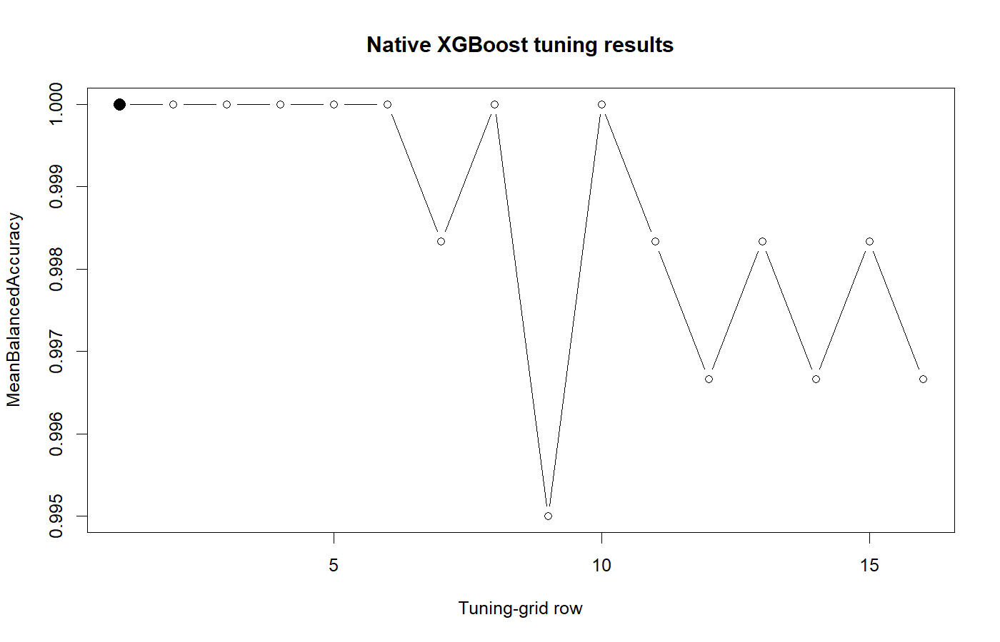

# Gradient-boosting results

This model uses native XGBoost to build a sequence of classification trees. Each new tree modifies the predictions produced by the preceding trees.

## Prediction results

- `Classifications.tabtxt` contains the predicted class, maximum probability, second-best class, second-best probability, and probability margin for every sample.
- `Class_Probabilities.tabtxt` contains one probability column for each class.
- `Classification_Confidence_Barplot.png` displays the maximum predicted probability by sample.
- `Classification_Probability_Heatmap.png` displays all class probabilities by sample.
- `Predicted_Class_Counts.png` shows the number of samples assigned to each class.

## Cross-validation results

- `CrossValidated_Training_Predictions.tabtxt` contains the combined out-of-fold prediction for each training sample.
- `CrossValidated_Overall_Metrics.tabtxt` contains accuracy, Cohen's kappa, macro precision, macro recall, macro F1, and mean one-vs-all balanced accuracy.
- `CrossValidated_PerClass_Metrics.tabtxt` contains TP, TN, FP, FN, sensitivity, specificity, precision, F1, and balanced accuracy for each class.
- `CrossValidated_Confusion_Matrix.tabtxt` and its heatmap compare known training classes with out-of-fold predictions.
- `CrossValidated_OOF_Probability_Heatmap.png` displays mean out-of-fold probabilities.

## Model and tuning results

- `Best_Tuning_Parameters.tabtxt` contains the selected boosting rounds, maximum tree depth, learning rate, gamma, column sampling, minimum child weight, and row sampling.
- `Tuning_Results.tabtxt` contains the performance calculated for the candidate parameter values.
- `Resampling_Results.tabtxt` contains metrics from the repeated cross-validation resamples.
- `Variable_Importance.tabtxt` and `Top_Variable_Importance.png` contain the model's variable-importance values.
- `Model_Summary.txt` contains a text representation of the fitted model.
- `Trained_Model.json` contains the saved fitted model.

## External-validation results

When the classification input contains non-empty `KnownClass` values, the external-validation tables compare those classes with the model predictions. They include overall metrics, per-class metrics, a confusion matrix, and a confusion-matrix heatmap.

## XGBoost-specific files

- `Preprocessing_and_Model_Metadata.rds` contains the training medians, internal feature names, internal class levels, class mapping, feature mapping, best tuning row, and XGBoost version.
- `Tuning_Plot.png` displays the selected metric for every XGBoost tuning-grid row.
- `Native_XGBoost_Fit_Errors.tabtxt`, when present, records the grid row, resample, and error message for unsuccessful tuning fits.

## Tuning figure

The horizontal axis identifies rows of the XGBoost tuning grid. The vertical axis contains mean balanced accuracy from repeated cross-validation. The filled point marks the selected parameter row. In this result, multiple parameter combinations have a mean balanced accuracy of 1.0.

