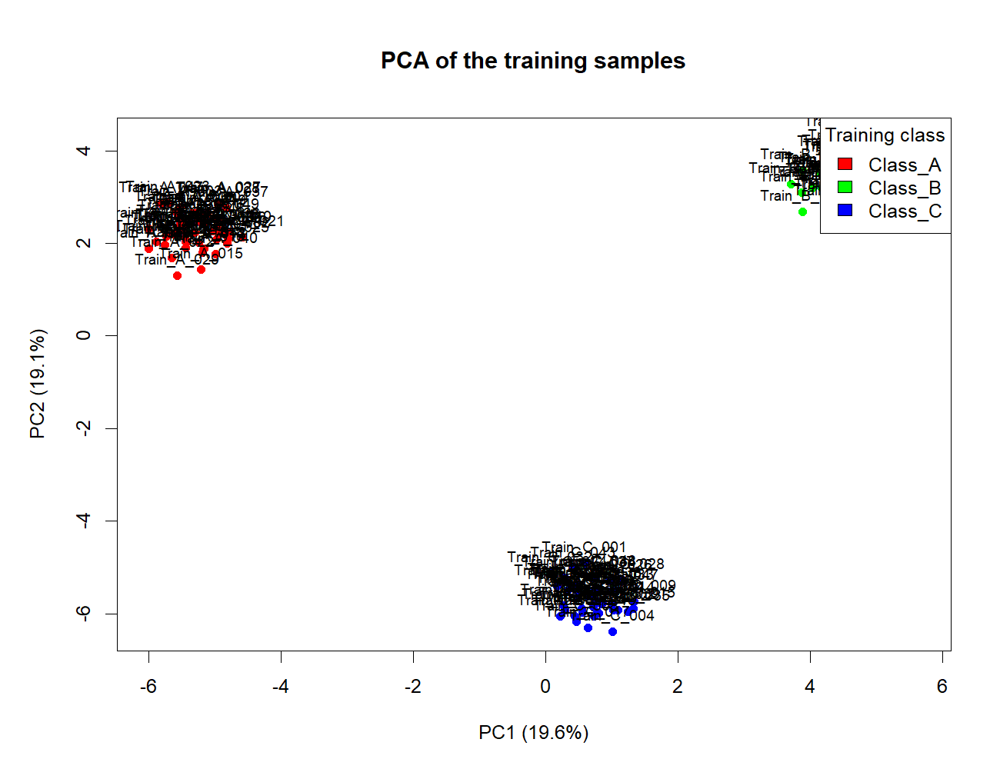
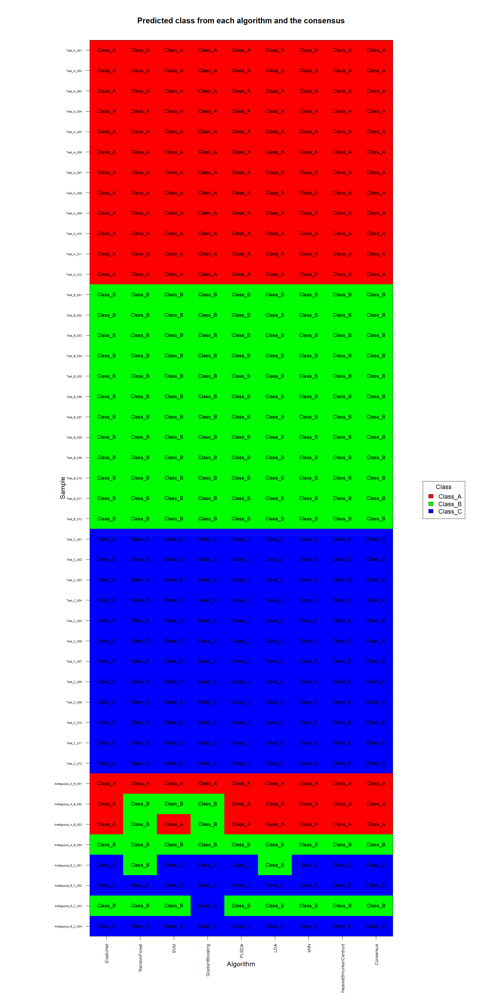
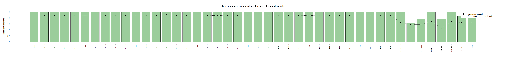
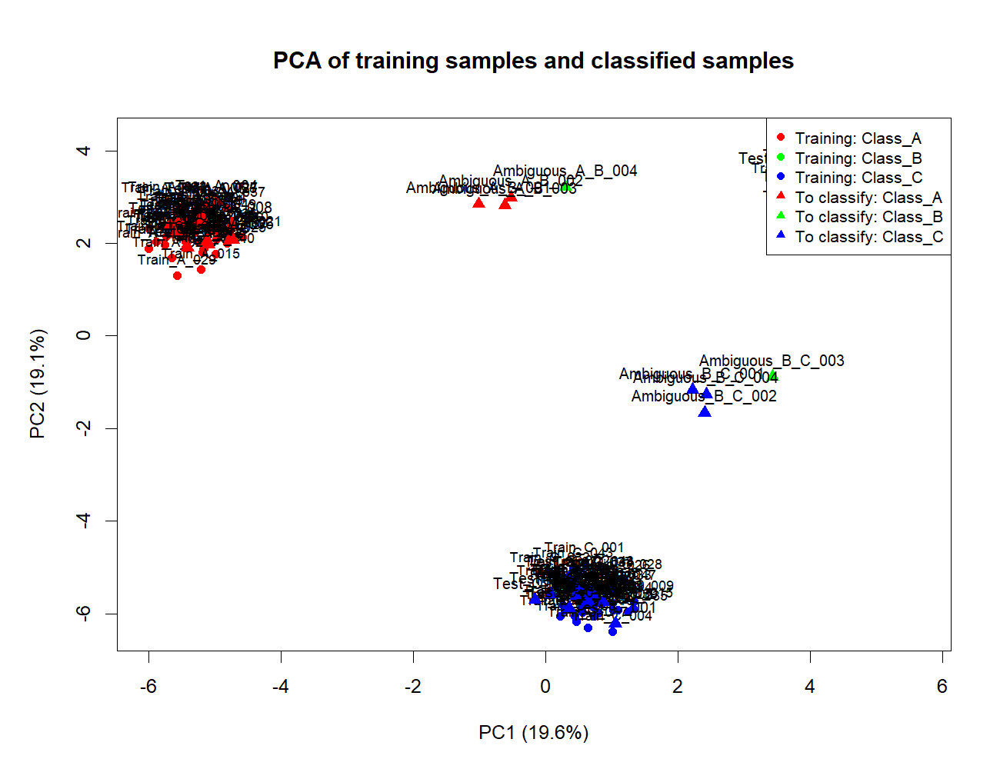
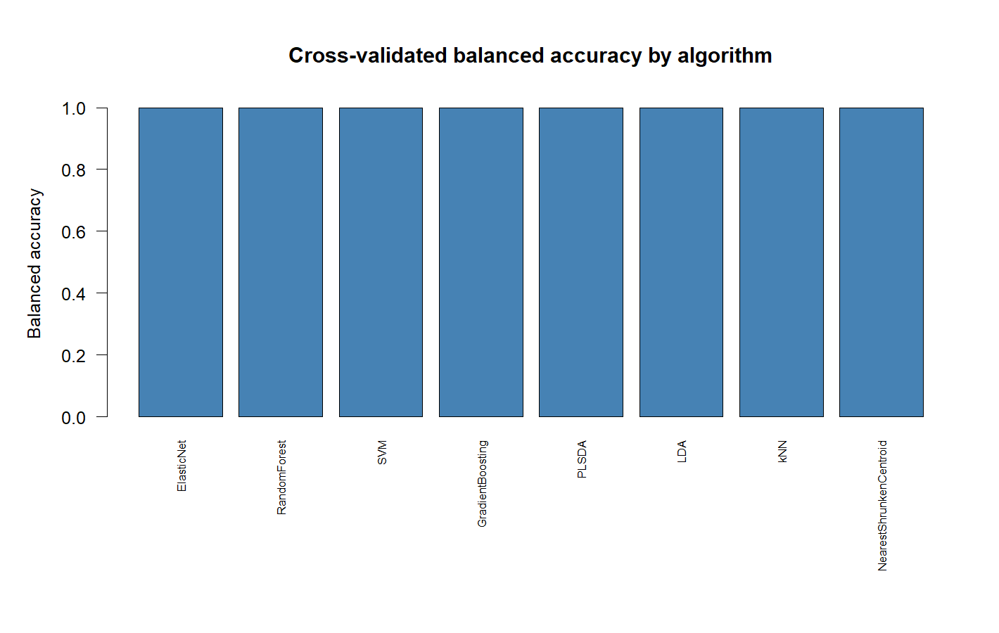
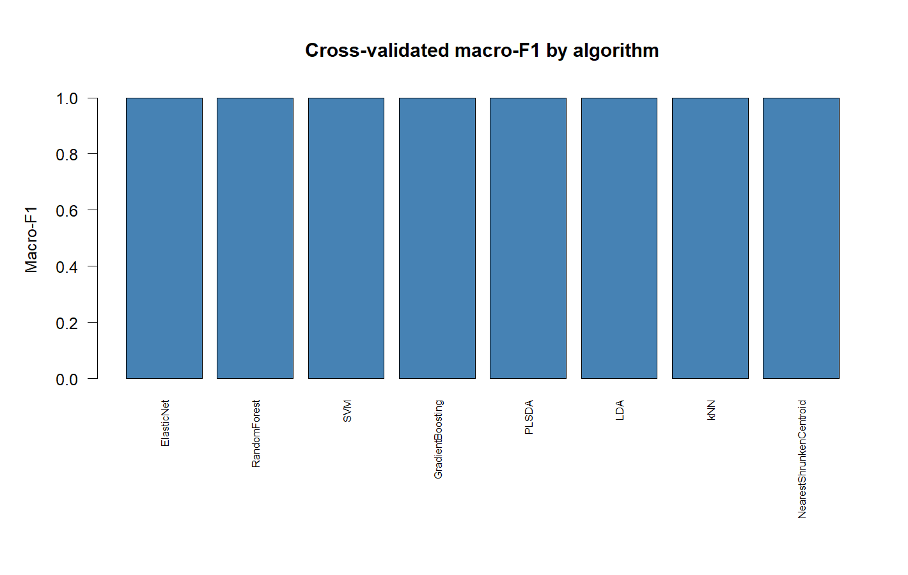
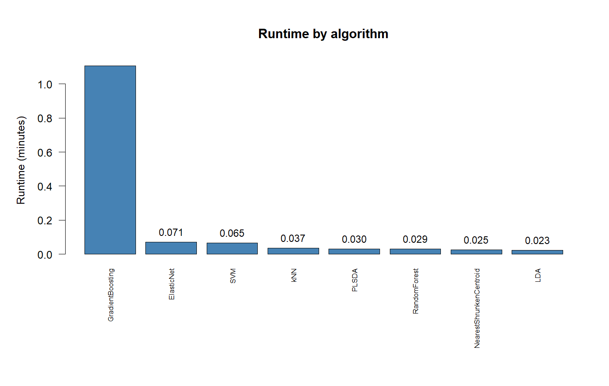
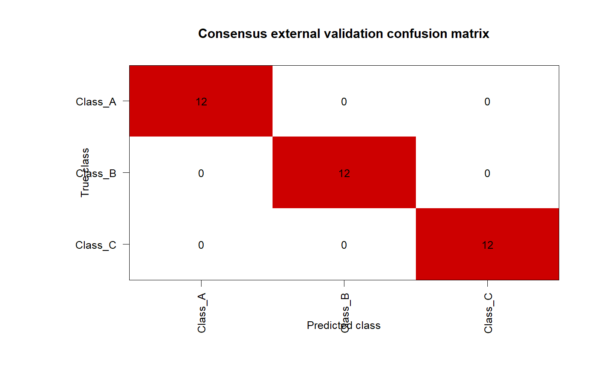
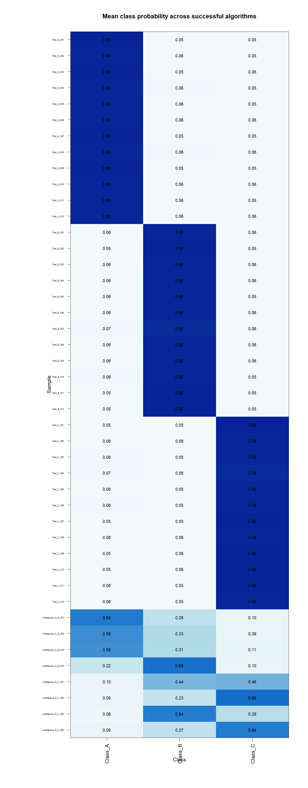

# Combined classification summary

This folder combines the predictions and performance results from all algorithms that completed successfully.

## Tables

- `All_Algorithms_Classification_Summary.tabtxt` contains the consensus class, agreement counts, agreement percentage, tie status, tie-resolution method, consensus mean probability, individual algorithm predictions, and individual confidence values.
- `Predictions_One_Column_Per_Algorithm.tabtxt` contains one prediction column per algorithm together with the consensus class, agreement percentage, and conclusion.
- `Algorithm_Performance_Summary.tabtxt` contains algorithm status, cross-validated accuracy, kappa, macro F1, balanced accuracy, selected parameters, runtime, and error text.
- `Consensus_ExternalValidation_Overall_Metrics.tabtxt` contains overall consensus metrics for samples with `KnownClass`.
- `Consensus_ExternalValidation_PerClass_Metrics.tabtxt` contains the consensus metrics for each class.
- `Consensus_ExternalValidation_Confusion_Matrix.tabtxt` contains known classes by consensus-predicted classes.

## `Training_PCA.png`

The first two principal components summarize variation in the processed training predictors. In this result, PC1 explains **19.6%** and PC2 explains **19.1%**. The red Class A samples form the left cluster, the green Class B samples form the upper-right cluster, and the blue Class C samples form the lower cluster. Class A separates along PC1; Classes B and C separate primarily along PC2.

`Training_and_Classified_Samples_PCA.png` uses the same training PCA transformation and adds the samples being classified.

## `Algorithm_Predictions_Heatmap.png`

Rows represent samples. Columns represent the eight algorithms and the consensus. Red denotes Class A, green denotes Class B, and blue denotes Class C.

The clear A, B, and C test samples form uniform color blocks because all algorithms assign the same class. The ambiguous A/B samples contain combinations of red and green predictions. The ambiguous B/C samples contain combinations of green and blue predictions. The final column contains the majority-vote consensus, with mean probability used to resolve tied votes.

## Performance and consensus plots

- `Algorithm_Performance_Accuracy.png` displays cross-validated accuracy by algorithm.
- `Algorithm_Performance_BalancedAccuracy.png` displays cross-validated balanced accuracy.
- `Algorithm_Performance_MacroF1.png` displays macro F1.
- `Algorithm_Runtime_Minutes.png` displays elapsed runtime.
- `Consensus_Agreement_Percent.png` displays the percentage of successful algorithms agreeing with the consensus for each sample.
- `Consensus_Mean_Probability_Heatmap.png` displays the mean probability assigned to each class across algorithms.
- `Consensus_ExternalValidation_Confusion_Matrix_Heatmap.png` displays known classes against consensus predictions.

## `Algorithm_Performance_Accuracy.png`

Each bar is the combined out-of-fold accuracy for one algorithm. All eight algorithms have an accuracy of 1.0 in this synthetic run.

## `Consensus_Agreement_Percent.png`

Green bars contain the percentage of algorithms that voted for the consensus class. The black point-and-line series contains the consensus mean probability expressed as a percentage. Clear samples show complete agreement; the variable bar heights near the right side correspond to ambiguous samples.

## `Training_and_Classified_Samples_PCA.png`

Training observations are circles and classification observations are triangles. Clear classification samples overlap their corresponding training clusters. Ambiguous samples appear between the class regions whose marker signals were combined during generation.

## `Algorithm_Performance_BalancedAccuracy.png`

Each bar shows mean one-vs-all balanced accuracy from the combined out-of-fold predictions for one algorithm. Balanced accuracy combines sensitivity and specificity across classes. All algorithms reach 1.0 in the displayed synthetic run.

## `Algorithm_Performance_MacroF1.png`

Each bar shows macro F1 for one algorithm. The script calculates F1 for every class from precision and recall and then averages those class values with equal class weight. All displayed algorithms have macro F1 equal to 1.0.

## `Algorithm_Runtime_Minutes.png`

The bars show elapsed model runtime in minutes. The displayed run records Gradient Boosting as the longest algorithm, followed by Elastic Net and SVM, while the remaining algorithms complete in shorter times.

## `Consensus_ExternalValidation_Confusion_Matrix_Heatmap.png`

Rows represent non-empty `KnownClass` values and columns represent consensus predictions. Cell values are sample counts. The clear synthetic validation samples appear on the main diagonal because their consensus predictions match their generated classes.

## `Consensus_Mean_Probability_Heatmap.png`

Rows represent classification samples and columns represent classes. Each cell is the mean probability assigned to that class across algorithms that produced probability output. Clear samples form high-probability blocks for Classes A, B, and C. Ambiguous samples distribute mean probability across the two classes represented in their mixed marker signal.
