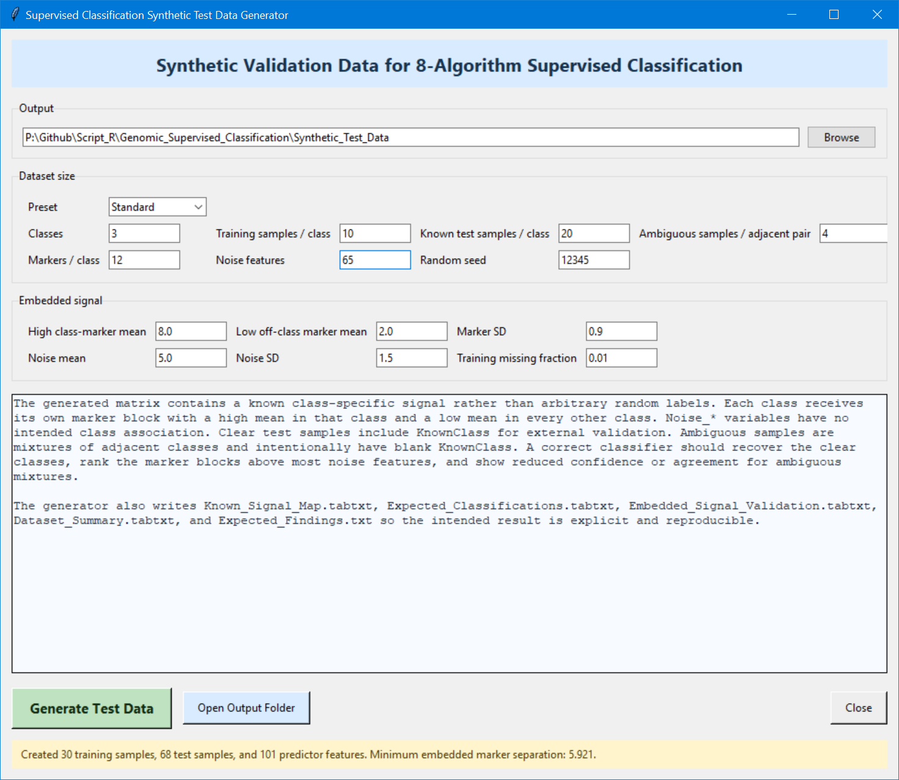
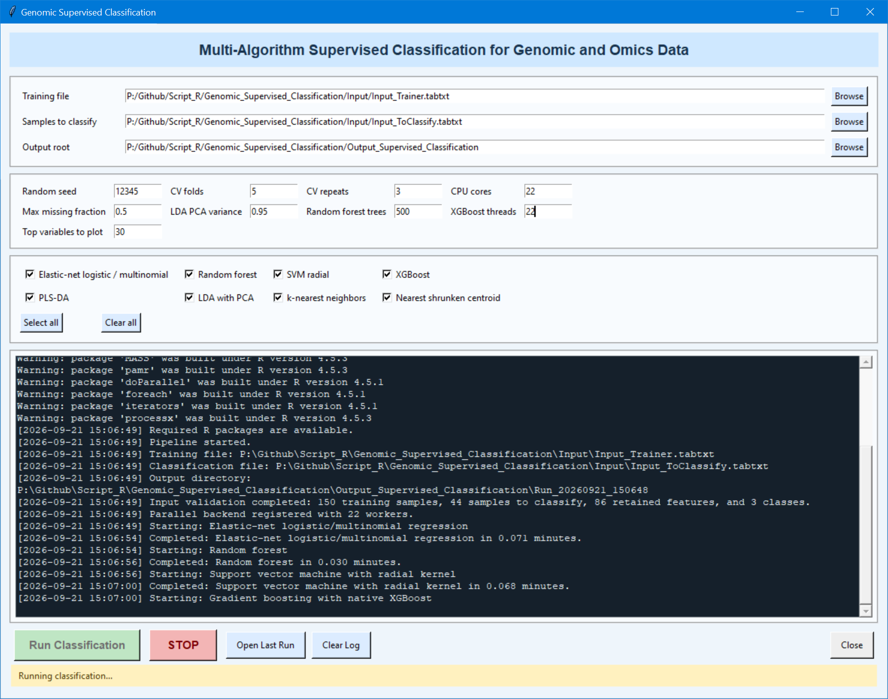
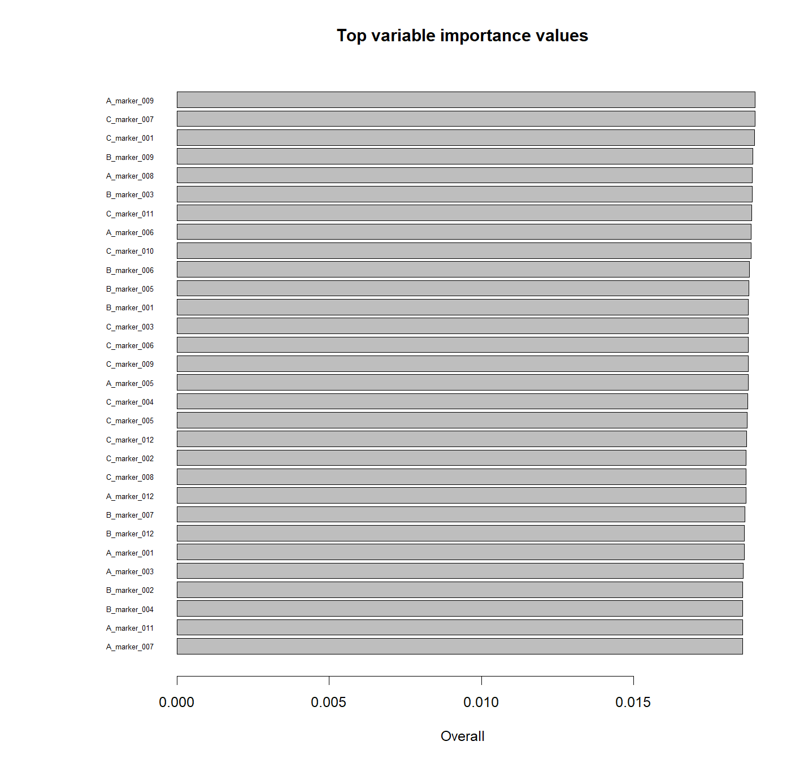
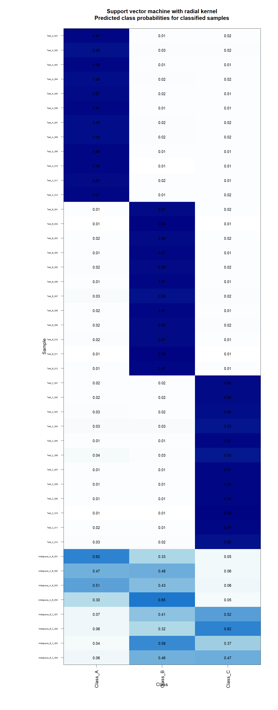

# Genomic Supervised Classification

This project contains a Python synthetic-data generator and an R supervised-classification pipeline for genomic and omics matrices.

## Project files

| File | Description |
| --- | --- |
| `00_Install_R_Packages_V2.R` | Checks, installs, loads, and reports the R packages referenced by the classification script. |
| `01_Generate_Test_Data.py` | Creates synthetic labeled training samples and samples to classify through a Tkinter interface. |
| `02_Supervised_Classification_V3.R` | Provides the classification interface, performs input processing, trains eight models, calculates metrics, predicts classes, and creates the combined summary. |

## Synthetic-data generator

The generator creates class-specific marker blocks. Markers belonging to a class receive values around the configured high mean in that class and around the configured low mean in the other classes. `Noise_*` predictors are generated independently of the class labels.

Clear test samples contain a value in `KnownClass`. Ambiguous samples combine the marker signals of two adjacent classes and contain an empty `KnownClass` value.

The generator writes:

- `Input_Trainer.tabtxt` — sample identifiers, training classes, and numeric predictors.
- `Input_ToClassify.tabtxt` — sample identifiers, optional known classes, and the matching predictors.
- `Known_Signal_Map.tabtxt` — the intended class association of every synthetic marker.
- `Expected_Classifications.tabtxt` — the expected classification behavior of the generated samples.
- `Embedded_Signal_Validation.tabtxt` — observed within-class and outside-class marker means.
- `Dataset_Summary.tabtxt` — the generator settings and resulting dimensions.
- `Expected_Findings.txt` — a text description of the embedded signal.

## Classification script

The R script reads a labeled training matrix and a matrix containing samples to classify. `SampleID` identifies each row, `Class` supplies the training label, and `KnownClass` supplies an optional label for classification samples.

The input-processing stage converts predictor columns to numeric data, removes all-missing, zero-variance, and excessive-missingness predictors, creates R-safe internal class and feature names, and constructs repeated stratified cross-validation folds.

The script fits eight classification methods:

1. Elastic-net logistic or multinomial regression
2. Random forest
3. Radial support vector machine
4. Gradient boosting with native XGBoost
5. Partial least-squares discriminant analysis
6. Linear discriminant analysis with PCA preprocessing
7. k-nearest neighbors
8. Nearest shrunken centroid

For each algorithm, the script selects tuning parameters from repeated cross-validation, fits a final model, predicts every classification sample, calculates class probabilities, saves out-of-fold predictions, computes performance metrics, calculates variable importance, and creates visual summaries.

## Consensus calculation

The script combines the successful algorithm predictions by majority vote. If the vote is tied, it compares the mean predicted probabilities for the tied classes. The combined table records the consensus class, number and percentage of algorithms agreeing with it, tie status, tie-resolution method, and consensus mean probability.

## Output organization

- `00_Input_Checks/` contains the input validation and mapping tables.
- `01_ElasticNet_Logistic/` through `08_NearestShrunkenCentroid/` contain the results for each model.
- `09_Summary/` contains the combined predictions, consensus, cross-algorithm comparisons, and PCA plots.
- `Run_Log.txt` records pipeline events.
- `Run_Configuration.tabtxt` records the settings used for the run.
- `SessionInfo.txt` records the R session and loaded package versions.

## `Training_PCA.png`

The plot displays the first two principal components calculated from the processed training predictors. PC1 explains **19.6%** and PC2 explains **19.1%** of the variance in the displayed result.

`Class_A` is the red cluster on the left. `Class_B` is the green cluster in the upper-right. `Class_C` is the blue cluster in the lower part of the plot. Class A is separated mainly along PC1, while Classes B and C are separated mainly along PC2. The compact clusters reflect the class-specific marker blocks generated in the synthetic matrix.

## `Algorithm_Predictions_Heatmap.png`

Each row represents a classification sample. The columns represent Elastic Net, Random Forest, SVM, Gradient Boosting, PLS-DA, LDA, kNN, Nearest Shrunken Centroid, and the consensus result. Red cells represent `Class_A`, green cells represent `Class_B`, and blue cells represent `Class_C`.

The clear `Test_A_*`, `Test_B_*`, and `Test_C_*` samples form uniform red, green, and blue blocks because the algorithms produce the same class prediction. The `Ambiguous_A_B_*` rows contain red and green cells, and the `Ambiguous_B_C_*` rows contain green and blue cells, reflecting the mixed marker signals used to generate those samples.

## Additional generated figures

### Variable importance

This figure ranks the 30 predictors with the largest elastic-net importance values. The displayed predictors are `A_marker_*`, `B_marker_*`, and `C_marker_*` variables rather than `Noise_*` variables. This matches the synthetic design, where marker blocks contain the class signal. Bar length represents the importance value calculated from the fitted model.

### SVM class probabilities

Rows are classification samples and columns are Classes A, B, and C. Each cell contains the SVM probability for that class; darker blue represents a larger probability. Clear samples contain probabilities around 0.93–0.98 for their corresponding class. Ambiguous samples divide probability between the two classes used to generate their mixed signal.

### Algorithm accuracy comparison

The bars show the cross-validated accuracy recorded for each algorithm. In the displayed synthetic run, all eight bars reach 1.0, meaning all combined out-of-fold training predictions match their training classes.

### Consensus agreement

The green bars show the percentage of algorithms agreeing with the consensus class for every sample. The black line shows the consensus mean probability as a percentage. Clear test samples have complete agreement, while several ambiguous samples have lower agreement and lower mean probability.

### Training and classification samples in PCA space

Circles represent training samples and triangles represent samples being classified. The clear classification samples project into the corresponding training-class clusters. The ambiguous A/B samples lie between the Class A and Class B regions, while the ambiguous B/C samples lie between the Class B and Class C regions.

### XGBoost tuning results

Each point represents one row of the XGBoost tuning grid, and the vertical axis shows mean balanced accuracy. The filled point identifies the selected grid row. Several parameter combinations reach a value of 1.0 in the displayed run.
