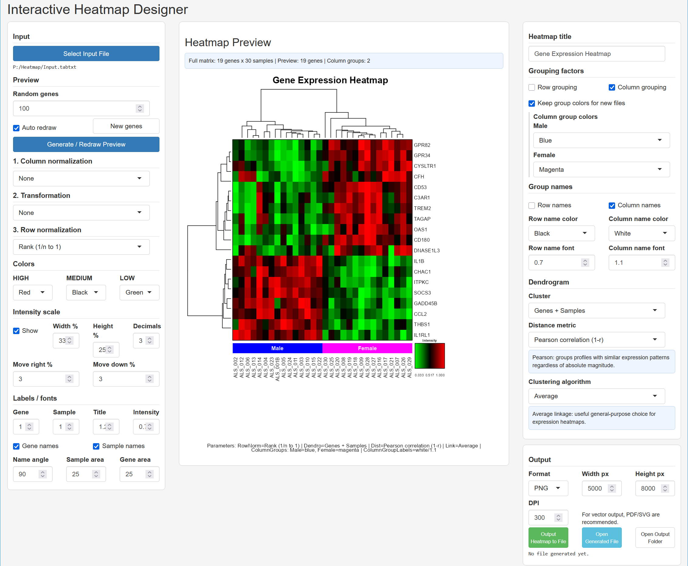
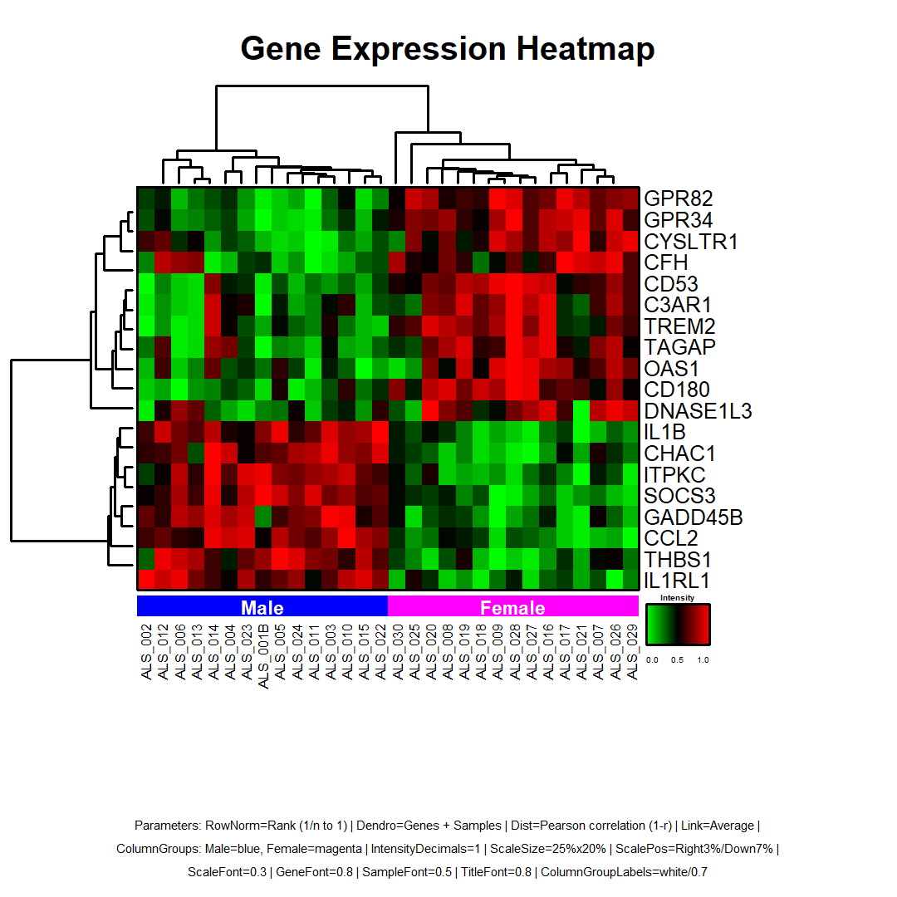

# Interactive Heatmap Designer

An R/Shiny tool for making publication-ready heatmaps from tab-delimited expression or numeric matrix data. It can preview a random subset of genes while you tune the display, cluster genes and/or samples, add row and column group annotations, and export the full heatmap as PNG, PDF, or SVG.



The bundled `Input.tabtxt` demonstrates a gene-expression matrix with a column grouping row (`Sex`) above the sample names. The same configuration produces the following exported figure:



## Requirements and launch

The interactive interface requires R and the `shiny` package:

```r
install.packages("shiny")
```

Start the designer from R/RStudio or a terminal:

```bash
Rscript Heatmap.R
```

Your browser opens the interface. Select a tab-delimited input file, inspect the preview, then use **Output Heatmap to File** to create the full-resolution figure beside the input file.

## Input file

The data must be tab-delimited, entirely numeric in the expression block, and contain at least two rows (genes). The tool detects group rows/columns automatically when possible. Four layouts are supported:

### Matrix only

```text
Gene	Sample_1	Sample_2
GeneA	8.2	9.1
GeneB	6.4	7.3
```

### Column grouping

```text
Group	Control	Treatment
Gene	Sample_1	Sample_2
GeneA	8.2	9.1
```

### Row grouping

```text
RowGroup	Gene	Sample_1	Sample_2
Pathway_A	GeneA	8.2	9.1
Pathway_B	GeneB	6.4	7.3
```

### Row and column grouping

```text
	Control	Treatment
RowGroup	Gene	Sample_1	Sample_2
Pathway_A	GeneA	8.2	9.1
```

The first column is the gene identifier unless row grouping is enabled, in which case the first column is the row group and the second is the gene identifier. Group values must not be empty. Duplicate gene or sample names are made unique automatically; missing, infinite, or non-numeric values stop the import so they can be corrected at the source.

## Processing order

The values are processed in this fixed order:

```text
input matrix → column normalization → transformation → row normalization → clustering → colour scale
```

This order matters. For example, row Z-scores or row ranks make genes comparable by pattern across samples, but they remove information about each gene’s absolute expression level. Use these transformations to visualize relative profiles, not to replace the original values for statistical testing.

| Control | Choices | When it is useful |
| --- | --- | --- |
| Column normalization | None, column sum, Z-score, rank | Makes samples comparable when the goal is to compare values across columns. |
| Transformation | None, `log10(1+x)`, `sqrt(x)`, `10^x` | Use a transform only when it fits the scale of the input. `log10(1+x)` requires all values to be greater than -1; `sqrt` requires non-negative values. |
| Row normalization | None, row sum, Z-score, rank | Highlights per-gene patterns across samples. Row rank is used in the example figure. |

## Clustering and grouping

Choose whether to cluster neither axis, genes, samples, or both. Clustering uses the processed matrix.

- **Pearson** and **Spearman** use `1 - correlation` as the distance, grouping profiles with similar patterns rather than similar absolute values.
- **Euclidean** and **Manhattan** use distances on the processed values.
- **Average** linkage is the general-purpose default for expression heatmaps.
- **Ward D2** is best paired with Euclidean distance; the app warns if another distance is selected.

Row and column group strips are optional. When enabled, the app assigns a color selector to each detected group and can keep those color choices when a new file is loaded. Group names can be displayed on the strips; sample and gene labels can also be shown or hidden independently.

## Display controls

Choose at least two of the low, medium, and high colors. The default is green → black → red. The colour limits are calculated from the final processed matrix; when the values span zero, the scale is symmetric around zero.

The intensity key can be shown, resized, moved, and given a chosen number of decimal places. Font sizes, label angle, title, and the reserved areas for gene/sample labels are all adjustable. These settings are included in a small parameter footer on the exported plot so the main display choices remain visible in the figure itself.

The preview uses a random gene subset (100 by default) for speed. **New genes** changes that subset. Always create the final file after checking the settings, because export redraws the complete matrix rather than only the preview subset.

## Output

| Format | Best use |
| --- | --- |
| PNG | High-resolution raster figure; default size is 5000 × 8000 px at 300 dpi. |
| PDF | Vector output for publication layouts. |
| SVG | Editable vector output for design tools. |

The generated filename encodes the major settings, including normalizations, clustering, group-strip choices, colors, scale placement, and output dimensions. If a file with the same name exists, the tool creates a unique filename instead of overwriting it.

## Command-line use

Running `Heatmap.R` with arguments uses non-interactive CLI mode. For example:

```bash
Rscript Heatmap.R --input "P:/data/Input.tabtxt" --format png --row-norm row_zscore --dendrogram both --distance pearson --linkage average --width 5000 --height 8000 --dpi 300
```

Use the following for the complete list of options, including group colors, labels, intensity-key placement, output path, and auto-open settings:

```bash
Rscript Heatmap.R --help
```
