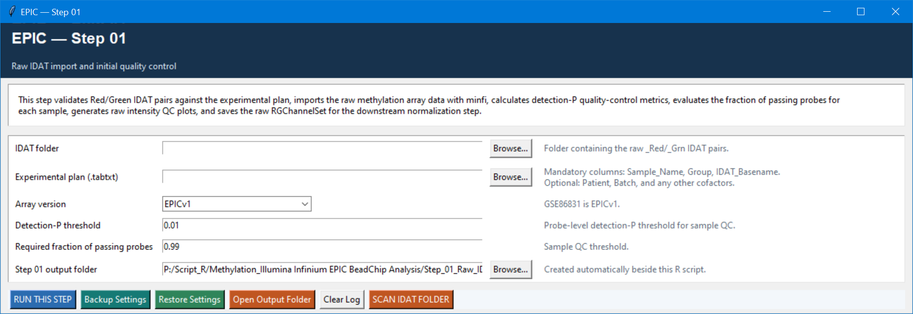

# Step 01 — Raw IDAT import and initial QC

This step is the entry gate for the pipeline. It checks the raw red/green IDAT pairs against the experimental plan, imports them with `minfi`, calculates detection-P values, and produces raw-intensity QC. Its key job is to identify technical problems before any normalisation or biological comparison is attempted.

## Settings

| Setting | Default | Meaning |
| --- | --- | --- |
| IDAT folder | Required | Folder containing matching `_Red` and `_Grn` IDAT files. |
| Experimental plan | Required | Tab-delimited file with `Sample_Name`, `Group`, and `IDAT_Basename`; `Patient`, `Batch`, and further cofactors are retained. |
| Array version | `EPICv1` | Select `EPICv2` only for EPIC v2 data. The bundled GSE86831 example is v1. |
| Detection-P threshold | `0.01` | A probe is considered to pass in a sample when its detection P is at or below this value. |
| Required fraction of passing probes | `0.99` | A sample passes technical QC only if at least 99% of probes pass the threshold. |
| Output folder | `Step_01_Output` | Destination for the imported objects and QC reports. |

Use **SCAN IDAT FOLDER** before running to review the detected IDAT files and their plan matching. Investigate missing pairs or unmatched basenames instead of editing outputs by hand.

## QC logic and outputs

The script writes `IDAT_scan.tsv`, `sample_qc.tsv`, a detection-failure-fraction plot, raw intensity QC tables/plot, `rgSet_raw.rds`, `detectionP.rds`, and `metadata_raw.csv`. Step 02 uses the last three files.

The 0.01/99% settings do not delete data at this stage; they establish which samples pass. Step 02 applies the optional sample-removal decision using the same thresholds.
