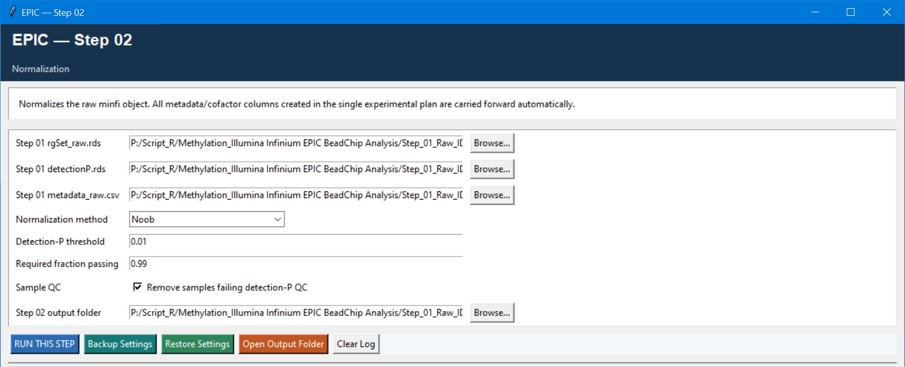

# Step 02 — Normalization and sample QC

This step normalizes the raw `RGChannelSet` from Step 01 and, by default, removes samples that fail the detection-P sample-QC rule. It is the correct point to exclude clearly failed samples, before probe filtering and matrix generation.

## Settings

| Setting | Default | Meaning |
| --- | --- | --- |
| Step 01 RG set, detection-P matrix, metadata | Step 01 outputs | Inputs carried forward automatically. Keep them from the same Step 01 run. |
| Normalization method | `Noob` | Choices: `Noob`, `Funnorm`, `Quantile`, `SWAN`, or `Raw`. Noob is the default background/dye-bias correction. |
| Detection-P threshold | `0.01` | Defines a passing probe for sample QC. |
| Required fraction passing | `0.99` | Minimum proportion of probes that must pass for a sample to be retained. |
| Remove samples failing detection-P QC | `TRUE` | When checked, failing samples are removed from the RG set, detection-P matrix, and metadata before normalisation. |
| Output folder | `Step_02_Output` | Destination for normalized data. |

## Logic and outputs

For every sample, the script calculates the fraction of probes with detection P above the threshold. A sample is retained when the complementary passing fraction is at least the configured value. If removal is enabled, at least two samples must remain.

It writes `normalized_object.rds`, `detectionP_normalized_samples.rds`, `metadata_normalized_samples.csv`, and `01_normalized_beta_density.png`. Review the density plot: strongly isolated or unusual distributions should be investigated with the raw QC and sample metadata before continuing.
