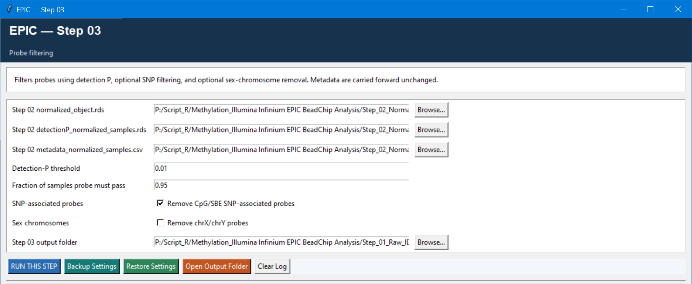

# Step 03 — Probe filtering

This step applies probe-level QC to the normalized data. It removes probes that fail detection-P requirements across retained samples, can remove SNP-associated probes, and can optionally remove sex-chromosome probes.

## Settings

| Setting | Default | Meaning |
| --- | --- | --- |
| Normalized object, detection-P matrix, metadata | Step 02 outputs | Use files from the same normalized run. |
| Detection-P threshold | `0.01` | A probe passes in a sample at or below this value. |
| Fraction of samples a probe must pass | `0.95` | Retains a probe only if it passes in at least 95% of the retained samples. |
| Remove CpG/SBE SNP-associated probes | `TRUE` | Recommended for most association analyses because genotype at the interrogated base or single-base extension can affect signal. |
| Remove chrX/chrY probes | `FALSE` | Enable only when sex-chromosome methylation is outside the study question or when a pre-specified policy requires it. |
| Output folder | `Step_03_Output` | Destination for filtered data and reports. |

## Logic and outputs

Detection-P filtering happens first, then optional SNP filtering and optional sex-chromosome removal. The script writes `filtered_object.rds`, `metadata_filtered.csv`, `removed_probes.tsv`, `filtering_summary.tsv`, and `01_probe_filtering.png`.

The purpose is not to maximise probe count. It is to keep probes whose measurement is reliable for the retained sample set while documenting each removal reason.
