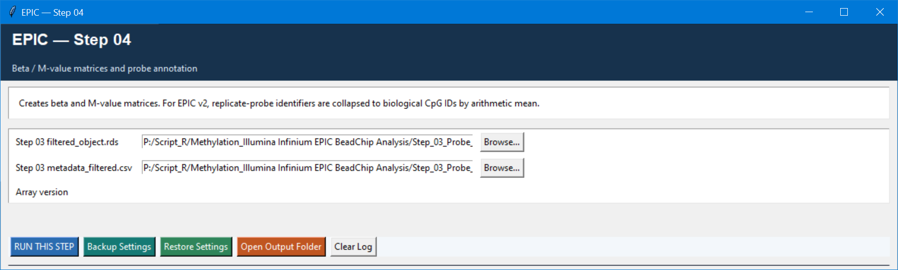

# Step 04 — Beta/M-value matrices and annotation

This step converts the filtered methylation object into the forms needed downstream: beta values for interpretation and QC, M values for statistical modelling, and a probe-annotation table for genomic/gene mapping.

## Settings

| Setting | Default | Meaning |
| --- | --- | --- |
| Filtered object and metadata | Step 03 outputs | Must come from the same filtering run. |
| Array version | `EPICv1` | Choose `EPICv2` for EPIC v2 data. For v2, replicated probe identifiers are collapsed to biological CpG IDs by arithmetic mean. |
| Output folder | `Step_04_Output` | Destination for matrices, annotation, and summary QC. |

## Outputs and use

The step writes native R objects—`beta_matrix.rds`, `M_value_matrix.rds`, `probe_annotation.rds`, and `metadata_matrices.csv`—plus compressed TSV versions for interoperability. It also creates `01_sample_mean_beta.png`.

Use the beta matrix in Step 05 and optional matched RNA/methylation correlation in Step 09. Use the M-value matrix in Steps 06 and 07: M values are the statistical input, whereas beta values are generally easier to interpret as methylation proportions.
