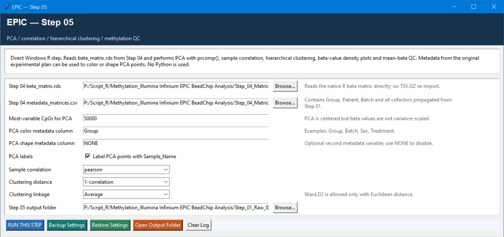

# Step 05 — PCA, correlation, clustering, and methylation QC

This is the main post-processing QC checkpoint. It does not change the analysis matrices; it creates evidence for detecting sample outliers, unexpected groupings, batch effects, and possible sample identity problems before DMP/DMR testing.

## Settings

| Setting | Default | Meaning |
| --- | --- | --- |
| Beta matrix and metadata | Step 04 outputs | Native R inputs; no TSV re-import is needed. |
| Most-variable CpGs for PCA | `50000` | PCA uses the highest-variance CpGs, is centered, and does not variance-scale beta values. Reduce this only for small or constrained analyses. |
| PCA colour column | `Group` | Metadata field mapped to point colour; useful choices include `Group`, `Batch`, `Sex`, or `Treatment`. |
| PCA shape column | `NONE` | Optional second metadata field mapped to point shape. |
| Label PCA points | `TRUE` | Adds `Sample_Name` labels; turn off for dense plots. |
| Sample correlation | `pearson` | Choose Pearson for linear similarity or Spearman for rank-based similarity. |
| Clustering distance | `1-correlation` | Uses one minus the selected correlation; `Euclidean` is also available. |
| Clustering linkage | `Average` | Choices are Average, Complete, Single, and Ward.D2. Ward.D2 is valid only with Euclidean distance. |

## How to review the results

The output includes PCA coordinates and variance explained, a PCA plot, sample-correlation matrix/heatmap, hierarchical-clustering object/plot, beta-density plot, and per-sample mean-beta table/plot.

Look for a sample that separates across several views, sample labels that disagree with expected groups, or clustering driven by batch rather than biology. These are prompts to investigate—not automatic grounds for removal. Reconcile any issue with the Step 01 sample-QC report and laboratory records, then document and apply any exclusion upstream.
