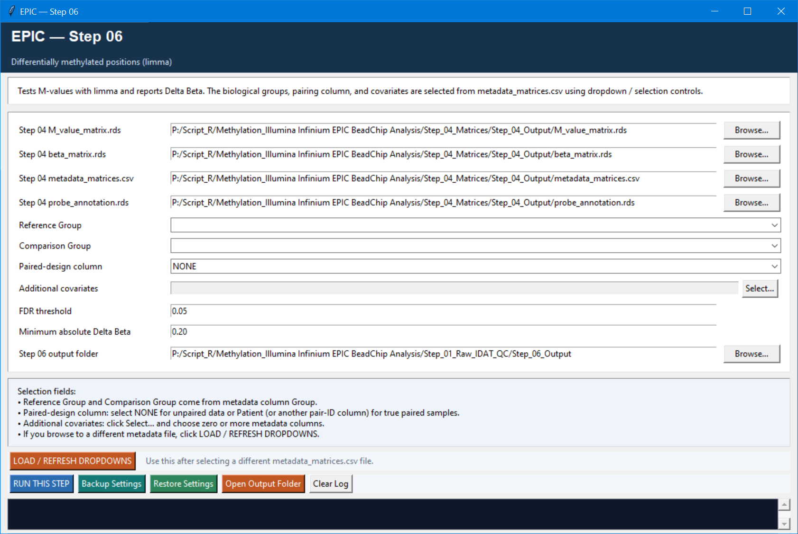

# Step 06 — Differentially methylated positions (DMPs)

This step tests CpG positions one at a time with `limma` using M values. It supports simple group comparisons, paired designs, and adjustment for additional metadata covariates. The reported Delta Beta makes the statistical result easier to interpret biologically.

## Settings

| Setting | Default | Meaning |
| --- | --- | --- |
| M-value matrix, beta matrix, metadata, annotation | Step 04 outputs | M values are fitted; beta values provide effect-size interpretation; annotation is merged into results. |
| Reference / Comparison group | Selected from `Group` | Defines the contrast direction. Refresh the dropdowns after changing metadata. |
| Paired-design column | `NONE` | Use `NONE` for independent samples. Choose a patient/pair identifier (often `Patient`) only for truly paired data. |
| Additional covariates | None | Optional metadata columns added to the model, such as Batch or Sex. Do not add variables confounded with group. |
| FDR threshold | `0.05` | Benjamini–Hochberg adjusted-P cutoff. |
| Minimum absolute Delta Beta | `0.20` | Practical effect-size requirement used together with FDR to define significant DMPs. |

## Modelling logic and outputs

The script validates that samples, metadata, groups, pair IDs, and covariates form a usable full-rank design. It fits `lmFit`/`eBayes` with robust and trend options, then calls a DMP significant only when both adjusted P/FDR is at or below the threshold and absolute Delta Beta is at or above the configured value.

Outputs are `DMP_all.tsv`, `DMP_significant.tsv`, and `01_DMP_volcano.png`. Keep the contrast direction in mind when interpreting positive and negative effects.
