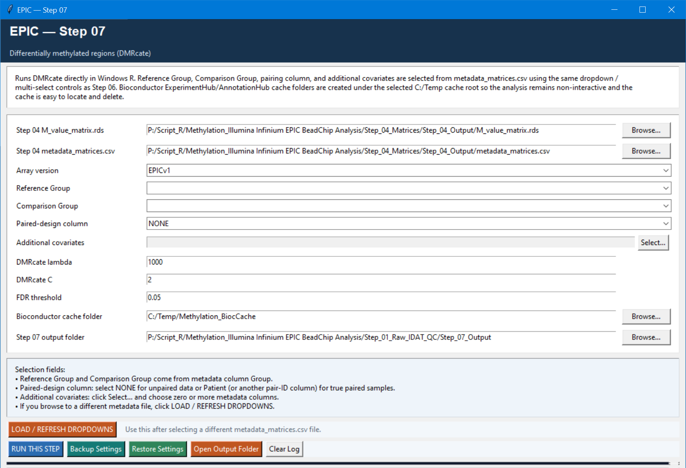

# Step 07 — Differentially methylated regions (DMRs)

This step uses DMRcate to identify genomic regions with coordinated differential methylation. It uses the same group, paired-design, and covariate logic as Step 06, but tests spatially related CpGs rather than treating each CpG independently.

## Settings

| Setting | Default | Meaning |
| --- | --- | --- |
| M-value matrix and metadata | Step 04 outputs | Inputs for the DMRcate model. |
| Array version | `EPICv1` | Sets DMRcate array type/genome build: v1 uses hg19; v2 uses hg38. The script checks whether probe IDs agree with the selected version. |
| Reference / Comparison group | Selected from `Group` | Defines the contrast; refresh dropdowns after replacing metadata. |
| Paired-design column / additional covariates | `NONE` / none | Model the pairing and adjustment variables only when supported by the study design. |
| DMRcate lambda | `1000` | Smoothing bandwidth in base pairs. Larger values encourage broader regional smoothing. |
| DMRcate C | `2` | Scaling parameter used by DMRcate during region calling. |
| FDR threshold | `0.05` | Used for CpG annotation and the regional calling cutoff. |
| Bioconductor cache folder | `C:/Temp/Methylation_BiocCache` | Storage for ExperimentHub/AnnotationHub resources; safe to move or clear when not in use. |

## Logic and outputs

The script validates the design matrix, uses `cpg.annotate()` on M values, calls `dmrcate()` with the selected `lambda`, `C`, and FDR cutoff, then extracts genomic ranges with the matching genome build.

It writes `DMRcate_CpG_annotation.rds`, `DMRcate_results.rds`, `DMR_significant.tsv`, `DMR_design_matrix.tsv`, and a DMR-width distribution plot when regions are found. The saved design matrix is the clearest record of what was actually tested.
