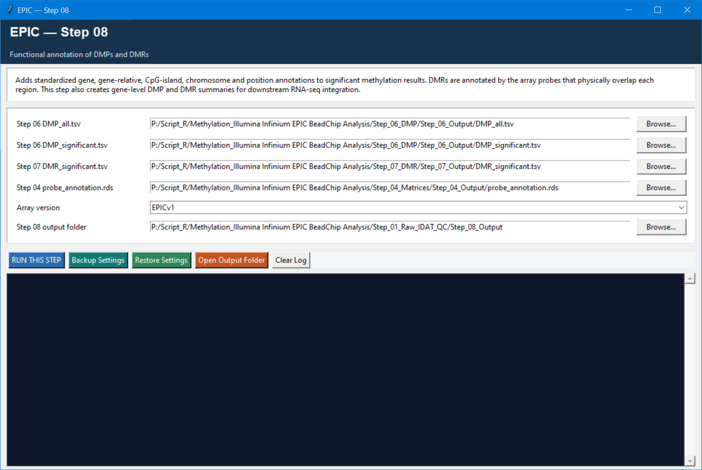

# Step 08 — Functional annotation of DMPs and DMRs

This step adds consistent genomic and gene context to the Step 06/07 findings. It is a translation step, not another significance test: it maps results to genes, gene-relative positions, CpG-island context, chromosome, and genomic coordinates.

## Settings

| Setting | Default | Meaning |
| --- | --- | --- |
| All/significant DMP tables | Step 06 outputs | All DMPs help describe regional overlap; significant DMPs supply the gene-level DMP summary. |
| Significant DMR table | Step 07 output | Regions are annotated using array probes physically overlapping each region. |
| Probe annotation | Step 04 output | Source of standardized EPIC gene and genomic annotations. |
| Array version | `EPICv1` | Select the version matching the matrices/annotation. |
| Output folder | `Step_08_Output` | Destination for annotated tables and summaries. |

## Outputs

The step writes `DMP_annotated_all.tsv`, `DMP_annotated_significant.tsv`, `DMR_annotated_significant.tsv`, `DMP_gene_summary.tsv`, `DMR_gene_summary.tsv`, an annotation summary, and context plots when applicable.

Gene mapping is inherently many-to-many: one CpG/DMR can map to more than one gene, and a gene can have multiple DMPs or DMRs. Treat these results as genomic associations rather than proof that methylation altered expression.
