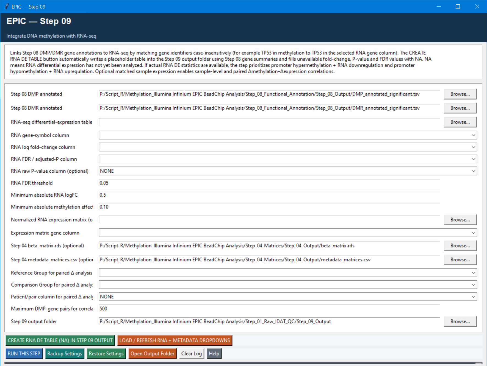

# Step 09 — RNA-seq integration

This optional step joins annotated methylation findings with an RNA-seq differential-expression table and ranks genes with convergent methylation/RNA evidence. It can also calculate matched sample-level and paired-delta correlations when normalized RNA expression, the beta matrix, and matching metadata are supplied.

## Settings

| Setting | Default | Meaning |
| --- | --- | --- |
| Annotated DMP/DMR tables | Step 08 outputs | Methylation evidence to integrate. |
| RNA-seq DE table | Required for RNA integration | Choose its gene, logFC, FDR/adjusted-P, and optional raw-P columns after refreshing the dropdowns. |
| RNA FDR threshold | `0.05` | RNA differential-expression significance cutoff. |
| Minimum absolute RNA logFC | `0.5` | Practical RNA effect-size requirement. |
| Minimum absolute methylation effect | `0.10` | Minimum effect used for methylation/RNA priority flags. |
| Normalized RNA expression matrix | Optional | Enables matched correlation when combined with the beta matrix. |
| Step 04 beta matrix and metadata | Optional defaults supplied | Required with the expression matrix for matched correlations. |
| Reference, comparison, patient/pair column | Optional | Used for paired delta analysis; choose `NONE` if data are not paired. |
| Maximum DMP–gene pairs for correlation | `500` | Caps correlation work for responsiveness; increase only when the sample matching and compute cost are understood. |

## Logic and outputs

The step standardizes RNA gene-level records, joins them to DMP- and DMR-associated genes, applies the RNA and methylation thresholds, flags inverse promoter-methylation/RNA patterns, and assigns an integrated priority score/level. It does not prove causality.

Outputs include `DMP_RNA_integrated.tsv`, `DMR_RNA_integrated.tsv`, `integrated_candidate_genes.tsv`, `integration_summary.txt`, and candidate plots. When the optional matched inputs are complete, it also writes sample-level and paired-delta DMP–gene correlation tables.
