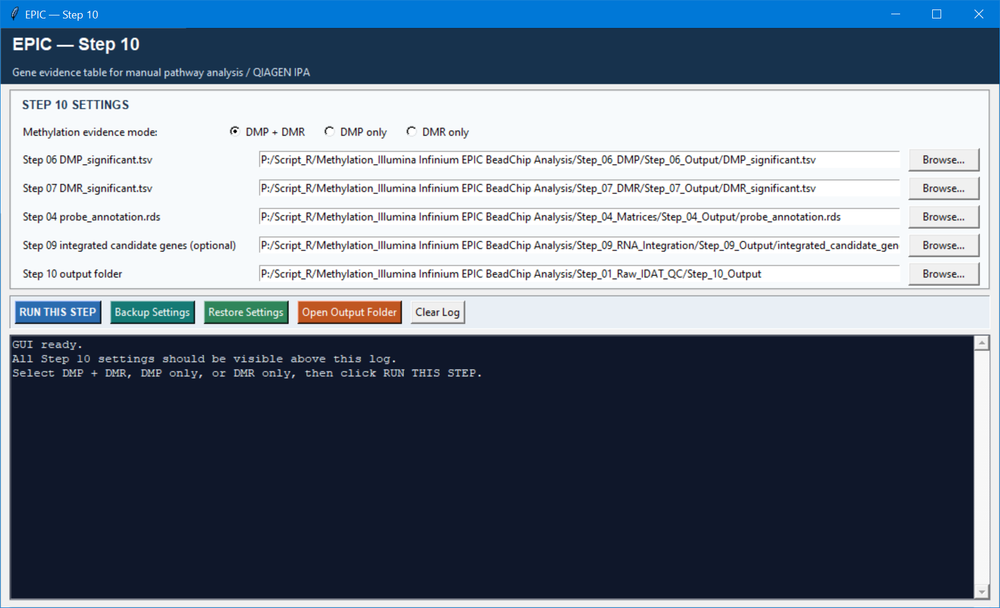

# Step 10 — Gene evidence export for biological interpretation

Step 10 is a curation-ready export, not an enrichment-analysis engine. It combines the selected methylation evidence and optional Step 09 RNA evidence into one row per gene, with definitions that make manual review or QIAGEN IPA preparation easier.

## Settings

| Setting | Default | Meaning |
| --- | --- | --- |
| Methylation evidence mode | `DMP + DMR` | Choose `DMP + DMR`, `DMP only`, or `DMR only` according to the evidence you want represented. |
| Significant DMP table | Step 06 output | Required when DMP evidence is enabled. |
| Significant DMR table | Step 07 output | Required when DMR evidence is enabled. |
| Probe annotation | Step 04 output | Required when DMP evidence is enabled to map CpGs and promoter context to genes. |
| Integrated candidate genes | Step 09 output, optional | Adds available RNA/integration columns; it does not determine whether a gene enters the chosen DMP/DMR evidence mode. |
| Output folder | `Step_10_Output` | Destination for the final workbook and TSV. |

## Outputs and use

The primary outputs are `Step10_Gene_Evidence_for_IPA.xlsx`, `Step10_Gene_Evidence_for_IPA.tsv`, and `gene_evidence_export_summary.txt`. The workbook has a **Results** sheet with one gene per row and a **Column_Definitions** sheet explaining the evidence fields.

`Select_for_IPA` starts at `0`. Set it to `1` only for genes you choose after reviewing FDR, effect size, DMP/DMR context, and optional RNA evidence. This version does not run GO or KEGG enrichment; it prepares a transparent evidence table for downstream manual/pathway work.
