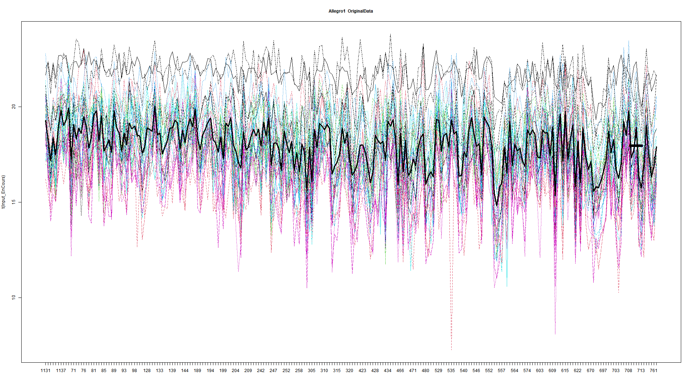
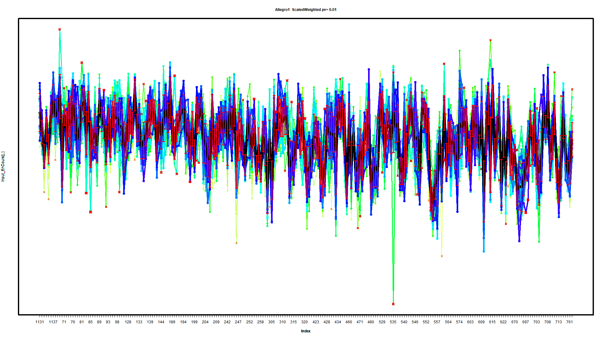
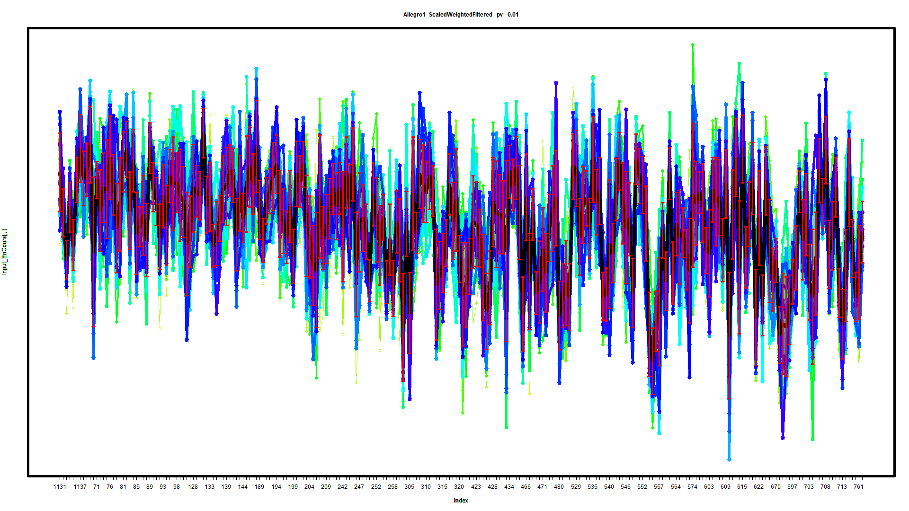
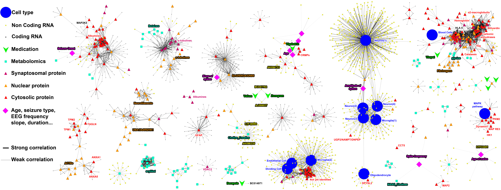
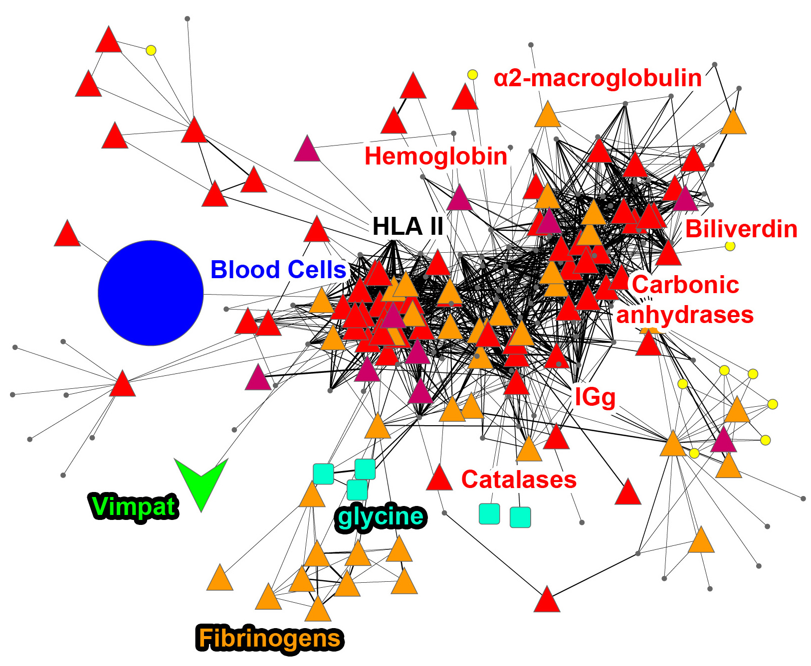

# Multi-omics correlation network and Cytoscape visualisation

This project brings several types of measurements into one correlation network: clinical variables, cell types, coding and non-coding RNA, proteins from different cellular compartments, metabolites, and medications. The goal is not to say that two things are directly causing each other. The goal is to identify relationships that repeat across the samples strongly enough to be worth looking at together.

For example, in a clinical multi-omics study we may ask whether a blood-cell pattern is associated with a group of proteins, metabolites, medication exposure, or a clinical feature such as seizure frequency, age, disease duration, or EEG measurement. A network gives an overview that is difficult to obtain by looking at thousands of correlations in a spreadsheet.

## What happens in the analysis

1. **Prepare the multi-omics table.** Measurements are organised as features (rows) by samples (columns). Each omics layer is normalised within its own measurement type before correlation, so a high-abundance proteomics measurement does not dominate simply because it uses a larger numeric scale than an RNA or metabolite measurement. This reduces some inter-patient/technical variability while preserving the between-sample pattern that will be compared.
2. **Turn complex factors into simple variables.** A clinical factor is often not one number. Treatment, sex, disease subgroup, cell type, or medication exposure can be separated into several dummy variables, usually 0/1 columns and optionally min–max scaled. This lets individual parts of a complex factor be correlated with genes, proteins, metabolites, and clinical measurements without giving a false numeric order to categories.
3. **Calculate relationships between features.** [`1.Interractom_2025.R`](1.Interractom_2025.R) calculates positive Pearson correlations and can also calculate Spearman and Kendall rank correlations. Pearson asks whether two measurements change together in an approximately linear way. Spearman asks whether their ranks move together and is less affected by unusual scales/outliers. Kendall compares concordant and discordant pairs and can be useful in small cohorts or data with many ties.
4. **Retain the strongest and most supported links.** The user can select the top positive results, set a correlation threshold, or set a P-value threshold. When more than one correlation method is enabled, the retained table brings that evidence together for the same feature pair. This stops the final network being filled with every weak association.
5. **Build a Cytoscape network.** Each feature becomes a node and each retained association becomes an edge. Cytoscape then provides layout, colours/shapes, labels, edge styles, and clustering.
6. **Find dense groups and create a profile.** AllegroMCODE identifies dense local groups of nodes/edges. A selected group can then be summarised with [`2.CellProfilCreator_V0.R`](2.CellProfilCreator_V0.R). This script scales the member profiles, weights them by their connectivity inside the cluster, checks whether the pattern is driven by too few unusual samples, and produces an outlier-filtered weighted profile. The profile can be used as one new feature in a second network run, replacing its many component features. This reduces a large, repetitive module to a more interpretable “module profile”.

The correlation script begins at step 3: it reads `Input.tabtxt`, calculates correlations, filters them, and writes a Cytoscape-ready edge table. Normalisation and dummy-variable construction are upstream preparation requirements; they are not created automatically by this script. This distinction is important, otherwise the result can be difficult to interpret.

## Main parameters in `1.Interractom_2025.R`

| Parameter | Plain-language meaning |
| --- | --- |
| `group_size` | `0` compares all features with all others. A positive number restricts the first analysis block and reduces the number of pairs to calculate. |
| `top_n` | Number of strongest positive correlations to retain when `filter_method = "top_n"`. |
| `filter_method` | Choose `top_n`, `corr_threshold`, or `pvalue_threshold` to decide which edges are retained. |
| `cor_threshold` | Minimum positive correlation strength required when using correlation filtering. |
| `pvalue_threshold` | Maximum P value allowed when using P-value filtering. A small P value means the observed association is less compatible with random variation under the model, not that it is clinically important. |
| `do_spearman` | Set `TRUE` to also calculate Spearman rank correlation. |
| `do_kendall` | Set `TRUE` to also calculate Kendall rank correlation. |

For large tables, the script chooses a full correlation matrix or a smaller per-pair calculation according to `group_size`. This is a practical speed/memory choice; it does not change the biological meaning of a retained link.

## From an AllegroMCODE cluster to one weighted profile

An AllegroMCODE cluster can contain many features that partly describe the same underlying programme. Leaving every component in the next correlation run can make that programme dominate the picture simply because it has many members. The profile creator gives the cluster one central representative curve across the samples, then lets this profile be correlated with the rest of the data.

The input table for `2.CellProfilCreator_V0.R` contains a **weight**, **cluster/cell-profile name**, **feature name**, and then one column per sample. Features with more edges inside the Cytoscape cluster receive more weight. The code calculates a weighted median central profile for each cluster and a weighted standard deviation at each sample. The use of a median is deliberate: it is less easily pulled by a few very extreme member values than a simple mean.

The most relevant settings are:

| Setting | Meaning |
| --- | --- |
| `ProfilMinSize` | Minimum number of component features needed for a usable profile. |
| `MinQuantityOfUPDrivingPatients` | Protection against accepting a profile that exists only because of a very small number of unusually high samples. |
| `ImpactCorrelationOutliers` | How much the profile correlation may change after removing possible driving outlier samples. |
| `Representation` | Controls the part of the sample distribution used when looking for unusual samples; it may need adjustment if too many/few samples are rejected. |
| `pValueForRandommess` | Cut-off used by the random-variation check when deciding whether a sample deviation is unusually large. |
| `QuantityOfIterrationsForRandomness` | Number of random iterations used by that check; more iterations are slower but stabilise the estimated threshold. |

### Figure 1 — Original cluster members: the raw starting point



*Figure 1. Each coloured line is one component feature from AllegroMCODE cluster 1, measured across the samples on the x-axis. At this stage the features keep their original numeric scale, so the plot is difficult to read: some lines are higher simply because of their original measurement range. The thick black line is a first central representation of the cluster. This figure is useful for checking that a visually dense Cytoscape module also has a recognisable shared pattern across patients/samples, rather than only a graph-layout effect.*

### Figure 2 — Scaled and connectivity-weighted profile



*Figure 2. Each component has now been scaled, allowing its pattern across samples to be compared rather than its original magnitude. Features with more internal cluster edges are given more weight: in the plot they have darker/thicker lines, while less-connected members have lighter/thinner lines. The central black line is the weighted cluster profile (calculated by the script as a weighted median); the red vertical interval shows the weighted standard deviation for that sample. The profile is therefore not one arbitrary gene/protein—it summarises the behaviour of a whole strongly connected module.*

### Figure 3 — Weighted profile after outlier filtering



*Figure 3. This is the same scaled, weighted module after the script has excluded sample positions considered too unusual for a stable common profile under the configured random-variation/outlier checks. The aim is not to erase real biology; it is to avoid replacing a module with a profile created by only one exceptional patient or one technical problem. If too much of the profile is rejected, the module should be reviewed rather than blindly used. A profile that remains stable after this step is more suitable for a second network run, where it can replace the individual members that constituted it.*

## How to read the Cytoscape network



*Figure 4. A multi-omics network imported into Cytoscape. Each point is a node (one measured feature) and each line is an edge (one retained association between two features). The legend at left explains the visual language used in this example: large blue circles are cell types; small yellow circles are non-coding RNAs; gray circles are coding RNAs; green downward shapes are medications; cyan squares are metabolites; magenta triangles are synaptosomal proteins; orange triangles are nuclear proteins; red triangles are cytosolic proteins; and magenta diamonds are clinical or EEG variables such as age, seizure onset, frequency, slope, or duration. Different colours and shapes make it possible to see quickly when a cluster mixes several biological layers rather than being made of only one omics technology.*

*The same pair of nodes can sometimes have more than one edge in Cytoscape. These multi-edges may represent different correlation methods (Pearson, Spearman, or Kendall), repeated evidence, or separate association records. They should be interpreted as multiple pieces of association evidence, not as proof that one node directly causes the other. In this style, a thicker/darker edge represents a stronger single bond between two nodes—usually based on a larger correlation coefficient or, if the style is configured that way, a smaller associated P value. The exact visual rule must be recorded with the Cytoscape style file or project, because edge thickness can mean correlation strength in one figure and statistical support in another.*

*The positions of nodes come from a spring/repulsion layout. Linked nodes pull toward each other, while all nodes repel enough to prevent the network collapsing into one point. Therefore, nodes with many mutually reinforcing links often appear closer together and form visible neighbourhoods. Two nodes joined by only one weak or isolated edge usually stay more peripheral. This proximity is a visual plausibility cue: a dense group is more interesting than a single link, but it is not a mathematical proof of a biological relationship. Layouts can change when the filtering or style changes, so dont use physical distance alone as a statistical result.*

## Example: a dense blood-related module



*Figure 5. A close-up of a dense module identified in the larger network. The large blue node is the blood-cell feature. Around it are protein nodes of several types (red cytosolic, orange nuclear, and magenta synaptosomal triangles), RNA nodes (gray/yellow circles), metabolites (cyan squares), and the medication Vimp at lower left (green shape). The heavy concentration of edges in the centre means that many features have retained correlations with one another, so the group is more plausible as a coordinated biological/technical module than two nodes connected by a single line. Labels such as HLA II, hemoglobin, α2-macroglobulin, immunoglobulin, fibrinogens, catalases, glycine, biliverdin, and carbonic anhydrases make the module easier to discuss with domain experts. AllegroMCODE can help identify such dense regions automatically, then the researcher can review whether the module suggests a blood/immune signal, a cell-composition effect, medication association, sample handling effect, or a biologically meaningful multi-omics programme.*

## A simple interpretation example

Suppose a blood-cell node is linked to HLA II, hemoglobin, immunoglobulin, and several metabolites. This does **not** immediately mean that blood cells regulate all these molecules. It may reflect immune activation, blood contamination, a change in cellular composition, disease severity, treatment, or another clinical factor that moves together across samples. The network helps find the question; follow-up analysis and clinical knowledge decide what the association may mean.

Dense modules are often more useful than isolated links because several independent-looking measurements reinforce the same idea. Even then, correlation is not causation. Check batch effects, sample size, multiple testing, missing data, treatment indications, and known confounders before proposing a mechanism.

## Cytoscape and AllegroMCODE

1. Run `1.Interractom_2025.R` after preparing `Input.tabtxt`.
2. Import the generated `R_Correlation_*.tabtxt` file into Cytoscape as an edge table, using `GeneSource` as source and `GeneTarget` as target.
3. Import or prepare a node table that assigns each feature its omics class, colour, shape, display label, and any clinical annotation.
4. Map edge width to correlation strength (or another explicitly documented statistic), choose a layout, and save the Cytoscape session/style.
5. Install/use the archive in [`Plugin_Alegro_Mcode/`](Plugin_Alegro_Mcode/) if AllegroMCODE clustering is wanted. Review each cluster with the clinical and biological context; an algorithmic cluster name is only a starting hypothesis.

## Files

```text
1.Interractom_2025.R               Correlation calculation and edge-table export
2.CellProfilCreator_V0.R           Weighted, outlier-checked cluster-profile creation
Screenshots/                       Cytoscape and profile examples
Plugin_Alegro_Mcode/               AllegroMCODE Cytoscape plugin archive
Readme.md                          This documentation
```

## Interpretation boundary

This workflow is exploratory. It is designed to organise many possible multi-omics associations and help prioritise reproducible modules for follow-up. It does not establish causality, treatment response, or a clinical diagnosis. Results should be checked in independent samples/cohorts and, where possible, with targeted biological or clinical validation.
