# Visium spatial transcriptomics: from tissue section to spatial pathway activity

This repository is a complete R workflow for analysing 10x Genomics Visium spatial-transcriptomics data. It starts with the Space Ranger output from a tissue section and finishes with maps that place genes, cell types, biological signatures, and pathway activity back onto the histology image.

For cancer research, the useful question is often not only “which gene is high?” but “where in the tumour is a biological programme active?” A tumour section can contain cancer cells, immune cells, stroma, necrosis, vessels, and normal tissue in close proximity. Spatial analysis helps a clinician or scientist ask whether immune activity is concentrated at the invasive edge, whether hypoxia is localised in a tumour core, or whether a region may be avoiding antigen presentation.

> **Important:** the custom pathway maps in `Results_of_Custom_Pathway_projection/` are artificial examples made to demonstrate the projection method. They are not results from a real patient cohort and should not be interpreted as clinical findings.

## The full workflow

```text
0. Install and check R packages
1. Space Ranger: sequencing reads → spatial gene-by-spot matrix
2. Quality control: remove low-quality spots
3. Normalisation: make spots comparable
4. Spatial clustering: find regions with similar expression
5. Spatial genes + custom weighted linear-model signatures
6. Cell-type annotation/deconvolution + region comparison
7. Perturbation-derived pathway footprints, including PROGENy
8. Seurat expression editor/debugger (development and checking tool)
```

| Step | What it answers in plain language | Main check before moving on |
| --- | --- | --- |
| **0** | Are the R/Bioconductor packages needed by the scripts available? | Confirm package installation and save the R session information. |
| **1** | Where are the RNA reads on the Visium slide and which genes were counted in each spot? | Use the correct reference, sample information, CPU/RAM settings, and Space Ranger executable. |
| **2** | Which spots have enough RNA and enough detected genes to be reliable? | Inspect count, detected-gene, mitochondrial-RNA distributions and tissue maps before choosing cut-offs. |
| **3** | Are differences between spots biological rather than only due to different sequencing depth? | Choose and record one normalisation strategy; do not regress away the biology being studied. |
| **4** | Which nearby spots have similar expression and may form a tissue region? | Explore more than one clustering resolution and check each cluster on the tissue image. |
| **5** | Which genes and biologically defined signatures show a non-random pattern across the tissue? | Select the expression layer and signature definition deliberately; inspect spatial significance and not only a top-N rank. |
| **6** | Which cell types or mixtures may explain each region, and what differs between regions? | Use an appropriate annotated scRNA-seq reference; do not treat spots from one section as independent patients. |
| **7** | Which signalling pathways leave an active or repressed transcriptional footprint in each spot? | Check gene coverage, footprint thresholds, selected pathways, and within-tissue cut-offs. |
| **8** | Can a Seurat expression layer be inspected/exported/edited for pipeline testing? | Preserve the original RDS and rerun downstream steps after any deliberate edit. |

## Why a standard pathway gene list is often not enough

Many common pathway analyses use an unweighted “bag of genes”: if a gene belongs to a pathway, it counts once; if it is absent, it simply contributes nothing. This can be useful for a quick overview, but it is usually not adequate as the main way to score a carefully defined spatial cancer process.

For a clinical example, a cytotoxic anti-tumour programme is not described well by a random collection of immune genes. High `IFNG`, `GZMB`, `GZMA`, and `PRF1` support cytotoxic immune activity. In contrast, high `VEGFA` or `TGFB1` may argue against the specific “cytotoxic cells attacking tumour” interpretation. Their **absence** can be informative too: if a gene expected to be strongly expressed is not present in a good-quality spot, that lack of expression may be evidence against the programme. Of course, absence from a low-RNA or low-coverage spot is not evidence—it may simply be a dropout. This is why Steps 2 and 3 must come first.

This workflow therefore uses **signed, weighted linear-model pathways** as the preferred approach for custom biological signatures. Each gene can be:

- **positive (`+`)** when higher normalised expression supports the programme;
- **negative (`-`)** when higher expression argues against it;
- **weighted**, so genes with stronger biological evidence contribute more than secondary markers.

For example:

```text
Cytotoxic immune activity =
  +2×IFNG + 2×GZMB + 1×GZMA + 2×PRF1 − 1×VEGFA − 2×TGFB1
```

The numbers are not automatically “correct”; they are a transparent model chosen by the investigator and should be justified from the question, published evidence, and validation data. The score is calculated from normalised expression, not raw counts, so one highly sequenced spot does not look more biologically active only because it captured more RNA. In this sense the custom weighted model can replace an unweighted pathway list when the question needs direction, relative importance, and negative evidence.

The repository includes examples in [`Full_Pipeline/5.LinearModelPathway.tabtxt`](Full_Pipeline/5.LinearModelPathway.tabtxt): cytotoxic immune attack, tumour counter-response, hypoxia, and loss of antigen presentation. A gene can also be written as `+2*GENE` or `-3*GENE` in a definition file to set its weight.

## Gene signatures: a clinical way to ask a spatial question

A **gene signature** is a small, explicit set of genes used to represent a biological state. It is not a diagnosis. It is a reproducible hypothesis such as:

- “Is this part of the tumour infiltrated by cytotoxic immune cells?”
- “Is there a hypoxic region, possibly near poorly perfused or necrotic tissue?”
- “Is the tumour showing an immune counter-response through PD-L1/PD-L2, IDO1, or TGFβ-related signalling?”
- “Is antigen presentation reduced in a particular tumour area?”

The important advantage of a spatial signature is that the score is shown **on the H&E image**. A high score can be compared with tumour nests, inflammation, fibrosis, necrosis, and anatomical location. This does not prove which cell type produced each RNA molecule—a Visium spot contains more than one cell—but it helps select regions for pathology review, immunohistochemistry, multiplex imaging, or deeper sequencing.

## Perturbation footprints and PROGENy: measure the effect of a pathway

A pathway is not always active just because one of its own genes is expressed. For example, EGFR mRNA can be present without demonstrating that EGFR signalling is currently active. The more useful question is: **has pathway activation or repression changed the expression of its downstream responsive genes?**

Step 7 uses this idea. A **perturbation footprint** is built from genes whose expression changes after a pathway is experimentally activated or inhibited. Each footprint gene has a direction (up/down) and a weight showing how strongly and specifically it responded in perturbation experiments. The pipeline looks for the combined downstream effect in each spatial spot.

**PROGENy** is a well-known set of such perturbation-derived pathway footprints. In the Step 7 screen, examples include EGFR, Hypoxia, JAK-STAT, MAPK, NFκB, p53, PI3K, TGFβ, TNFα, TRAIL, and VEGF. The selected number of “most significant PROGENy genes per pathway” controls how many of the strongest footprint genes are retained. More genes may capture a broader signal; fewer genes make a more focused signature.

This approach can be powerful in cancer because it may detect active signalling even when the receptor or central pathway gene is not highly expressed in that spot. An active TGFβ programme, for example, may be recognised through the downstream genes it changes in tumour/stromal regions. Similarly, a hypoxia footprint can be more informative than one gene such as `HIF1A` alone.

Across multiple independent cohorts, the most credible pathways are usually those that show the same direction of footprint activity in comparable regions and remain associated with the biological/clinical question after each sample has been analysed separately. The footprint score is a strong prioritisation tool, not magic proof of pathway activity. Replication, pathology review, and independent assays still matter.

The custom database format for Step 7 is documented in [`Full_Pipeline/7.Fingerprint_Pathways.tabtxt`](Full_Pipeline/7.Fingerprint_Pathways.tabtxt). It records organism, source, pathway identifier/name, gene, direction, model P value/FDR, and a specificity weight. These fields make the origin and importance of each footprint gene visible rather than hidden in a black box.

## Screenshots and the main parameters

### Figure 1 — Step 1: Space Ranger prepares the spatial matrix

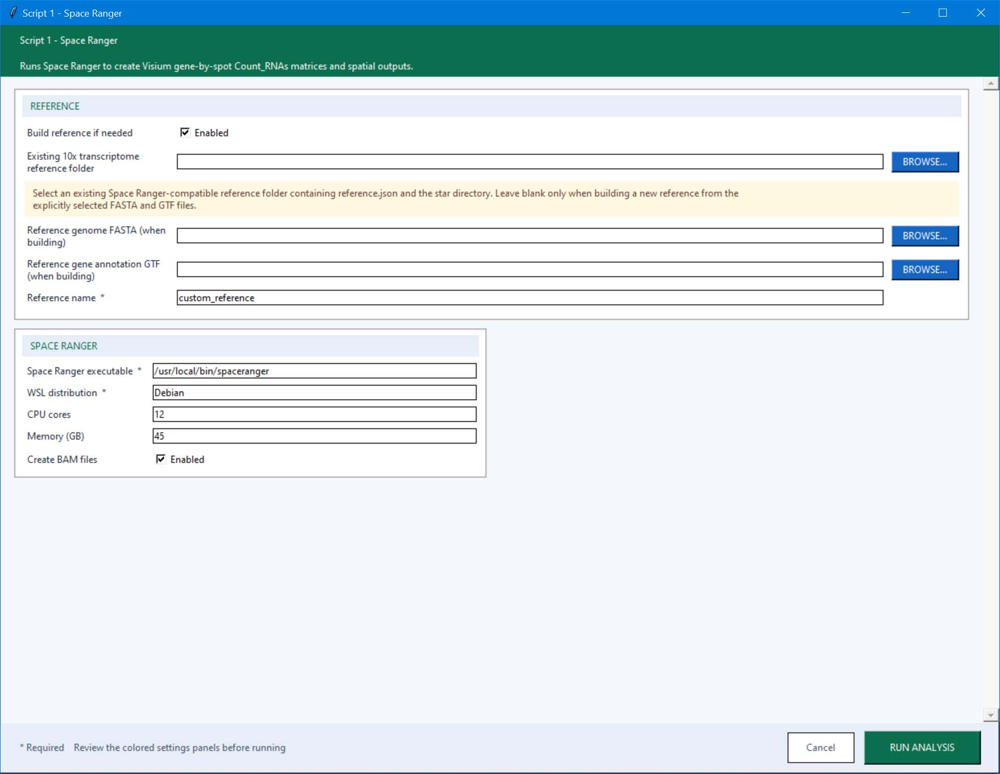

*Figure 1. This screen runs Space Ranger and creates the gene-by-spot count matrix plus the tissue image and spatial coordinates. **Existing 10x transcriptome reference folder** is used when a compatible reference already exists. **Build reference if needed** enables creation of a reference from the selected genome FASTA and annotation GTF; **Reference name** labels that new reference. **Space Ranger executable** and **WSL distribution** say where the tool runs. **CPU cores** and **Memory (GB)** reserve computing resources, while **Create BAM files** keeps alignments for later checking. For a clinical study, the practical message is simple: use a reference/annotation appropriate for the species and genome build, then keep a record of it because it affects every later result.*

### Figure 2 — Step 2: remove spots that are unlikely to be reliable

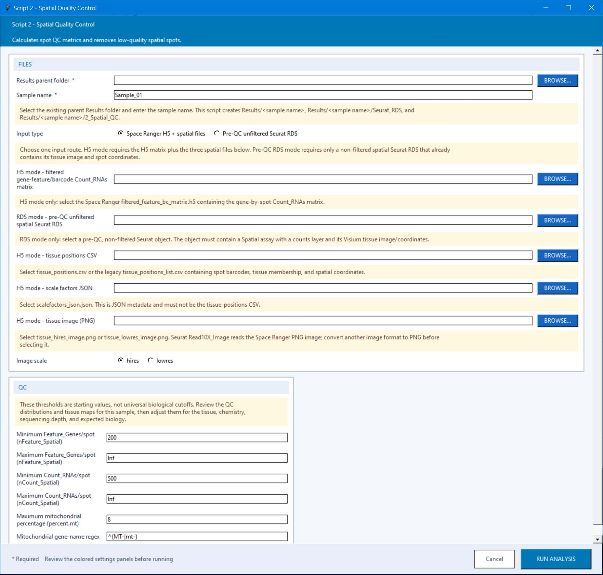

*Figure 2. This is the spatial quality-control screen. **Results parent folder** and **Sample name** create an organised workspace. The user may load either the Space Ranger H5 matrix plus spatial files, or a pre-QC Seurat RDS. In H5 mode, **tissue positions CSV**, **scale factors JSON**, and the tissue **PNG image** preserve the link between RNA and histology; **hires/lowres** selects the image scale. The QC cut-offs are starting values, not universal truth: **minimum/maximum Feature_Genes per spot** measures gene diversity, **minimum/maximum Count_RNAs per spot** measures RNA amount, and **maximum mitochondrial percentage** flags spots that may be damaged or low quality. The mitochondrial-gene regex tells the script how to recognise mitochondrial genes. A doctor should review the distributions and the tissue map before accepting the cut-offs; tissue type, necrosis, and chemistry matter.*

### Figure 3 — Step 3: make spots comparable before interpretation

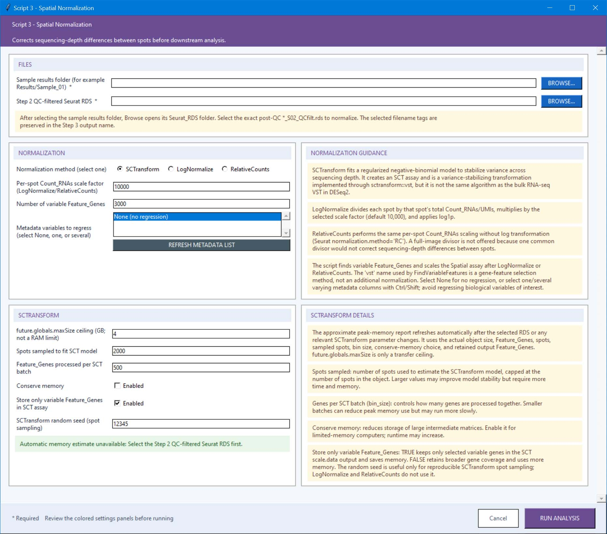

*Figure 3. This screen normalises the QC-filtered Seurat object. **SCTransform** is the default variance-stabilising method; **LogNormalize** divides by the total RNA per spot, uses the selected **scale factor** (often 10,000), then log-transforms; **RelativeCounts** keeps the per-spot scaling without the log transformation. **Number of variable Feature_Genes** controls how many genes are used as the most variable signals downstream. **Metadata variables to regress** can reduce an unwanted technical effect, but should not include the biological variable of interest. The lower settings are mainly memory/reproducibility controls: the globals ceiling is a data-transfer limit rather than RAM, sampled spots fit the SCT model, genes per batch trade speed for memory, conserve-memory reduces storage, store-only-variable-genes saves space, and the random seed makes sampling reproducible. In short: normalisation reduces technical depth differences; it should not be used to erase a tumour-versus-normal difference you actually want to study.*

### Figure 4 — Step 4: find expression-defined tissue regions

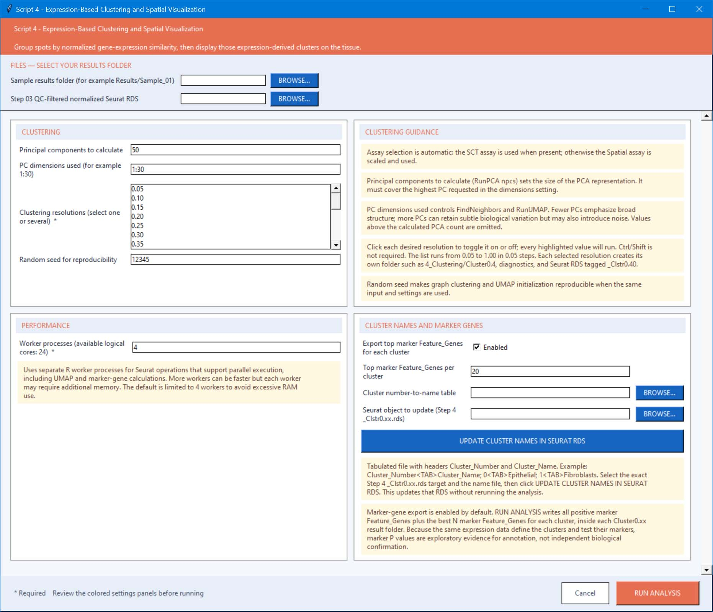

*Figure 4. This screen groups spots with similar normalised expression and places the groups back onto the section. **Principal components to calculate** sets the size of the initial data summary. **PC dimensions used** selects how much of that summary is used for neighbour finding and UMAP: fewer dimensions emphasise broad tissue structure; more dimensions can reveal smaller differences but may also add noise. **Clustering resolution** controls how finely the tissue is divided—low values give broad regions, higher values split them into more subregions. **Random seed** allows the same settings to be reproduced. **Worker processes** controls parallel computing and RAM use. The marker-gene options export genes enriched in each cluster; **top markers per cluster** sets how many are reported. Cluster labels should be reviewed with the histology and marker genes, not treated as an automatic pathology diagnosis.*

### Figure 5 — Step 5: spatial genes and signed/weighted linear-model signatures

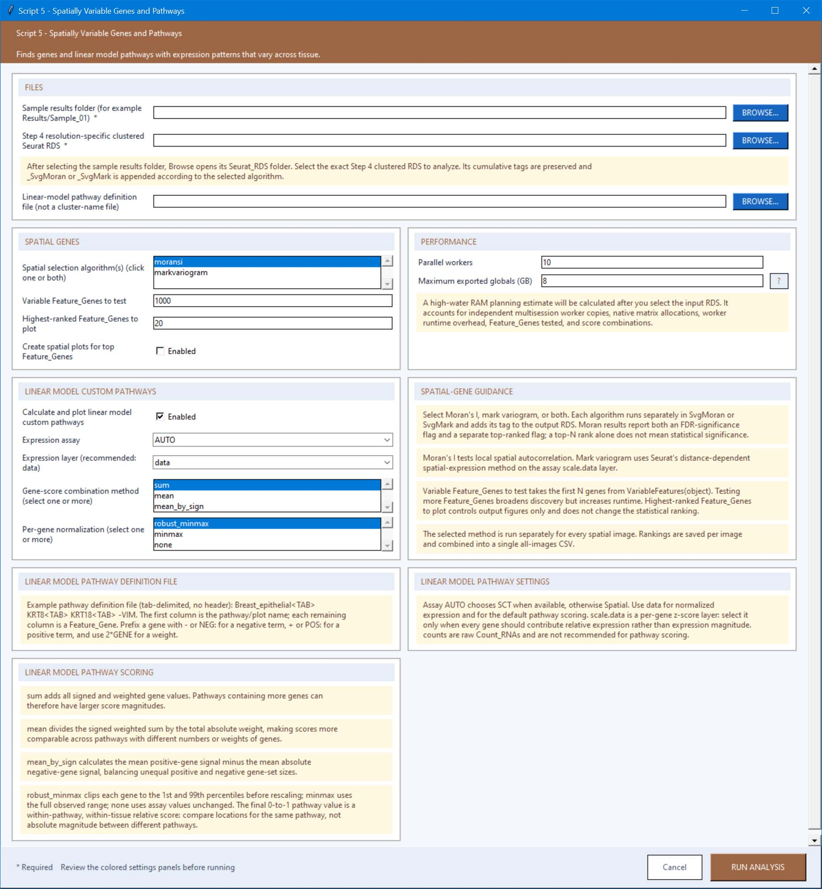

*Figure 5. This is the custom-signature screen. **Spatial selection algorithm** chooses Moran's I, mark variogram, or both to find genes with non-random spatial structure; **variable Feature_Genes to test** sets the number tested, and **highest-ranked Feature_Genes to plot** controls figures only. **Parallel workers** and **maximum exported globals** control performance. In the lower-left panel, **expression assay/layer** chooses the normalised expression to score (normally `data`, not raw `counts`). **Gene-score combination method** is `sum`, `mean`, or `mean_by_sign`; the signed mean is useful when a signature has unequal positive and negative gene lists. **Per-gene normalisation** can be `robust_minmax`, `minmax`, or none; robust min–max limits the effect of outliers. The definition file contains the pathway name followed by signed/weighted genes. This is where a pathway becomes a transparent linear model rather than an unweighted gene list.*

### Figure 6 — Step 6: add cell-type context and compare regions carefully

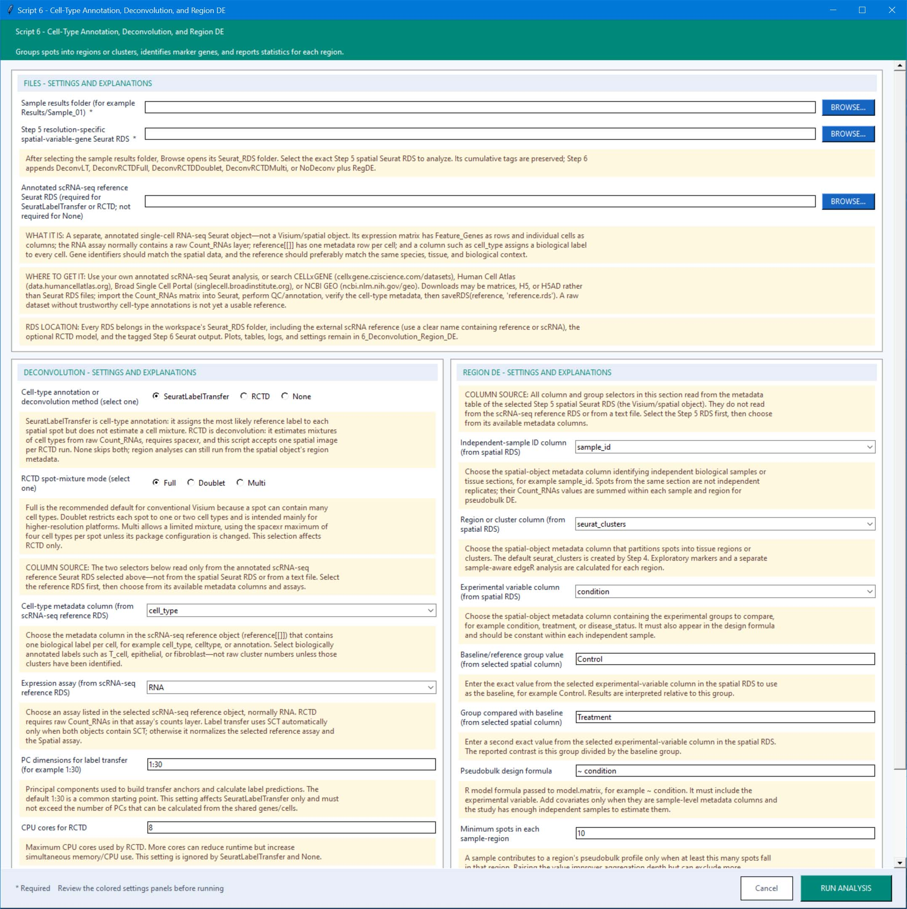

*Figure 6. A Visium spot usually contains RNA from several cells, so this step adds context using an annotated single-cell RNA-seq reference. **SeuratLabelTransfer** gives the most likely reference label per spot; **RCTD** estimates a mixture of cell types. For conventional Visium, **RCTD Full** is generally the appropriate mode because a spot may contain many cells; doublet/multi modes make more restrictive assumptions. The selected reference **cell-type metadata column**, **assay**, and **PC dimensions** determine the label-transfer setup. The Region DE panel is especially important for multi-sample studies: **independent sample ID** identifies biological replicates, **region/cluster column** selects tissue areas, **experimental variable** defines the clinical comparison, and **baseline/compared group** define its direction. **Pseudobulk design formula** is the statistical model. Spots from one slide are not independent patients, so the script sums spot counts within sample and region before testing; this avoids a common false-positive problem called pseudoreplication.*

### Figure 7 — Step 7: perturbation-derived pathway footprints and PROGENy

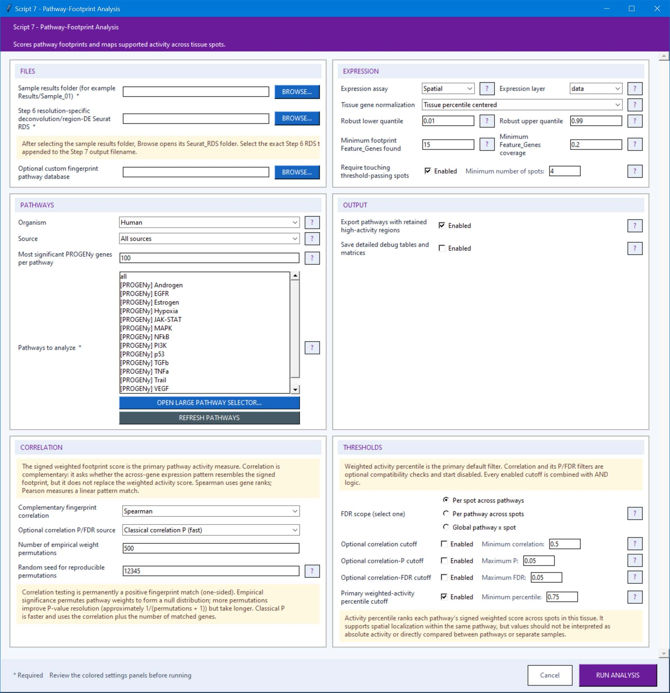

*Figure 7. This screen scores pathway footprints across the tissue. **Expression assay/layer** selects normalised data. **Tissue gene normalisation** centres/scales gene expression within the tissue; **robust lower/upper quantiles** (0.01 and 0.99 here) limit the influence of very extreme spots. **Minimum footprint Feature_Genes** and **minimum Feature_Genes coverage** require enough footprint genes to be observed before a score is trusted. **Require touching threshold-passing spots** and its minimum spot count remove isolated single-spot findings. The pathway list includes PROGENy and custom sources; **most significant PROGENy genes per pathway** chooses how many of its highest-weight downstream genes are used. **Correlation** is complementary—does the pattern resemble the footprint?—but the signed weighted activity is the primary score. The threshold panel can filter by correlation/P/FDR, but the default important filter is the **weighted-activity percentile**. Percentiles localise the highest activity within one tissue and should not be read as an absolute level that can simply be compared between every slide. The random seed and number of empirical permutations control reproducibility and the precision/time of empirical significance estimates.*

### Figure 8 — Step 8: inspect or deliberately edit a Seurat expression matrix

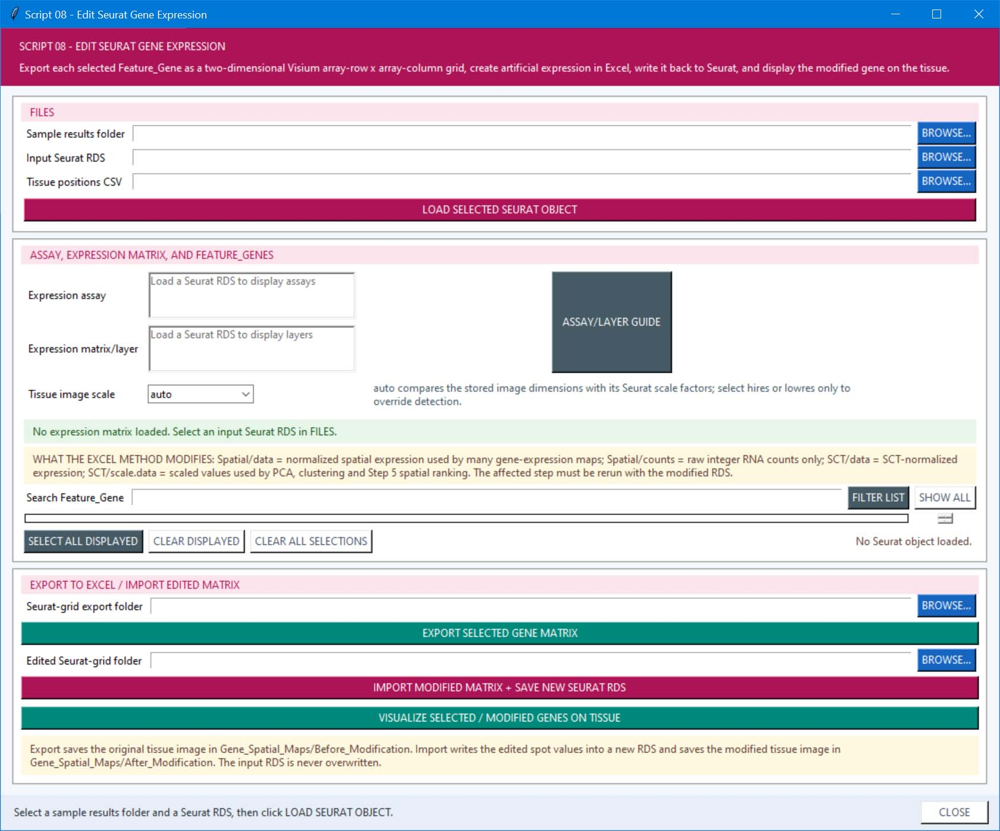

*Figure 8. This development/debugging tool can export selected gene-expression values as a Visium-array grid, import deliberately edited values into a **new** Seurat RDS, and visualise the result on the tissue. **Input Seurat RDS**, **tissue positions CSV**, **assay**, and **expression layer** specify exactly which values are being inspected; **tissue image scale** normally stays on automatic detection. The screen explains that `Spatial/data` is normalised expression, `Spatial/counts` is raw integer counts, and SCT layers represent SCTransform output. The input RDS is never overwritten. This tool was used to test and verify normalisation, clustering, spatial-gene detection, and pathway behaviour; it is not intended to manufacture biological results.*

## Examples of custom spatial signatures

### Figure 9 — Cytotoxic immune cells attacking tumour

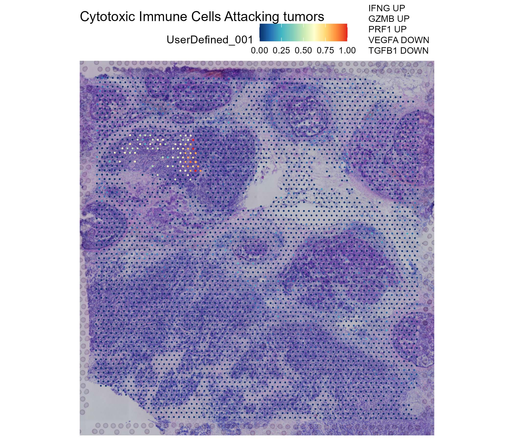

*Figure 9. This artificial demonstration map projects a custom cytotoxic-immune signature onto the tissue image. Each blue dot is a Visium spot; warmer colours show a higher score after the signed genes are combined. The gene list at upper right explains the model: `IFNG`, `GZMB`, and `PRF1` support cytotoxic activity, while `VEGFA` and `TGFB1` oppose this particular interpretation. For a cancer clinician, the question is whether a local group of spots has the coordinated pattern expected when cytotoxic immune cells are attacking tumour. The map would help select a region for pathology review or orthogonal immune-cell validation, not prove immune killing by itself.*

### Figure 10 — Tumour counter-response / immune suppression

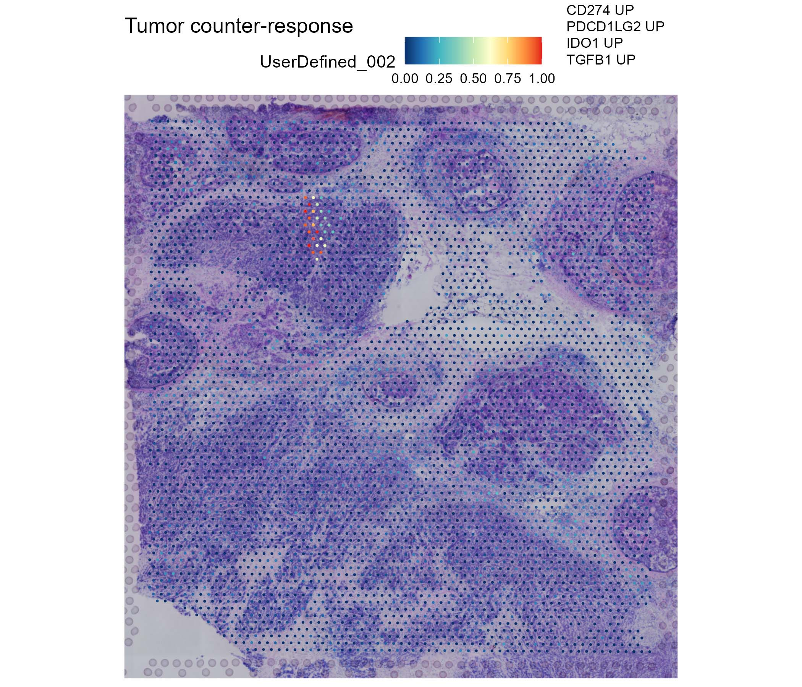

*Figure 10. This artificial example uses `CD274` (PD-L1), `PDCD1LG2` (PD-L2), `IDO1`, and `TGFB1` as positive components of a tumour counter-response signature. A high region suggests a local transcriptional pattern compatible with immune-suppressive adaptation. Compared with Figure 9, the different spatial location illustrates why several signatures can be more useful than asking only whether one checkpoint gene is present. In a real cohort this could be compared with immune infiltration, tumour area, response to therapy, and other independent samples.*

### Figure 11 — Hypoxia and reduced cytotoxic context

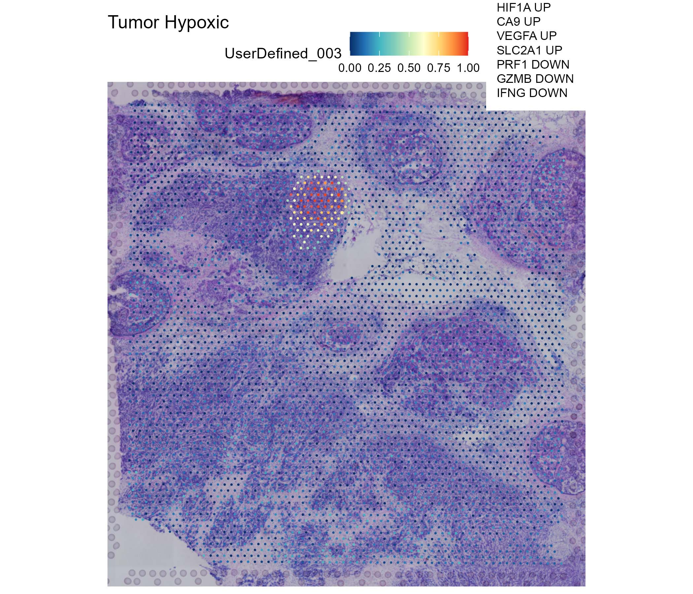

*Figure 11. This artificial map combines positive hypoxia genes (`HIF1A`, `CA9`, `VEGFA`, `SLC2A1`) with negative cytotoxic genes (`PRF1`, `GZMB`, `IFNG`). A warm spot cluster is therefore not merely “high HIF1A”; it is the combined pattern expected for a hypoxic, less cytotoxic tumour microenvironment. In a cancer project, such a region could be compared with necrosis, blood vessels, immune exclusion, and treatment resistance markers.*

### Figure 12 — Reduced antigen presentation

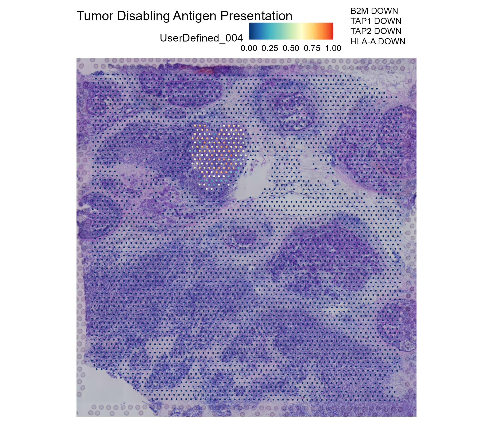

*Figure 12. This artificial signature treats low `B2M`, `TAP1`, `TAP2`, and `HLA-A` as evidence in favour of an antigen-presentation-loss programme. It demonstrates why the absence of expected expression can be informative in a signed model. Before considering a biological interpretation, check that the warm area has adequate RNA counts and gene coverage; otherwise low expression could reflect a poor-quality spot. In a real cancer study, a validated local loss of antigen-presentation machinery could be relevant to immune escape and immunotherapy resistance.*

## Software and repository layout

```text
Full_Pipeline/00_Install_R_Packages.R
Full_Pipeline/1.SpaceRanger_Rscript.R
Full_Pipeline/2.Spatial_QC_Rscript.R
Full_Pipeline/3.Spatial_Normalization.R
Full_Pipeline/4.Spatial_Clustering_Rscript.R
Full_Pipeline/5.Spatially_VariableGenes&LinearModelPathways.R
Full_Pipeline/6.Deconvolution_Region_DE_Rscript.R
Full_Pipeline/7.Pathway_Footprint_Analysis_Using_Perturbation_Derived_Gene_Weights_v3.R
Full_Pipeline/8.Edit_Gene_Expression_Matrix.R
Full_Pipeline/5.LinearModelPathway.tabtxt
Full_Pipeline/7.Fingerprint_Pathways.tabtxt
Screenshots/
Results_of_Custom_Pathway_projection/
```

Run `00_Install_R_Packages.R` first. The scripts use packages including Seurat, sctransform, progeny, edgeR, DESeq2, limma, SingleR, celldex, and optionally spacexr/RCTD. Step 1 also requires a configured Space Ranger installation.

## Interpretation boundary

Spatial pathway and footprint scores are useful to prioritise regions and hypotheses. They are not a diagnosis of a patient, proof of pathway activation, proof of protein abundance, or proof that one cell type caused the signal. Use independent tissue sections, appropriate biological replicates, pathology review, and orthogonal tests where a clinical or mechanistic conclusion is required.
